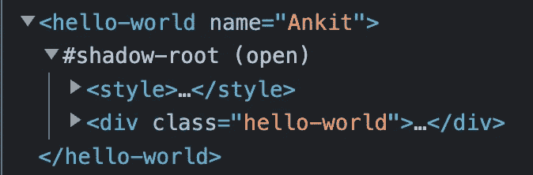
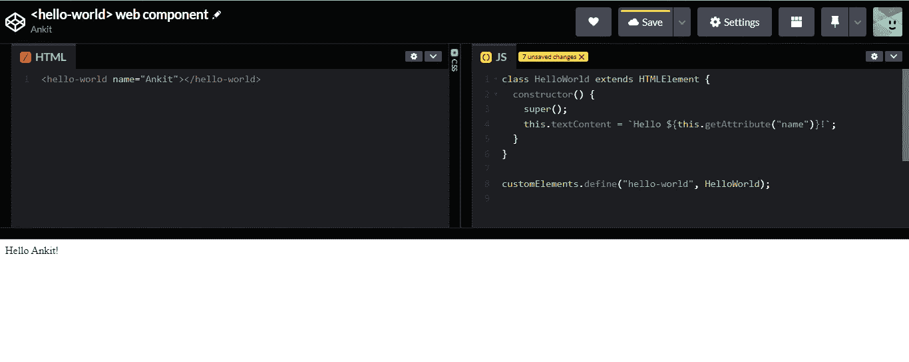
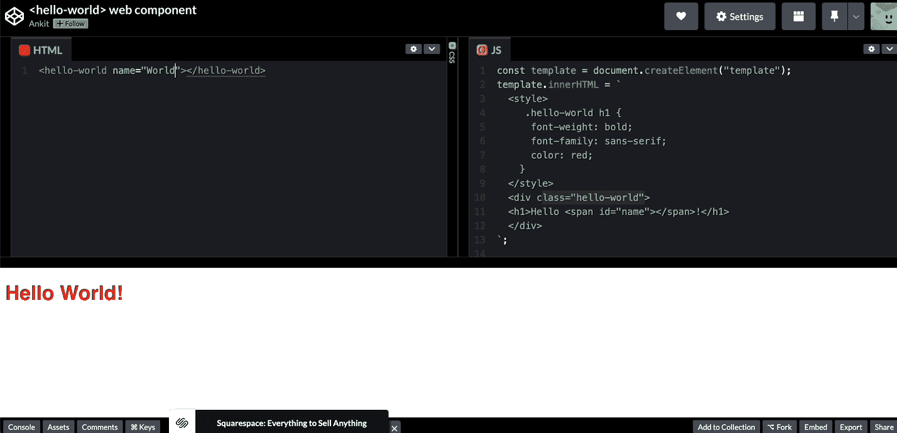

# JavaScript 中的 Web 组件简介:创建 Hello-World Web 组件

> 原文：<https://javascript.plainenglish.io/introduction-to-web-components-in-javascript-create-a-hello-world-web-component-e624874ec3b1?source=collection_archive---------5----------------------->

## 关于如何使用 JavaScript 创建 Hello-World web 组件的教程。

Web 组件是一套不同的技术，允许您创建可重用的自定义 HTML 元素。它的伟大之处在于组件的逻辑和风格的封装。我们可以保持一个元素的特性是私有的，所以它们可以被脚本化和样式化，而不用担心与文档的其他部分冲突。

Web 组件由三种主要技术组成:

*   **定制元素**:一组 JavaScript APIs，允许你定义新的定制 HTML 标签或者改进现有的标签。

```
class MyComponent extends HTMLElement {
  constructor() {
    super();
    this.innerHTML = `<p>My Web Component</p>`;
  }
}

customElements.define('my-component', MyComponent);
```

*   **影子 DOM:** 一组 JavaScript APIs，用于将封装的“影子”DOM 树附加到独立于主文档 DOM 呈现的元素上。Shadow DOM 确保我们为 web 组件定义的样式或 JavaScript 不会泄露出去，也不会影响应用程序的其他部分。
    您可以使用 Element.attachShadow()方法将阴影根附加到任何元素。

```
const shadow = this.attachShadow({mode: 'open'});
```



*   HTML 模板:模板允许你在你的页面中定义你的 web 组件可以使用的 HTML。模板及其内容不在 DOM 中呈现，但仍然可以使用 JavaScript 引用。
    **注意**:还有一个<槽>元素，你可以用它来管理一个元素的内容。

# 生命周期方法

在 Web 组件状态的整个生命周期中，浏览器会自动调用六种方法。

1.  **constructor()** :组件初始化时调用。它必须调用 super()，并且可以设置任何默认值或执行其他预渲染过程。
2.  **connectedCallback()** :当自定义元素第一次连接到文档的 DOM 时调用。
3.  **disconnectedCallback()** :当自定义元素与文档的 DOM 断开连接时调用。
4.  **adoptedCallback()** :当 Web 组件从一个文档移动到另一个文档时，调用这个函数。
5.  **attributeChangedCallback()**:添加、删除或更改定制元素的属性之一时调用。
6.  **static observed attributes()**:返回浏览器将观察到的属性数组。

# 创建一个 web 组件:

# 自定义元素

我们需要定义一个类来控制元素。它可以取任何名字，姑且叫它 HelloWorld 吧。它必须扩展 HTMLElement 接口，该接口表示每个 HTML 元素的默认属性和方法。

```
class HelloWorld extends HTMLElement {
  constructor() {
    super();
    this.textContent = 'Hello World!';
  }
}
```

该类必须向 CustomElementRegistry 注册，以将其定义为特定元素的处理程序。名称必须包含破折号，以免与 HTML 规范中正式支持的元素冲突。

```
customElements.define( 'hello-world', HelloWorld );
```

# 添加属性

到目前为止，我们的组件只是在屏幕上打印 hello world。为了使问候语动态，我们可以添加 HTML 属性:

```
<hello-world name="Ankit"></hello-world>
```

并且 textContent 将发生如下变化:

```
class HelloWorld extends HTMLElement {
  constructor() {
    super();
    this.textContent = `Hello ${this.getAttribute("name")}!`;
  }
}
```



# 阴影 Dom

虽然我们在上面构建的 Web 组件可以工作，但是它不能免受外部干扰，CSS 或 JavaScript 可以修改它。我们为组件定义的样式可能会泄露出来并影响文档的其他部分。为了防止这种情况，我们需要创建一个影子 dom。影子 DOM 通过将一个单独的 DOM 附加到 Web 组件来解决这个封装问题。阴影 DOM 可以像任何其他 DOM 元素一样进行操作。

```
this.shadow = this.attachShadow({ mode: "open" });
```

*   { mode: "open" } —这意味着我们可以使用在主页面上下文中使用 Element.shadowRoot 属性编写的 JavaScript 来访问影子 DOM。
*   { mode:“closed”}—这意味着只能在 Web 组件中访问影子 DOM。如果您使用{ mode: "closed"}将影子根附加到自定义元素，您将无法从外部访问影子 DOM，即 Element.shadowRoot 将返回 null。

# HTML 模板:

在这里，我们可以为 web 组件定义 HTML 和 CSS。

```
const template = document.createElement("template");
template.innerHTML = `
  <style>
     .hello-world h1 {
      font-weight: bold;
      font-family: sans-serif;
      color: red;
    }
  </style>
  <div class="hello-world">
  <h1>Hello <span id="name"></span>!</h1> 
  </div>
`;
```

更新构造函数以将我们的模板附加到影子 DOM，并将 name 的初始值设置为“World”:

```
constructor() {
    super();
    this.shadow = this.attachShadow({ mode: "open" });
    this.shadowRoot.appendChild(template.content.cloneNode(true));
    this.shadowRoot.querySelector("#name").innerText = "World";
  }
```

现在，当我们的 web 组件被添加到 DOM 时，我们还可以使用 observedAttributes 和 attributeChangedCallback 方法来更新名称。

```
static get observedAttributes() {
    return ["name"];
  }
attributeChangedCallback(property, oldValue, newValue) {
    if (oldValue === newValue) return;
    this[property] = newValue;
  }
connectedCallback() {
    this.shadowRoot.querySelector("#name").innerText = this.name;
  }
```



完整的 JS 代码:

完整代码: [Codepen 演示](https://codepen.io/AnkitSaxena2605/pen/dyeNYNN?editors=1010)

更多 web 组件示例:

1.  计数器: [Codepen Demo](https://codepen.io/AnkitSaxena2605/pen/OJZgOdg)
2.  编辑单词: [Codepen 演示](https://codepen.io/AnkitSaxena2605/pen/GRdEOzr)

*更多内容请看*[***plain English . io***](https://plainenglish.io/)*。报名参加我们的* [***免费周报***](http://newsletter.plainenglish.io/) *。关注我们关于*[***Twitter***](https://twitter.com/inPlainEngHQ)[***LinkedIn***](https://www.linkedin.com/company/inplainenglish/)*[***YouTube***](https://www.youtube.com/channel/UCtipWUghju290NWcn8jhyAw)*[***不和***](https://discord.gg/GtDtUAvyhW) *。对增长黑客感兴趣？检查* [***电路***](https://circuit.ooo/) *。***