# 直观实用——nuxt . js 中第一个带有 Stylify 的 CSS

> 原文：<https://javascript.plainenglish.io/intuitive-utility-first-css-in-nuxt-js-with-stylify-79ad46f3a38b?source=collection_archive---------19----------------------->

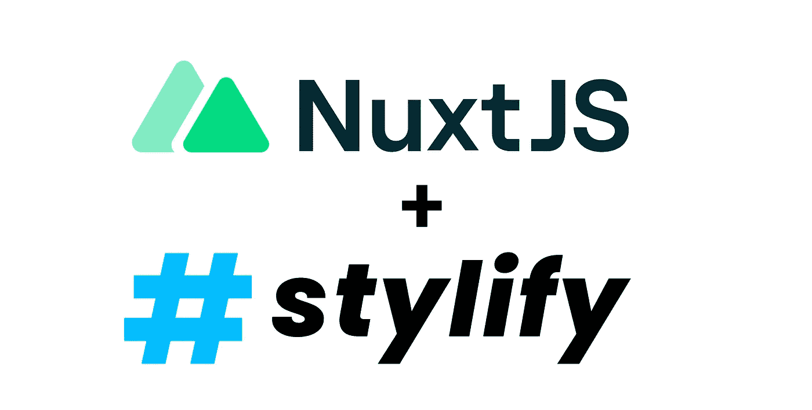

Intuitive Utility-First CSS in Nuxt.js with Stylify

类固醇上的纯 CSS。无需思考，轻松地用 CSS 样式化你的 Nuxt.js 应用程序，就像实用优先选择器一样。

Nuxt.js 是一个使用 Vue.js 构建 SPA 和 SSR 应用的神奇工具，当你想要对 app 进行样式化时，你可以使用各种框架和预处理器。

我个人更喜欢纯 CSS 或者 SCSS，而不是实用优先的框架。尽管语法有点长，但还是命名并缩短了选择器。

手动编写 CSS 的问题是速度慢。在不同的选择器中也很容易出现重复的 CSS `property:value`,这会导致 CSS 的大小增加。

正因为如此，我创建了[风格化 CSS](https://stylifycss.com) :

*   它根据我写的内容动态生成实用优先的 CSS。
*   选择器和纯 CSS 中的一样。
*   只有两条规则。`__`代替空格，`^`代替引号。
*   还有许多其他功能，如代码分割、选择器缩小、动态屏幕、按需生成 CSS 等。请随意查看[风格化文档](https://stylifycss.com)。

在本文中，我将向您展示如何在 Nuxt.js 中使用它🤟。

# 装置

Stylify 提供了 [@stylify/nuxt-module](https://stylifycss.com/docs/nuxt-module) ，最大限度地简化了集成过程:

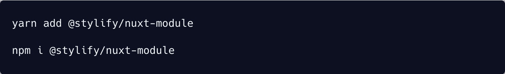

Intuitive Utility-First CSS in Nuxt.js with Stylify

安装 Stylify 后，将 Nuxt 模块添加到`nuxt.config.js`中的`buildModules`部分。

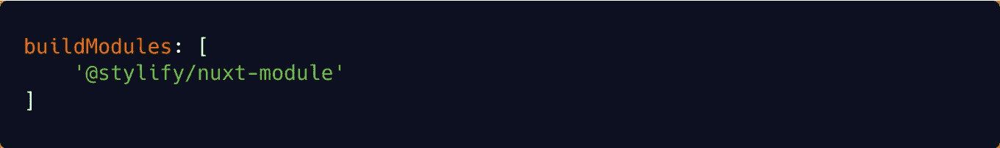

Intuitive Utility-First CSS in Nuxt.js with Stylify

仅此而已。现在你可以开始使用 [Stylify](https://stylifycss.com/docs/nuxt-module) 来设计你的 Nuxt.js 应用了🤩。

# 第一个 CSS

打开`pages/index.vue`目录，将以下内容复制到其中，并运行 dev 命令:

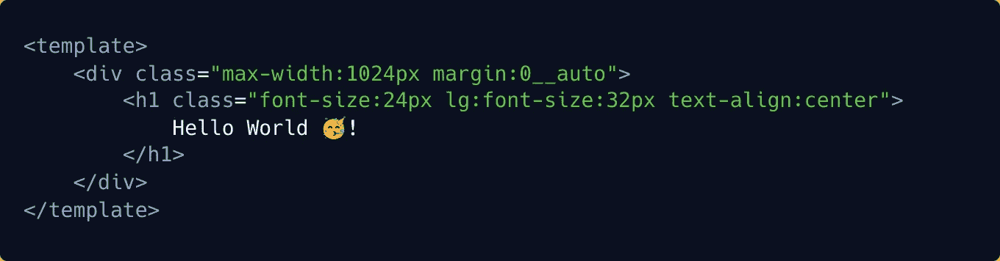

Intuitive Utility-First CSS in Nuxt.js with Stylify

恭喜你，你已经设计了你的第一页！

# 清理和配置

当实用优先方法中的选择器数量开始增加时，它可能会变成一个巨大的、不可读的混乱，后端工程师看到它时会日夜哭泣。

所以，我们有组件。可以在三个地方定义组件:

*   在使用它们的文件中。
*   在`stylify.config.js`文件中。
*   在 Stylify 部分的`nuxt.config.js`内。

让我们定义将标题组件添加到 index.vue 中，因为它仅在此处使用:

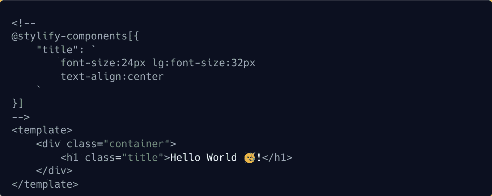

Intuitive Utility-First CSS in Nuxt.js with Stylify

现在，让我们在`stylify.config.js`中添加一个容器组件，因为它可能会在整个项目中使用。

创建`stylify.config.js`:

Intuitive Utility-First CSS in Nuxt.js with Stylify

有时有必要对元素进行全局样式化。可以使用**平原选择器**来完成:

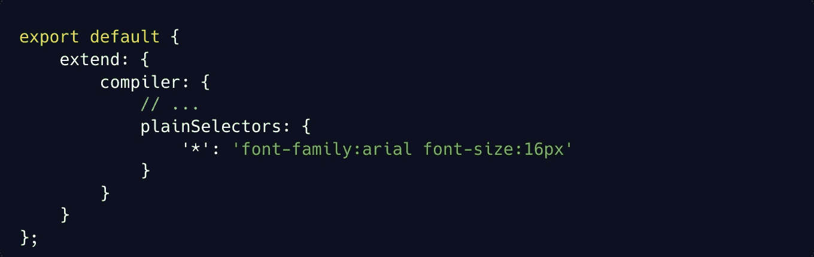

Intuitive Utility-First CSS in Nuxt.js with Stylify

几乎每个代码中都要用到变量。在 CSS 中没有什么不同。所以让我们添加一个变量:

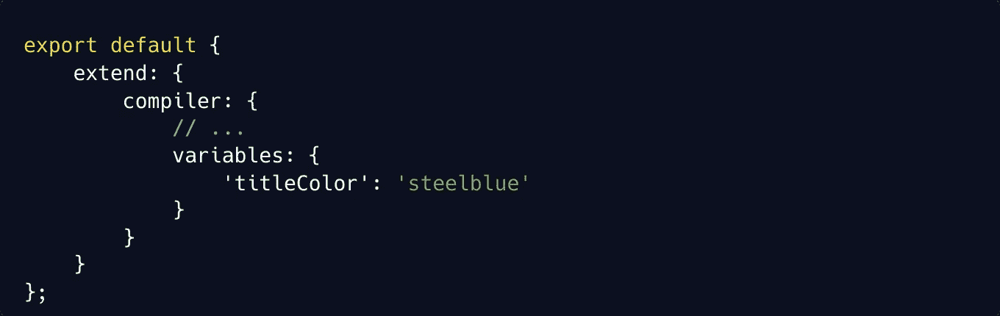

Intuitive Utility-First CSS in Nuxt.js with Stylify

现在我们可以在整个项目中使用选择器中的变量:

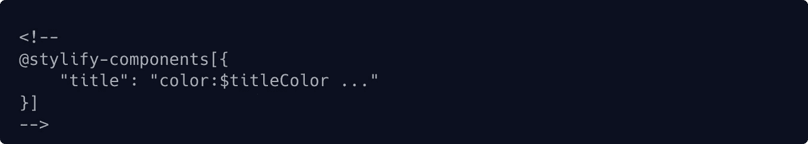

Intuitive Utility-First CSS in Nuxt.js with Stylify

# 结果呢

Stylify 在资产目录中生成 stylify.css。CSS 尽可能重用每个选择器以避免重复`properties:values`。在生产模式(生成、构建)中，它也破坏选择器。

**缩小的 HTML:**

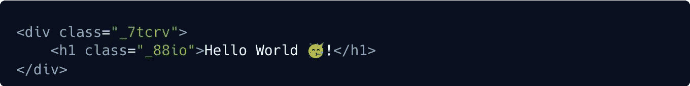

Intuitive Utility-First CSS in Nuxt.js with Stylify

**生成的 CSS:**

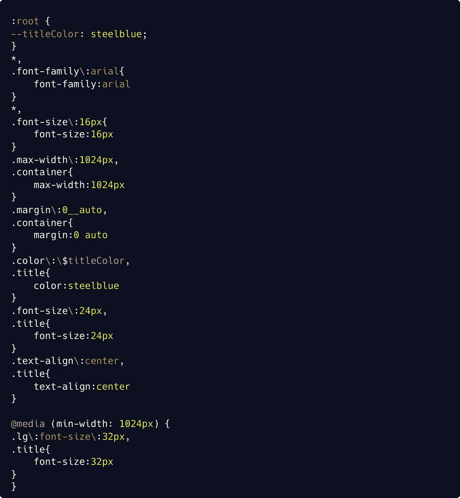

Intuitive Utility-First CSS in Nuxt.js with Stylify

**缩小的 CSS:**

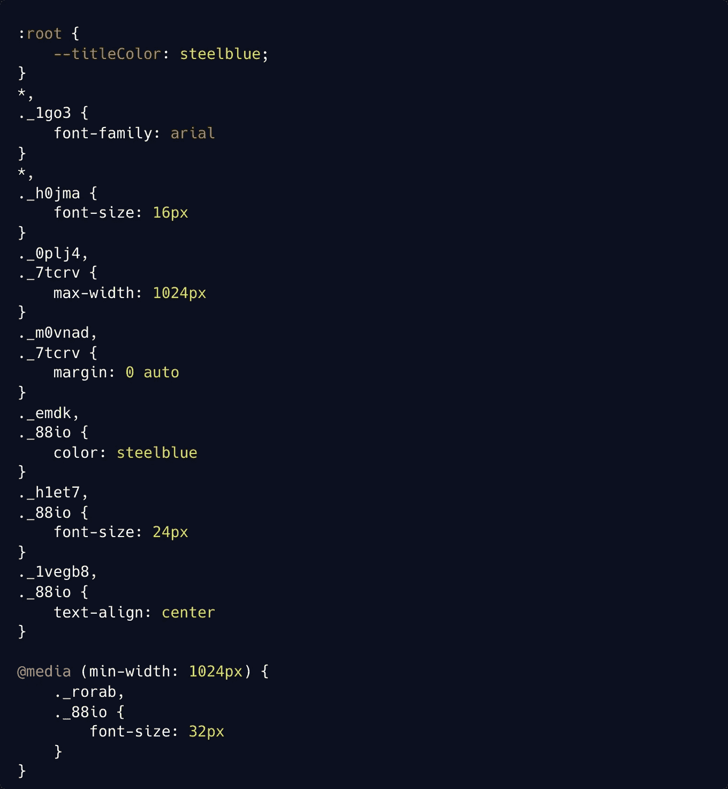

Intuitive Utility-First CSS in Nuxt.js with Stylify

# 让我知道你的想法！

Stylify 是一种以更快、更无缝的方式编写纯 CSS 的方法。对我来说，这是一种比手工编写更有效的方法。

但我知道这并不适合所有人，因此，我很乐意接受任何反馈、想法、问题、想法或问题🙂。

保持联系:
👉 [@8machy](https://twitter.com/8machy)
👉 [@stylifycss](https://twitter.com/stylifycss)
👉[Stylifycss.com](https://stylifycss.com)👉[dev.to/machy8](https://dev.to/machy8)👉[medium.com/@8machy](https://medium.com/@8machy)

*更多内容请看*[***plain English . io***](http://plainenglish.io/)*。报名参加我们的* [***免费每周简讯***](http://newsletter.plainenglish.io/) *。在我们的* [***社区***](https://discord.gg/GtDtUAvyhW) *获取独家写作机会和建议。*