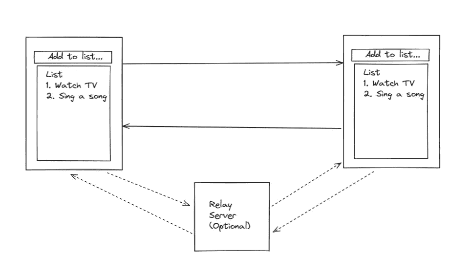
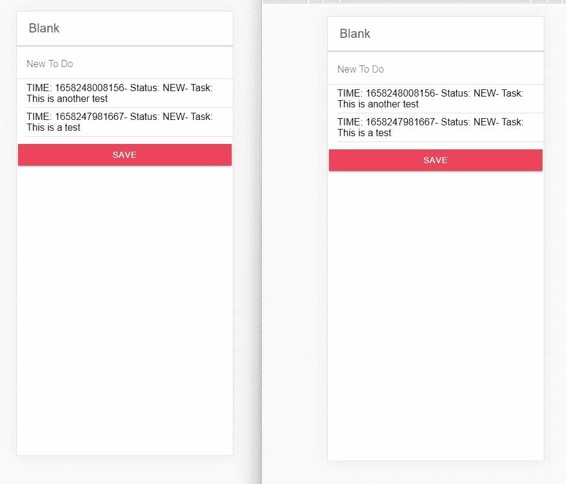

# Ionic & GunJS:在你的 Ionic 应用中使用一个分散的数据库来构建一个 dApp

> 原文：<https://javascript.plainenglish.io/ionic-gunjs-build-a-dapp-using-a-decentralised-db-in-your-ionic-app-4cbb5325b63e?source=collection_archive---------8----------------------->

## 如何使用 GunJS 构建 Ionic 应用程序的指南。


Photo by [Campaign Creators](https://unsplash.com/@campaign_creators?utm_source=medium&utm_medium=referral) on [Unsplash](https://unsplash.com?utm_source=medium&utm_medium=referral)

当构建一个应用程序时，你需要了解后端发生了什么，你需要在后端托管一些东西，可能是服务器和数据库，要么在某个地方的机器上进行物理托管，要么通过云提供商进行虚拟托管。

你需要看看你的应用程序如何与一个遥远的未知领域的后端进行通信。

如果有一种方法可以让您托管数据库，而不需要实际拥有物理和/或虚拟的服务器，会怎么样？有了马克·纳达尔的 GunJS，这是一种可能。

## **什么是 GunJS？**

简而言之:GunJS 是一个去中心化的数据库，位于设备的本地存储领域。

虽然不需要设置实际的服务器，但是如果您愿意，可以选择设置一个称为中继服务器的东西，我也将在本文中向您展示。

没有人是一座孤岛。在研究写这篇文章的过程中，我阅读并修改了 React 教程上的 [GunJS 文档](https://gun.eco/docs/React-Tutorial)，并观看了来自 [Nader Dabit](https://medium.com/u/695782484bda?source=post_page-----4cbb5325b63e--------------------------------) 、 [Mark Nadal](https://medium.com/u/ef09f9b6b917?source=post_page-----4cbb5325b63e--------------------------------) 和 Fireship 的视频。我将构建的应用程序已经根据我读过的文档进行了修改，以使其与 Ionic React 配合使用。

我已经计划写一篇关于使用 GunJS 构建一个 Ionic 应用程序的文章很长时间了。我花了一段时间研究如何用 Ionic 实现 GunJS，因为它非常棘手，我盯着几个死胡同。

## 先决条件

*   请注意，这需要中级水平的离子反应知识
*   您还需要 Node.js Express 方面的中级知识，因为我们还将构建一个中继服务器。这是可选的，但是有一个中继服务器是很酷的。

## **软件版本**

Ionic React 应用程序采用 Ionic 版本 6 构建，其 Ionic CLI 版本为 6.20.1。

## 我们将会建造什么？

我们将在这里构建一个所有设备共享的待办事项列表。不会实现复杂的身份验证，只是一个简单的共享列表，以演示在 Ionic React 应用程序中使用 GunJS 数据库。



## 步骤 0:启动一个新的 Node.js Express 服务器(可选的，但是很酷)

我们将从创建一个中继服务器开始。中继服务器只是一个简单的“中继器”,将任何数据库更改中继到其他设备。这是可选的，因为你并不真的需要一个中继服务器，因为 GunJS 是在没有“中间人”的情况下开发的。

要启动中继服务器，请设置一个新的 Node.js Express 服务器。安装以下 NPM 软件包:

1.  快递`npm install express`
2.  枪`npm install gun`

在 index.js 文件中，插入以下代码:

这是一篇很短的文章，大约只有 11 行。在后台运行 index.js，下一步就可以开始你的 Ionic 项目了。请注意服务器地址，在本例中，它是 [http://localhost:3000。](http://localhost:3000.)

如果您计划在其他地方托管它，请记住记下服务器地址，因为这在以后会很重要。

## 步骤 1:启动一个 Ionic React 项目，并在你的应用程序中设置 GunJS

开始一个离子项目，并选择反应作为建造的方法。这将开始构建一个 Ionic React 应用程序的过程，供您阅读。

对于这个列表应用程序，我选择使用空白模板。您可以选择您喜欢的任何其他模板，但我将使用一个普通的空白模板开始。

类似于节点服务器，我们还需要安装 Gun:

```
npm install gun
```

## 第二步:在你的 App.tsx 中设置 GunJS

好了，现在我们必须在你的 App.tsx 中设置 GunJS。下面是 App.tsx 文件的代码:

第 6 行-导入枪到你的离子反应项目。

第 32 行-声明 gun 库(我意识到这听起来很酷，但重读后可能会误解:)，再次指责 Gun 的创造者[马克·纳达尔](https://medium.com/u/ef09f9b6b917?source=post_page-----4cbb5325b63e--------------------------------)。不过名字很酷)。请注意，我已经在这里添加了中继服务器。如果您没有任何中继服务器，您可以选择添加`http://localhost:3000`或将其留空，只需声明`Gun()`。

第 40 行——将枪作为道具放在家中——如果枪在其他地方使用，重复此步骤。

## 第三步:写信给你的家

这是所有奇迹发生的地方。在 Home.tsx 中编写以下代码:

好了，接近 106 行，这里是重要的部分:

第 7–9 行——这是我们设置取自 App.tsx 的枪支道具的地方。

第 11–13 行——这是我们在首次加载应用程序时将 initialState 设置为一个空白的 todos 数组的地方。

第 15–19 行——这是扩展 todo 和添加任何新 todo 的 reducer 函数。

第 25 行——这是我们设置 todo 使用状态的地方。

第 30–40 行——如果有任何更改，将加载该代码，并将所有 todo 放入 todos 数组中。

第 51–59 行——这是我们将待办事项保存到数据库的地方。

第 62–71 行——我们必须根据索引重新排列待办事项。

第 85–87 行-这是我们可以添加新待办事项的输入框。

第 89–95 行——这是一个循环，重复了 newTodoArray 中重新排列的 todos。

第 98–101 行——这是保存并向列表中添加新待办事项的按钮。

## 第四步:构建你的 Ionic 应用并测试它

在使用 Ionic 应用程序后，我能够创建以下列表



因为我是在本地网络中工作，所以这很好。有了中继服务器，数据几乎是实时传入的。如果没有中继服务器，您可能需要进行刷新，以给它额外的推动力来获取最新的数据。

## 结论

不言而喻，如果您决定在基于云的服务器(也许是 Heroku，或者任何数量的基于云的提供者)中构建和托管 Node.js Express 服务器(参见步骤 1 ),效果会更好。这将在所有下载了你的应用程序的设备上创建一个可靠的分散数据库中继，从而创建一个分散的数据库系统。

请注意，这只会创建一个 Ionic 应用程序，而不是一个可以直接安装到您的设备上使用的应用程序。这需要一些工作，以确保分散的 GunJS 数据库的工作。

从这里开始，有两种方法可以确保 Ionic GunJS 应用程序按预期运行:

1.  将主机应用程序作为渐进式网络应用程序(PWA)——这可以通过 Ionic 轻松完成
2.  为基于 GunJS 的列表创建一个微前端(MFE)接口，并将其嵌入到 Ionic 应用程序中，以便在 Android 或 iOS 上构建的混合原生应用程序中使用。这将在另一篇文章中涉及，希望很快。

同时，一定要试一试，让我知道你的想法。

*塞拉马特·孟加图拉*

*更多内容看* [***说白了。报名参加我们的***](https://plainenglish.io/) **[***免费周报***](http://newsletter.plainenglish.io/) *。关注我们关于*[***Twitter***](https://twitter.com/inPlainEngHQ)*和*[***LinkedIn***](https://www.linkedin.com/company/inplainenglish/)*。查看我们的* [***社区不和谐***](https://discord.gg/GtDtUAvyhW) *，加入我们的* [***人才集体***](https://inplainenglish.pallet.com/talent/welcome) *。***