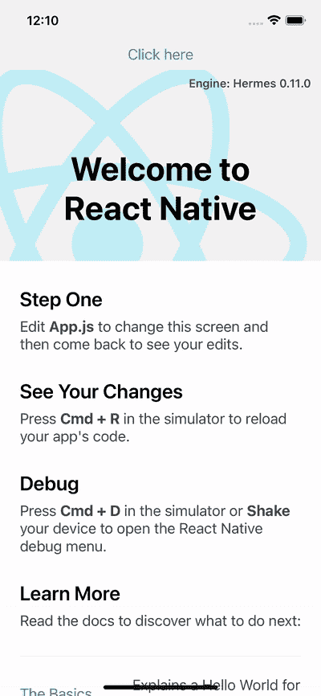
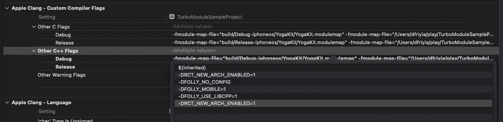
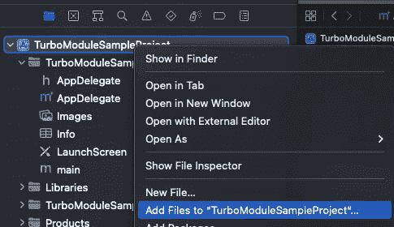
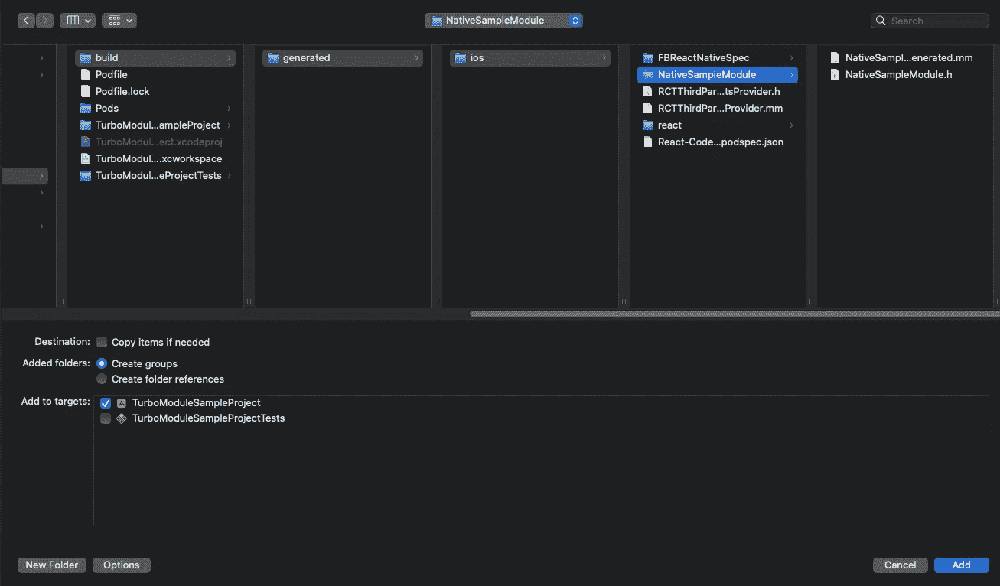
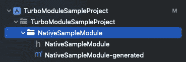

# 面向早期采用者的 React-Native turbo modules iOS 指南

> 原文：<https://javascript.plainenglish.io/ios-guide-to-turbomodules-in-react-native-for-early-adopters-8b2e9ab66852?source=collection_archive---------2----------------------->

## 在 React-Native 中提前了解涡轮模块和代码


[Photo by Tuur Tisseghem](https://www.pexels.com/photo/space-gray-iphone-8-818043/)

## **简介**

在上一篇文章中，我们在 Android 中实现并启用了 [TurboModules。如果你还没有完成那个博客，你需要在开始这个博客之前回去完成它。前一篇文章包含了您需要在 TypeScript 代码中完成的附加说明。本文将讨论如何在 iOS 中启动和运行。像往常一样，如果你遇到困难，你可以点击这里查看 GitHub repo。如果你喜欢视觉学习，你可能想看看我在 YouTube 上关于这个主题的教程。简要回顾一下上一篇文章，我们正在构建下面的应用程序，它可以使用 TurboModule 调用原生层并打印一条消息。](/android-guide-to-turbomodules-in-react-native-for-early-adopters-b07f3e23fd1c)



## 更新我们的 package.json

iOS 需要在 React 端增加一个额外的步骤来启动和运行。iOS 不像`gradle`那样能够找到文件夹，所以我们需要在`package.json`中指定 Spec 文件的路径。您可以通过在文件末尾添加以下代码来实现这一点:

```
"codegenConfig": {
  "libraries": [{
    "name": "NativeSampleModule",
    "type": "modules",
    "jsSrcsDir": "./js"
  }]
}
```

## 在 iOS 上启用 Codegen

接下来，我们需要在 iOS 上启用新的架构。你可以在 Xcode 中打开`ios`文件夹，然后进入构建设置。在 Apple Clang-Custom Compiler Flags 下找到 Other C++ Flags 一节，添加`-DRCT_NEW_ARCH_ENABLED=1`。



我们现在必须运行一个特殊的`pod install`命令来处理新架构中的所有事情:

```
RCT_NEW_ARCH_ENABLED=1 pod install
```

您应该会看到许多新的架构库正在安装。

## 将 Objective-C 连接到 React-Native

现在一切都已启用，我们可以继续编写我们的本机代码了。我们首先将一个`Podspec`文件添加到`js`文件夹中。我们这样做是因为 Cocoapods 用于管理 TurboModule 生态系统，iOS 需要知道您正在安装一个模块。调用文件`NativeSampleModule.podspec`，复制粘贴以下内容:

```
folly_version = '2021.06.28.00-v2'folly_compiler_flags = "-DFOLLY_NO_CONFIG -DFOLLY_MOBILE=1 -DFOLLY_USE_LIBCPP=1 -Wno-shorten-64-to-32"Pod::Spec.new do |s|
  s.name = "NativeSampleModule"
  s.version = "0.0.1"
  s.summary = "NativeSampleModule"
  s.description = "NativeSampleModule"
  s.homepage = ""
  s.license = "MIT"
  s.platforms = { :ios => "11.0"}
  s.author = ""
  s.source = { :git => "https://github.com/facebook/react-native.git", :tag => "#{s.version}"}
  s.source_files = "./**/*.{h,m,mm,swift}"
  s.compiler_flags = folly_compiler_flags
  s.pod_target_xcconfig = {
    "HEADER_SEARCH_PATHS" => "\"$(PODS_ROOT)/boost\""
  }
  s.dependancy "React"
  s.dependancy "React-RCTFabric"
  s.dependancy "React-Codegen"
  s.dependancy "RCT-Folly", folly_version
  s.dependancy "RCTRequired"
  s.dependancy "RCTTypeSafety"
  s.dependancy "ReactCommon/turbomodule/core"
end
```

现在，如果我们再次运行`RCT_NEW_ARCH_ENABLED=1 pod install`，我们应该能够为 Objective-C 生成绑定。如果您看到类似这样的内容，这意味着 Codegen 成功了:

```
[Codegen] >>>>> Processing NativeSampleModule[Codegen] Generated schema: /var/folders/70/796_sfnj3xn48tzsx0tzz4g80000gn/T/NativeSampleModuleJbRobp/schema.json[Codegen] Generated artifacts: TurboModuleSampleProject/ios/build/generated/ios/NativeSampleModule
```

回到 Xcode，右键单击项目并选择将文件添加到 TurboModuleExampleProject:



接下来查找 ios >构建>生成> ios > NativeSampleModule。确保选中创建组，然后单击添加:



此时，您应该看到 TurboModuleSampleProject 下的 NativeSampleModule 包:



现在创建一个头文件和一个名为 RCTNativeSampleModule 的 Objective-C++文件。在头文件中，您需要添加以下代码:

```
#ifndef RCTNativeSampleModule_h
#define RCTNativeSampleModule_h#include "NativeSampleModule.h"**@interface** NativeSampleModule : NSObject<NativeSampleModuleSpec>
**@end**#endif /* RCTNativeSampleModule_h */
```

最后，让我们通过在 Objective-C++文件中创建方法来结束工作。RCTNativeSampleModule.mm 的内容应该如下所示:

```
#import <Foundation/Foundation.h>#include "RCTNativeSampleModule.h"**@implementation** NativeSampleModule
RCT_EXPORT_MODULE()- (std::shared_ptr<facebook::react::TurboModule>)getTurboModule:(**const** facebook::react::ObjCTurboModule::InitParams &)params {
  **return** std::make_shared<facebook::react::NativeSampleModuleSpecJSI>(params);
}- (NSString *)getHelloWorld:(NSString *)first second:(NSString *)second {
  **return** [NSString stringWithFormat:@"HelloWorld %@ %@", first, second];
}**@end**
```

现在，如果你用`yarn ios`编译，我们应该可以点击按钮，看到警告信息。

## 结论

这就是 React-Native 中对涡轮模块的介绍。我很高兴这个架构能够使用这些更好的工具来调用本地代码。下次见，黑客快乐！

*更多内容尽在* [***说白了. io***](https://plainenglish.io/) *。报名参加我们的* [***免费周报***](http://newsletter.plainenglish.io/) *。关注我们关于* [***推特***](https://twitter.com/inPlainEngHQ) *和*[***LinkedIn***](https://www.linkedin.com/company/inplainenglish/)*。查看我们的* [***社区不和谐***](https://discord.gg/GtDtUAvyhW) *加入我们的* [***人才集体***](https://inplainenglish.pallet.com/talent/welcome) *。*