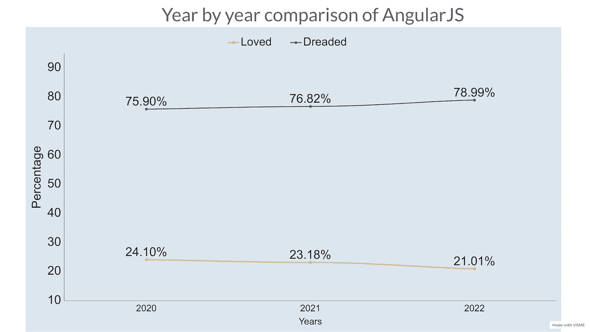
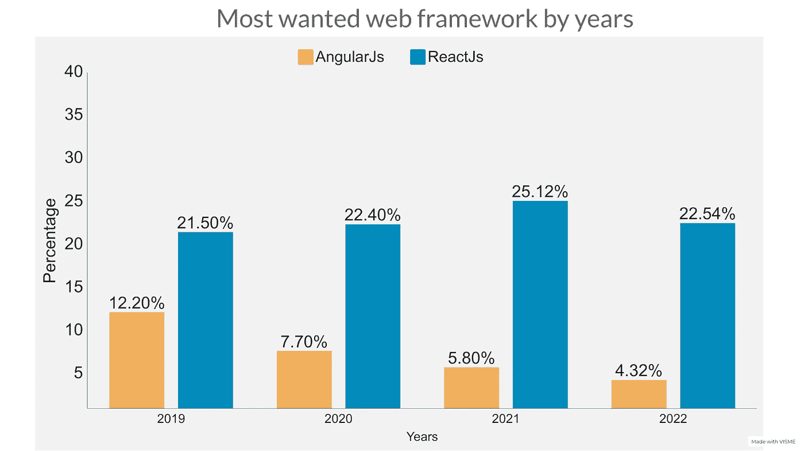
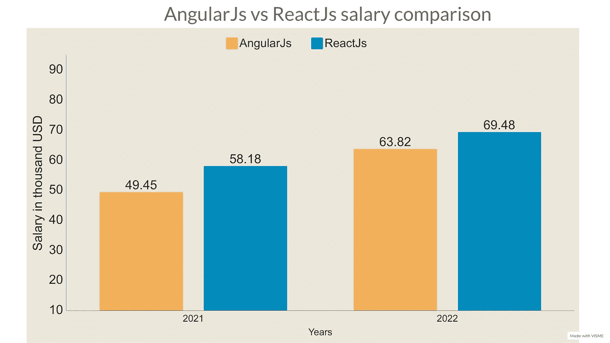

# 角状死亡是由于反应吗？

> 原文：<https://javascript.plainenglish.io/is-angular-dying-due-to-react-a7838319877a?source=collection_archive---------4----------------------->

## 让我们了解一下 Angular 和 React 的受欢迎程度，他们在工资方面支付多少，以及其他事情…

Photo by [Lautaro Andreani](https://unsplash.com/@lautaroandreani?utm_source=medium&utm_medium=referral) on [Unsplash](https://unsplash.com?utm_source=medium&utm_medium=referral)

说到开发者调查，在我看来栈溢出开发者调查是最好的调查之一。因为他们有最大的开发者社区，每年都有许多开发者参与调查。

这篇文章的目的是让开发者了解一些来自世界各地的重要统计数据和概述。我不会进入一个沉重的技术分析哪个更好，因为这总是有争议的。

每个开发人员都有自己的偏好，两种框架都有各自的优缺点，对吗？因此，我们将只讨论统计数据，因为这些数据反映了发展领域正在发生的事情。

# 关于 ReactJs 和 AngularJs，数据是怎么说的？

## AngularJs 已经成为最可怕的 web 框架

Graph made by the author

堆栈溢出在他们的调查中有一个非常有趣的部分。每年，他们都会对最受欢迎和最令人恐惧的编程语言和 web 框架发表意见。

AngularJs 已经连续三年成为最可怕的 web 框架。而且，每年，这么想的人似乎都在增加。

> 从上图可以看出，2022 年，78.99%的开发者表示 AngularJs 让他们望而生畏，21.01%的人喜爱。

## 最想要的 web 框架

Graph made by the author

web 框架有很多种——一些用于后端，一些用于前端。但是我们今天将比较 ReactJs 和 AngularJs。

React 作为最受欢迎的 web 框架/库已经走过了第五个年头。22.54%的开发者希望使用/学习 React。虽然在 2021 年，25.12%的开发者想要它。

2021 年的数字更高，因为在 2022 年，StackOverflow 在列表中添加了 Next.js 作为不同的框架。11.28%的开发者希望学习 Next.js，这是一个 React 框架。

从图表中，我们还可以看到，想要学习 AngularJs 的开发人员的比例每年都在下降。这可不是什么好兆头。

## 薪资比较

Graph made by the author

有些人可能认为这不相关，但工资比较是我最喜欢的部分。😛

从 Stack Overflow 的调查可以看出，React 开发者比 AngularJs 开发者赚得多。我对比过他们 2021 年和 2022 年的工资。

因此，React 是最流行的前端 web 框架/库——毫无疑问。但问题是安古拉吉斯是不是要死了。

我个人不这么认为。每天仍有大量的公司和开发者在使用 AngularJs。但是越来越多的新开发者正在学习 React。所以，如果我是一个新的开发者，我会开始学习 React。

但那是我个人的看法。你有什么看法？

*数据:堆栈溢出*