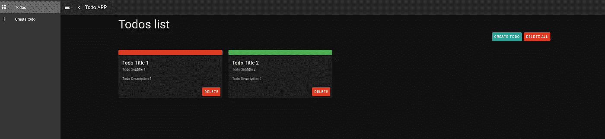
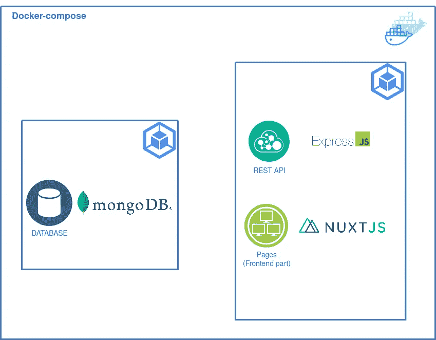

# 有没有可能用 Nuxt 创建一个 REST API？

> 原文：<https://javascript.plainenglish.io/is-it-possible-to-create-a-rest-api-with-nuxtjs-230685fbd2bc?source=collection_archive---------4----------------------->

## 使用 docker-compose 在 Nuxt 应用程序中使用 serverMiddleware 创建 Express + MongoDB RESTful API


在我去年开始使用 NuxtJS 之后，我发现这个框架是多么强大，充满了选项和属性，使得创建 web 应用程序更加容易。关于这个框架，你需要知道的最重要的一点是，NuxtJS 支持 SSR(服务器端渲染)，这意味着 NuxtJS 需要一个渲染网页并将其传递给 VueJS 客户端的服务器(所有这些都是由 NuxtJS 在幕后实现的)。然而，如果你试图实现复杂的操作，比如访问数据库或者拥有推送通知通道，你会发现困难，特别是当你试图在不请求外部 REST API 的情况下实现时。这促使我们问这样一个问题:

***有没有可能用 NuxtJS 创建一个 REST API？***

答案是:**是的。**通过使用 NuxtJS 的 [serverMiddleware](https://nuxtjs.org/docs/configuration-glossary/configuration-servermiddleware/) 属性，用 NuxtJS 创建 REST API 是完全可能的。通过本教程，我们将发现如何实现这一点。

# 待办事项列表

1.  创建 Nuxt 应用程序
2.  设置服务器中间件
3.  创建 ExpressJS API
4.  记录我们的 Nuxt 应用程序
5.  与数据库建立连接

# 关于这个例子

我们将创建的项目是一个简单的应用程序，带有一些基本的 CRUD 操作。

# 我们将使用什么？

*   [NuxtJS :](https://nuxtjs.org/) 是一个基于 VueJS 和 NodeJS 的开源框架，用于简化使用 VueJS 创建 SSR web 应用程序。
*   [ExpressJS](https://expressjs.com/) :是一个极小的 Node.js web 应用框架，为 web 和移动应用提供了一组特性。
*   [MongoDB :](https://www.mongodb.com/) 是一个面向文档的数据库。归类为无 SQL 数据库。MongoDB 使用带有可选模式的类似 JSON 的文档。
*   [Docker](https://www.docker.com/)&[Docker-compose](https://docs.docker.com/compose/gettingstarted/):是一个开发、发布和运行应用程序的开放平台。

# 1 .创建 Nuxt 应用程序

我们项目的第一步是创建一个 NuxtJS 应用程序，我们将使用[create-nuxt-app](https://nuxtjs.org/docs/get-started/installation)web pack 快速开始。

```
$ npm init nuxt-app <project-name>
```


Create nuxt app

因为我们想把重点放在 API 部分，我建议你直接克隆我为此创建的前端部分。



UI for our todo app

# 2 .设置服务器中间件

根据 NuxtJS 的官方文档，serverMiddleware 属性帮助我们定义一个服务器端的中间件。

> Nuxt 在内部创建了一个 [connect](https://github.com/senchalabs/connect) 实例，您可以向其中添加自己的定制中间件。这允许我们注册额外的路线(通常是`/api`路线)**而不需要外部服务器**。

因此，让我们在项目的根目录下创建一个名为`api`的文件夹，并在其中创建一个名为`index.js`的文件

首先，我们的文件只包含一个日志中间件:

然后，我们应该告诉我们的 NuxtJS 应用程序考虑我们的中间件，为此，让我们将这个属性添加到`nuxt.config.js`文件:

如果你试图进入我们的 NuxtJS 应用程序的任何页面，并在你的控制台中查看，你会找到你请求的 URL。事实上，每次页面访问都会处理我们的日志中间件。

# 3.创建 ExpressJS API

现在，让我们创建 API 部分。我们将从安装 ExpressJS 开始。

```
$ npm install express --save
```

那么让我们把`api/index.js`的内容更新成这样:

现在，如果您尝试请求[http://localhost:3000/API](http://localhost:3000/api)，您将获得以下结果:


# 4 .记录我们的 Nuxt 应用程序

出于开发目的，我们将使用 Docker 和 docker-compose 来构建和运行我们的应用程序。通过使用 Docker，我们可以很容易地建立一个本地开发环境。另一方面，使用 docker-compose 帮助我们构建和运行多个容器。在我们的案例中，我们需要两个容器:

*   我们的 Nuxt 应用程序的容器
*   MongoDB 数据库的容器

我们的应用程序的架构如下图所示:



Application architecture

让我们从在我们项目的根目录下创建`Dockerfile`开始，内容如下:

之后，我们将对我们的`nuxt.config.js`文件进行一些修改:

现在，我们将创建一个`docker-compose.yaml`文件，在其中我们将定义两个容器:

只需一步，我们就可以通过 docker 构建并运行我们的应用程序。因此，让我们为数据库和 Nuxt 应用程序定义`.env`文件:

而对于`database/.env :`

除此之外，我们还可以为我们的`todo_db`设置管理员用户，为此我们应该在`database`文件夹中创建一个`mongo-init.js`文件:

现在，我们可以通过键入以下命令来构建和运行我们的应用程序:

```
$ docker-compose up --build
```

# 5.与数据库建立连接

在本教程中，我们将使用 MongoDB 数据库。事实上，ExpressJS 和 MongoDB 的组合非常受欢迎，但是您可以选择任何其他数据库，也可以通过相同的过程实现。

为此，我们将使用[mongose](https://mongoosejs.com/)，它是 Node.js 的 MongoDB 对象建模。

```
$ npm install mongoose --save
```

并创建以下文件结构:


让我们解释一下每个文件的内容:

*   `todo.model.js`包含我们的待办事项模式:

*   `todo.controller.js`包含我们的 CRUD 操作:

*   `todo.routes.js`包含我们的路线描述:

*   最后，`database.js`包含与我们数据库的连接。这个文件的内容是:

最后，让我们更新我们的`index.js`文件，考虑我们的变化。

现在，您可以通过使用 Postman 来测试我们 API 的每个端点。

# 结论

本教程到此结束，感谢您的阅读。

如果您有任何问题或意见，请不要犹豫，在下面留下您的评论。

*   GitHub 项目链接:

[](https://github.com/SihemBouhenniche/Todo-App-Nuxt) [## GitHub-SihemBouhenniche/Todo-App-Nuxt:Todo App 使用 NuxtJS - ExpressJS - MongoDB 和…

### 安装依赖项$ NPM install # serve with hot reload at localhost:3000 $ NPM run dev # build for production and…

github.com](https://github.com/SihemBouhenniche/Todo-App-Nuxt) 

*更多内容看* [***说白了。报名参加我们的***](https://plainenglish.io/) **[***免费周报***](http://newsletter.plainenglish.io/) *。关注我们关于* [***推特***](https://twitter.com/inPlainEngHQ) ，[***LinkedIn***](https://www.linkedin.com/company/inplainenglish/)*，*[***YouTube***](https://www.youtube.com/channel/UCtipWUghju290NWcn8jhyAw)*，* [***不和***](https://discord.gg/GtDtUAvyhW) *。对增长黑客感兴趣？检查* [***电路***](https://circuit.ooo/) *。***