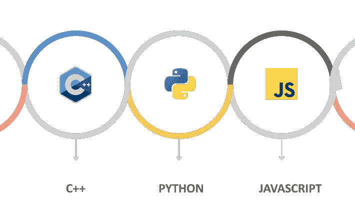
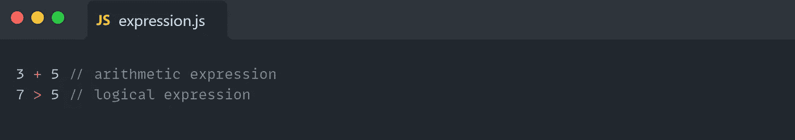
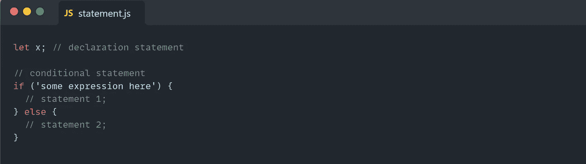
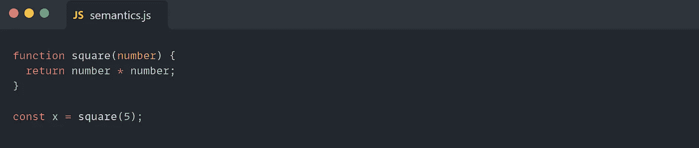

# JavaScript 是编程语言吗？

> 原文：<https://javascript.plainenglish.io/is-javascript-a-programming-language-516f365c9967?source=collection_archive---------7----------------------->

> “一种语言，无论是自然的(如英语)还是人工的(如 Java)，都是来自某种字母表的一组字符串。
> 
> 编程语言的学习和自然语言的学习一样，
> 可以分为**语法**和**语义**的考试。
> 编程语言的语法是其表达式、语句和程序单元的形式。它的语义就是那些表达式、语句和程序单元的含义。“~程序设计语言的概念(罗伯特 w .塞贝塔)

## **语法**

给定编程语言的语法描述了哪些字符串构成了有效的程序。

***JavaScript 用哪些关键字声明变量？***
var，let 和 const，所以 JavaScript 有关键字。

***JavaScript 有哪些类型的运算符，它们是用来做什么的？***
JavaScript 运算符类型有赋值、算术、比较、逻辑、
按位、一元、关系、条件、字符串和逗号运算符。它们用于 JavaScript 的算术表达式、比较表达式、逻辑表达式、赋值表达式等等。

***JavaScript 中的表达式是什么？***
表达式是解析为值的任何有效的代码单元。

***JavaScript 中的语句是什么？***
语句是 JavaScript 语句或命令。

***JavaScript 程序中的“程序单元”是什么？*** 程序单元是系统中可以逻辑隔离的最小的一段代码，例如 React JS 中的可重用组件。

所以，这些问题的答案集合就叫做 JavaScript 的语法。

## 语义学

给定编程语言的语义描述了语法上有效的程序意味着什么。

***下面的代码是什么意思？***

如果你熟悉 JavaScript 的语法，你可以很容易地描述这段代码的意思。这就是语义。

所以 JavaScript 有语法和语义，所以符合上面给出的编程语言的定义。

> 编程语言通常分为四类:命令型、函数型、逻辑型和面向对象型。
> 
> 一些作者将脚本语言称为一种独立的编程语言。然而，这一类别的语言更多地是通过它们的实现方法(部分或全部解释)而不是通过通用语言设计绑定在一起的。通常被称为脚本语言的语言在任何意义上都是命令式语言。“~程序设计语言的概念(罗伯特 w .塞贝塔)

因此，脚本语言是编程语言的一个子集，就像命令式、函数式或面向对象的语言(C#、F#、Java……)。

这意味着脚本语言和编程语言不是“其他想法”的子类型，并且“脚本语言不是编程语言”的观点是不正确的。

脚本语言通常是解释型的而不是编译型的(它们不需要编译这一步，但并不意味着它们不能编译)，也许这就造成了混乱。

比如 V8 (JavaScript 引擎)有编译器(涡扇)，所以 JavaScript 也可以编译，所以 JavaScript 是一种编程语言。

> 如果语言的语法允许计算机程序语言模仿图灵机，那么这种语言通常被称为“图灵完全”。JavaScript 肯定是图灵完备的，事实上今天使用的所有编程语言都是如此。任何图灵完全编程语言都可以模拟任何其他图灵完全语言。~带注释的图灵(查尔斯·佩佐德)

有各种各样的编程语言，它们有着非常不同的目标——解决科学问题、创建编译器、提供视频游戏、开发 web 服务等等。这些语言有些是命令式的，有些是声明式的、过程式的。

所有这些编程语言都是图灵完备的。

所有这些语言的代码在物理计算机上转换成机器码(有些用编译器，有些用解释器)。有可能将一种语言的程序翻译成任何其他语言。

因此，所有的编程语言都是基于相同的基本概念设计的，所以为了用这些语言中的一种开发程序，我们应该首先获得与编程语言无关的原则——编程的概念、范例和方法。最终，为特定问题设计解决方案的能力。

换句话说，不是训练一种或两种编程语言，而是需要理解语言的基本概念，在这之后，理解这些概念在其他语言中是如何工作的，以及学习第二语言就变得更容易了。

因此，编程语言只是解决问题的工具，每种语言都有自己的一套特定任务。基于我们的问题，我们使用一种特殊的工具来解决。

> JavaScript 是网络的编程语言**。绝大多数现代网站使用 JavaScript，所有现代网络浏览器——在台式机、游戏机、平板电脑和智能手机上——都包含 JavaScript 解释器，这使得 JavaScript 成为历史上最普遍的编程语言。JavaScript 是所有 Web 开发人员必须学习的三大技术之一:HTML 指定网页的内容，CSS 指定网页的表示，JavaScript 指定网页的行为。
> ~ JavaScript —权威指南(大卫·弗拉纳根)**

**有一种观点认为脚本语言不是编程语言，使用 JavaScript 的工程师不是真正的程序员。**

**也许有些人对“真正的程序员和真正的编程语言”有他们个人的定义。然而，JavaScript 是一种真正的编程语言，而**是历史上最普遍的编程语言。****

***作者 Mariam Kochumian。***

***更多内容看* [***说白了就是***](https://plainenglish.io/) *。报名参加我们的* [***免费周报***](http://newsletter.plainenglish.io/) *。关注我们关于*[***Twitter***](https://twitter.com/inPlainEngHQ)*和*[***LinkedIn***](https://www.linkedin.com/company/inplainenglish/)*。加入我们的* [***社区***](https://discord.gg/GtDtUAvyhW) *。***