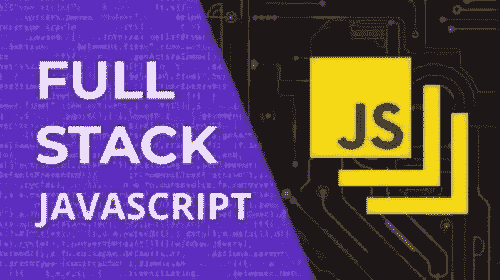
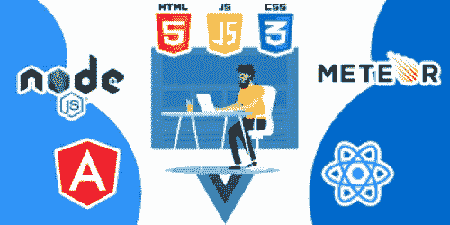

# JavaScript 足以让你成为全栈开发者吗？

> 原文：<https://javascript.plainenglish.io/is-javascript-enough-to-make-yourself-a-fullstack-developer-c2ba0f1e8f07?source=collection_archive---------3----------------------->

## 了解 JavaScript 基础知识及其主要框架会让你成为全栈开发人员吗？你应该花时间学习这种编程语言吗？

Fullstack Javascript

JavaScript 是最著名的编程语言之一。自从 1995 年它的创作者布伦丹·艾奇以摩卡的名字出版它以来，它就一直存在。然后，它令人难以置信地增长了几年甚至几十年。

根据 2021 年 stackoverflow.com 年度开发者调查，是开发者社区中最受欢迎的编程语言。漫长的时间和巨大的社区创造了一个令人难以置信的多样化和有价值的框架和库的生态系统，现在的程序员可以用它来执行许多不同的任务。也许任务太多了。

使用 JavaScript 几乎可以做任何事情，从前端到后端开发，从游戏开发到机器学习，不胜枚举。可能性似乎是无穷的。

因此，许多新开发人员，但也有更有经验的开发人员，决定学习 JavaScript 并把它作为他们唯一的语言，用于全栈工作。在今天的行业中，这可能吗？或者这是一个乌托邦，也许是试图只使用 Javascript 的夸张说法？让我们找出答案。

Frameworks

## **什么是全栈式？**

Fullstack dev

当我们谈论全栈时，我们谈论的是正确处理一个完整的功能性 web 应用程序的前端、后端、数据库和服务器所需的一套技术。比如前端使用的最著名的框架/技术有 Bootstrap、Tailwind CSS、HTML 等等。

在后端领域，广泛使用的有 Laravel、Spring、Django、Flask 和 Ruby on Rails。对于数据库，热门的选择是 PostgreSQL 和 MySQL，而在服务器领域，Apache 和 AWS 是领头羊。这些都是 JavaScript 生态系统中没有的技术。这些只是让你正确理解文章内容的几个例子。现在，让我们深入核心:JavaScript。

## **全栈 JavaScript:足够的框架？**

所以，要做 JavaScript 的全栈开发者，你至少需要有在全栈所有领域工作的可能性，你也需要框架来做到这一点。那么，JavaScript 有所有需要的东西吗？答案是:差不多。而且，这些可能性总是足够好吗？答案是:差不多，再来一次。

如果你对所有最著名的 JavaScript 框架都感兴趣，建议你看一下这篇文章:[*https://JavaScript . plain English . io/JavaScript-most-named-libraries-and-framework-in-2022-90c 6560 F5 ca 4*](/javascript-most-famous-libraries-and-framework-in-2022-90c6560f5ca4)

## **前端:检查**

我们开始吧。你可能知道 JavaScript 的战马是前端。事实上，它就是为这个用例而生的。这个领域有最重要的框架，开发人员最多。最受认可和使用的当然是 React、Angular、Vue.js 和 Svelte。

目前处于开发阶段的大多数网站都使用这些技术中的一种。对于前端，JavaScript 以一种令人敬畏的方式完成工作。此外，这里仍然使用普通的 JavaScript。准确地说，JavaScript 是前端的主要语言，所以它很容易通过这个字段检查这一事实没有严重的疑问。

## **后端:几乎检查**

是的，JavaScript 也用于工作和开发后端。怎么可能呢？JavaScript 不在浏览器上运行吗？是的，但是 Node.js 已经被创建了，现在，由于谷歌 Chrome V8 引擎，它也可以在你自己的机器上运行。因此，您可以使用 JavaScript 和其他一些框架创建自己的后端脚本，让整个开发过程变得更好、更愉快。

这些框架中最著名的是 sure Express，它允许您创建一个敏捷的 API，并以一种简单的方式创建路线。看起来不错，那么为什么只有一个几乎检查？因为 JavaScript，尤其是 Node.js，是一个单线程，这对于更大的项目和后端系统的性能来说可能是一个问题。如果你决定用 Node.js-Express 做一个项目，过一会儿你可能需要扩展它，用这个栈，可能会很困难。像 Java 或 Go 这样的语言更容易扩展，也更好。所以，这就是为什么只有几乎检查。

## **数据库:差不多查完了**

这个也比后端领域弱一点。这不仅仅是因为 MongoDB，一个用 JavaScript 编写的非关系数据库，它与 Node.js 及其所有特性融为一体。这个数据库的性能非常高，可扩展性非常好，而且背后有一家很棒的公司。他们也有他们的在线地图集，在那里你可以托管你的在线数据库，而不是在你自己的机器上。似乎很棒，而且几乎是真的，但是没有足够的选择来说 JavaScript 可以直接处理数据库字段。

事实上，许多人更喜欢使用关系数据库，并将其集成到 Javascript 项目中，这至少需要 SQL，如果不需要其他语言的话。所以…是的，差不多了。

## **服务器:丢失**

要让一些东西在线直播，你需要一个可以托管你的网站的服务器。针对这一特殊需求的最著名的服务是 AWS、谷歌云服务或微软 Azure。这些服务中没有一个仅仅是基于 JavaScript 的，所以这个领域尤其缺失

## **额外版本控制和项目管理工具:缺失**

对于版本控制，我指的是 Git 之类的东西，你可以用它来存储项目当前的演进状态，并将其安装在一些在线服务上，比如 Github、GitLab 或 BitBucket。

对于项目管理工具，我指的是像 Slack、吉拉或 Trello 这样的工具，开发人员用它们从更高的角度检查他们的进度。我什么意思？使用 Git，您可以在第 54 行看到变化，等等，而在 Trello 上，您可以写您修复了导致应用程序崩溃的错误。显然，这里没有 JavaScript。

要想做好这个领域，你还需要非编码技能，比如沟通和时间管理。需要明确的是，这个字段缺失的事实一点都不重要。这几乎是一个额外的，使应用程序的开发敏捷和固化。事实上，对于小型项目来说，版本控制也是必要的。我建议你总是使用 Git

## **结论**

JavaScript 是一种非常棒的编程语言，有大量的用例和潜力，但不能被认为是一种全栈开发的语言。事实上，他需要一些额外的帮助，一些他能完成的任务，并不是它的最佳应用。

当然，如果你选择使用 JavaScript，尽管如此，你还是做了一个很好的选择。

感谢阅读，希望你喜欢它。请订阅。

*更多内容看* [***说白了。报名参加我们的***](http://plainenglish.io/) **[***免费周报***](http://newsletter.plainenglish.io/) *。在我们的* [***社区获得独家访问写作机会和建议***](https://discord.gg/GtDtUAvyhW) *。***