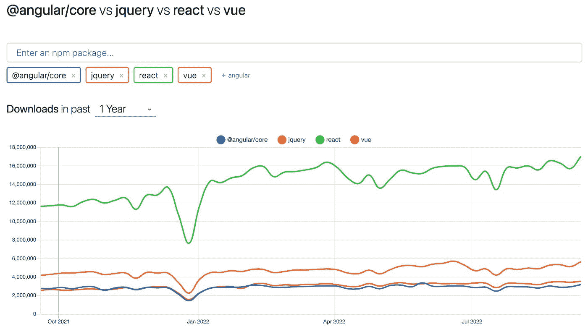

# jQuery 仍然相关吗？

> 原文：<https://javascript.plainenglish.io/is-jquery-still-relevant-58b2e9c1671f?source=collection_archive---------7----------------------->


Illustration by the author

如果您目前正在进行前端开发，您可能会与 jQuery 混淆。目前尚不清楚它的作用、使用原因以及是否值得学习。让我们看看这个问题——从一点历史开始。

# 2008 年 jQuery 是如何帮助程序员的

我的第一份编程工作是在 2008 年。那时，我正在帮助建立网站，当时主要关心的是:它在 Internet Explorer 6 中能工作吗？让网站在浏览器中工作和看起来一样很容易就完成了 50%的前端工作——也是最不有趣的部分。

jQuery 当时在那里帮助解决许多与浏览器环境相关的问题。

# 浏览器兼容性问题

浏览器之间有很多不同。如果你在现代浏览器中测试你的代码，比如火狐或者 Chrome，它不能保证在 Internet Explorer 中工作。CSS 中有很多不同，JS 中稍微少一点。当时的最佳实践是让网站首先在现代浏览器中运行，这样它就可以经受住未来的考验(《T2 》),然后添加所有必要的黑客，使其在旧浏览器中运行。

jQuery 解决了这些问题的一部分——它提供的方法在所有支持的浏览器中都是一样的。所有的解决方法都已从应用程序代码库中删除。有许多库都在 jQuery 之上构建了用户界面(UI)组件——最显著的是 jQuery UI——使用这些库可以使营销界面元素看起来正确并在所有浏览器中工作，从而省去很多麻烦。

# 选择器

CSS 有一个非常合理的从文档中挑选元素的模型:选择器。当时，JavaScript 只在浏览器上使用:所以，JS 和 CSS 被同一个人使用，他们也希望 CSS 选择器在 JS 端。当时，浏览器在本地没有类似的东西。

这是 jQuery 提供的另一个特性。有了它，您可以找到一些简单的 DOM 元素

```
var element = $(‘.some-class’);
```

# 模糊的浏览器 API

第一个版本的 JavaScript 是在 10 天内开发出来的，所以有很多粗糙的边缘。多年来，它的临时性质一直存在。`XMLHttpRequest`是将 JavaScript 转换成可用于开发浏览器端应用程序的语言的一个关键特性——它允许从 JS 向服务器发出额外的请求。使用它的方式不是很好阅读:

```
const request = new XMLHttpRequest();
request.addEventListener("load", function () {
    console.log(this.responseText);
  }
);
request.open("GET", "http://www.example.org/example.txt");
request.send();
```

使用 jQuery，同样的目标可以通过更易读的方式来实现:

```
$.ajax({
 method: "GET",
 url: "http://www.example.org/example.txt",
})
 .done(function( msg ) {
   // or however the result was read in jQuery 1.2
   console.log(msg);
 });
```

# 现代浏览器提供的解决方案

如果您最近才开始前端之旅，那么您在实践中不太可能看到这些问题——除非您正在维护一个与遗留应用程序的 IE 6 接口，该接口在某些企业环境中已经僵化。

多亏了 evergreen 浏览器，我们现在几乎听不到兼容性问题了。如果您的日常业务应用程序工作正常，您可以假设所有浏览器都工作正常。并等待错误报告，以防它们都不一样。

API 问题也得到了解决——我们有了`document.querySelectorAll`和`fetch`,它们提供了一个很好的 API 来执行本地函数的常见操作。

# 仍然是一个非常受欢迎的包

尽管 jQuery 不再是焦点，但它仍然是一个非常受欢迎的包:



如果你[和 React、Vue、Angular](https://npmtrends.com/@angular/core-vs-jquery-vs-react-vs-vue) 比，只有 React 下载量多。你可以期待在很多项目中看到它。尤其是如果您考虑到大量的 jQuery 用法可能不会通过 NPM——许多将使用不推荐的包管理器 Bower 或 CDN 链接。

# 2022 年为什么要用 jQuery？

我看到的主要原因是，你有一个习惯于它的团队——也许不一定是前端开发人员，但也许是内容作者、设计师或营销专家，他们学会了用 jQuery 做事情，并且认为没有理由改变事情。

出于一致性的考虑，您也可以这样做。例如，如果代码库中有 200 个`$.ajax`调用，我会在添加一些`fetch`调用之前三思。这将是一个大重构的开始，我不确定在什么情况下投入这么多精力是有意义的。

# 应该学习 jQuery 吗？

学习它不会伤害你，但是将它引入到一个项目中会让人惊讶。对于绿地项目，默认使用普通 JS 是有意义的。如果你加入了一个大量使用 jQuery 的项目，你很可能通过阅读文档(我为它写了一个[指南](https://how-to.dev/how-to-read-the-documentation))和从其余代码库中获取代码示例，在工作中很好地学习它。

# 你呢？

你自己在用 jQuery 吗？你经常在项目或工作邀请中看到它吗？在评论中分享你的 jQuery 故事吧！

*最初发布于*[*https://how-to . dev*](https://how-to.dev/is-jquery-still-relevant)*。*

*更多内容请看*[***plain English . io***](https://plainenglish.io/)*。报名参加我们的* [***免费周报***](http://newsletter.plainenglish.io/) *。关注我们关于*[***Twitter***](https://twitter.com/inPlainEngHQ)[***LinkedIn***](https://www.linkedin.com/company/inplainenglish/)*[***YouTube***](https://www.youtube.com/channel/UCtipWUghju290NWcn8jhyAw)*[***不和***](https://discord.gg/GtDtUAvyhW) ***。*****

*****对缩放您的软件启动感兴趣*** *？检查* [***电路***](https://circuit.ooo?utm=publication-post-cta) *。***