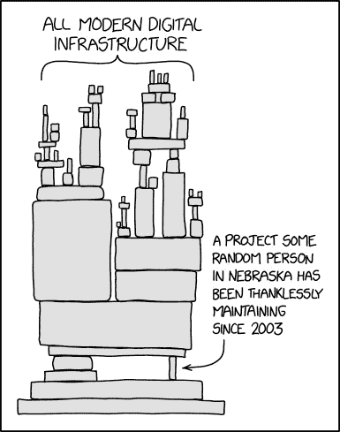

# 开源激进主义是一种威胁吗？

> 原文：<https://javascript.plainenglish.io/is-open-source-activism-a-threat-26dde5d4c81e?source=collection_archive---------15----------------------->

## 开源安全

## 故意破坏开源包。

当使用免费开源软件时，你已经习惯于看到漏洞和恶意软件包的新闻，但是最近的事件展现了对你的供应链风险自助餐的一种新的威胁:**开发者行动主义**。

通过**故意破坏**你所依赖的包并破坏你的构建——目的是让他们自己的议程得到认可。您正在使用的每个依赖项，可能有数百个，都是这些“攻击”的潜在候选者。

## 发生了什么事？

Photo by [Nahel Abdul Hadi](https://unsplash.com/@nahelabdlhadi?utm_source=medium&utm_medium=referral) on [Unsplash](https://unsplash.com?utm_source=medium&utm_medium=referral)

2022 年 1 月 8 日，广泛使用的 npm 软件包“colors”的开发者发布了一个新版本， *colors@1.4.1。*

新版本引入了一个无限循环——实质上破坏了所有依赖它的应用程序。几天前，来自同一个维护者的另一个包 *faker* 收到了一个新的主要版本 *faker@6.6.6* 完全删除了包中的源代码——使它变得毫无用处。

最初被解释为供应链攻击的攻击，经过进一步的调查，被证明是针对使用自由/开源软件的大公司的一种表现，而没有对开发者进行补偿(阅读全文[这里](https://www.bleepingcomputer.com/news/security/dev-corrupts-npm-libs-colors-and-faker-breaking-thousands-of-apps/)，这是一个有趣的阅读)。

这是一个道德上有问题的举动，给全球的开发人员带来了大量的问题——尽管有些人认为维护人员完全有权利对他们的代码做任何他/她想做的事情。

## 我如何减轻事故？

缓解这个问题很简单——恢复或锁定对先前版本 *colors@1.4.0* 和 *faker@5.5.3* 的依赖。此外，在*颜色*的情况下， [npmjs](https://npmjs.org) 已经移除了损坏的版本，确保后续下载获得工作版本。

从长远来看，用户应该考虑迁移到其他库，让维护者计划继续开发。

以后其他类似事件怎么办？一个担心是事件会在其他连接的 OSS 项目中重复出现。此外，这类行为通常会鼓励有相同想法的模仿者。

无论是现在还是将来，完全避免损坏的软件包不是更好吗？这是我和我在 Bytesafe 的同事去年讨论的主题之一，后来设计了一个提供长期解决方案的功能，我们称之为[延迟上游](https://bytesafe.dev/posts/safety-delay-protect-from-compromised-versions/)，它允许你和开源社区有时间做出反应，过滤这种恶意行为。

# 行动主义——像供应链攻击一样执行

对 *colors* 和 *faker* 的破坏为开源社区正在进行的关于为开源维护者的工作提供公平报酬的讨论带来了新的曙光。由于花费了巨大的努力来修补大量的漏洞，这是开源开发者无偿过度工作的一个典型例子。

Dependency on open source according to xkcd.com, source: [https://xkcd.com/2347/](https://xkcd.com/2347/)

这一事件与最近的供应链攻击 [ua-parser-js、coa 和 rc](https://bytesafe.dev/posts/case-study-protecting-every-part-of-the-organization-from-malicious-threats/) 有几个共同的特征，在这些攻击中，有害代码传播到广泛的流行依赖库和不知情的用户。在这些情况下，船只被帐户接管，而在这种情况下，它是由合法的维护者。
但是任何故意破坏包依赖的行为本质上都是恶意的，应该被阻止。

开源社区对该事件的总体看法一直存在分歧。许多开发人员都在考虑让开源工作更具可持续性，最终改善社区。
但是对执行情况的总体调查是负面的，打破了开发者之间心照不宣的信任，浪费了资源来纠正错误，而像[软件许可](https://bytesafe.dev/posts/automated-continuous-license-compliance/)这样的其他货币化选择本应得到考虑。

**不管对事件的看法如何，有一件事是清楚的**:组织有更多的动机和证据证明他们必须采取行动保护他们的供应链免受任何旨在拒绝你的服务功能的行动。

## 阻止新发布的包，直到安全延迟过去

Photo by [Erik Mclean](https://unsplash.com/@introspectivedsgn?utm_source=medium&utm_medium=referral) on [Unsplash](https://unsplash.com?utm_source=medium&utm_medium=referral)

这种供应链攻击模式的出现和被开源社区迅速补救，确保了问题不会在野外持续太久。但是尽管如此，这当然会给依赖最新版本来构建应用程序的人带来很多问题。我们@ bytesafe 考虑到这一点，设计了一个我们称之为 Delay Upstream 的功能。

作为依赖性防火墙一部分的[延迟上游](https://docs.bytesafe.dev/policies/delay-upstream/)策略在允许新版本到达您的代码之前启用了一个自定义的“时间缓冲”。

通过给数百万开源用户一个评估新版本的机会，您可以防止关键的漏洞和恶意软件包进入您的应用程序。让我们面对现实吧，您很少需要所有包中最新最棒的包立即可用于您的应用程序。

在设定的延迟过去之前，npmjs、Maven Central 和 NuGet Gallery 等公共库的新版本对您不可用。Bytesafe 会自动为您选择其他最新的和允许的版本，而不会中断您的构建。

## 可定制的延迟以满足您的需求

期望的“发布后的成熟度”是什么，在不同的组织之间是不同的。在 Bytesafe 工作区中，延迟完全可以根据注册表进行自定义。

根据每个生态系统的需求进行调整，对 npm 强制延迟 3 周，而对 maven 和 NuGet 使用 2 个月——如果它适合您的话。
您的组织可以在延迟(安全性)和访问新功能之间找到合适的平衡。

# 希望保护您的供应链吗？

[bytes safe](https://bytesafe.dev/)提供了一个依赖防火墙，保护不同源代码生态系统的私有注册中心。允许组织审查并有意识地决定他们用于[安全供应链](https://bytesafe.dev/posts/preventing-supply-chain-attacks/)的依赖关系。

记住——如果你广泛使用开源库——考虑支持它和它的维护者。为所有人提供一个更好更安全的开源社区。

*更多内容看* [***说白了。报名参加我们的***](http://plainenglish.io/) **[***免费周报***](http://newsletter.plainenglish.io/) *。在我们的* [***社区不和谐***](https://discord.gg/GtDtUAvyhW) *获得独家获取写作机会和建议。***