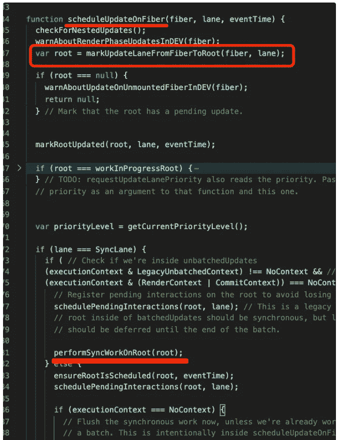
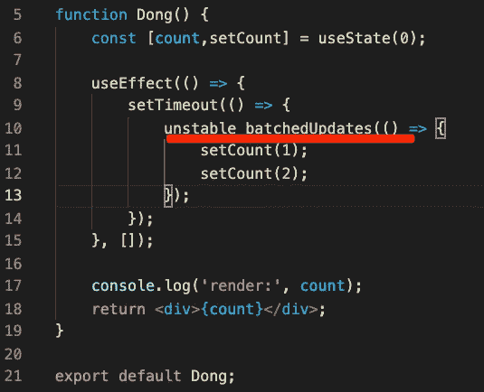

# React 中 setState 是同步执行还是异步执行？

> 原文：<https://javascript.plainenglish.io/is-setstate-executed-synchronously-or-asynchronously-in-react-9b81d67f3e03?source=collection_archive---------2----------------------->

## 找出在 React 中 setState 是同步执行还是异步执行。

Photo by [Blake Verdoorn](https://unsplash.com/@blakeverdoorn?utm_source=medium&utm_medium=referral) on [Unsplash](https://unsplash.com?utm_source=medium&utm_medium=referral)

setState 是同步的还是异步的？它必须是异步的。你确定吗？然后看看这段代码输出了什么。

状态在 setTimeout 中被修改两次，并且状态的值被打印出来。如果是异步的，它应该打印 count 没有被修改，仍然是 0，所以它打印 0 两次。然后初始化渲染一次，setState 再次渲染后应该渲染两次，计数分别为 0 和 2。异步分析确实应该如此。我们执行吧。

我们发现这两个打印是 1 和 2，也就是说 setState 同步修改了状态，然后每次都触发渲染，所以渲染了 3 次，分别是 0，1，2。所以 setState 是同步的？你确定吗？然后看看这段代码输出了什么。

如果 setState 是同步的，它将在执行后修改状态并应分别打印 1、2 和 3，然后触发 render 三次，加上第一次，总共四次，打印 0、1、2 和 3。我们执行吧。

三次打印都是 0，这意味着 setState 是异步的。并且三个 setStates 只触发了一次 render，加上第一次 render，两次，打印 0 和 3。什么鬼，怎么又异步了？不仅是类组件的 setState，还有函数组件的 useState。例如，如果状态被修改三次，它将只呈现一次。

在 setTimeout 中，每次修改状态时，都会呈现:

是不是有点混乱，setState 什么时候同步，什么时候异步？我们来看看 setState 的源代码。首先，我们来了解一下 React 渲染的流程。

## 反应渲染流

react 通过 JSX 描述接口，可以通过 babel 等编译器编译成渲染函数，然后执行产生 vdom。

该 vdom 不是直接渲染的，而是首先转换成纤维，然后进行渲染。由于 vdom 中的每个节点只记录子节点，而不是兄弟节点，因此必须不间断地同时渲染。转换成纤程的链表结构会记录父(返回)、子(子)和兄弟(兄弟)节点，所以它变得可中断。这里 vdom 是 React 元素对象。

在转换成纤维后，它是 FiberNode 的对象:

从 vdom 转换到纤程的过程称为 reconcile，它在这个过程中创建相应的 dom 元素，然后在所有转换完成后立即提交到 dom。这个过程不是一次性的，而是由调度程序执行的，所以它可以批量执行，这意味着它可以被中断。这是 React 的纤程架构下的渲染过程。理论说完了，让我们看看源代码(这里是 v17 源代码)。

React 调用调度和协调渲染阶段，这是将 vdom 转换为纤程的阶段。(schedule 只是允许 reconcile 执行多次，可以被中断，但是它做的事情是一样的，所以 schedule 也是渲染阶段的一部分)。将纤程更新为 dom 的过程称为提交阶段。源代码中的等效代码如下

这个 performSyncWorkOnRoot 是渲染的入口点，如前所述，它首先执行渲染阶段，将 vdom 转换为纤程，然后执行提交，更新为 dom。渲染阶段执行一个调度循环:

这个循环是不断处理一个又一个纤程的协调:

每个节点有两个阶段:beginWork 和 completeWork，因为 vdom 为纤程，而 vdom 是树形结构，需要递归处理。

不同节点的协调逻辑不同:

例如，将调用函数组件来获取呈现的 vdom 并继续协调:

例如，类组件将创建一个实例，调用 render 方法，获取 vdom，然后继续处理 renconcileChildren。

简而言之，vdom 到光纤是一个递归过程。之后，将进入提交阶段。整个渲染过程的入口点是 performSyncWorkOnRoot 函数。渲染过程完成后，下一步是 setState 如何触发渲染过程。

## setState 的流程

我们知道渲染的入口点是 performSyncWorkOnRoot 函数，那么在 setState 修改状态后触发这个函数还不够吗？确实如此。setState 调用 dispathAction 创建一个 update 对象放在纤程节点的 updateQueue 上，然后调度呈现。

调度更新自然意味着调度上面描述的 performSyncWorkOnRoot 函数。React 将首先从触发更新的纤程中找到根纤程节点，然后调用 performSyncWorkOnRoot 函数来呈现它:

这是在 setState 之后触发重新呈现的实现。这是我们控制 setState 是同步还是异步的地方。我们看到判断条件中有一个 excutionContext，用来标识当前环境，比如是批处理还是非批处理，是否执行了 render 阶段或者 commit 阶段。执行 ReactDOM.render 时，首先调用 unbatchUpdates 函数。

此函数在 excutionContext 中设置一个 unbatch 标志:

以便在进行更新时，将立即执行 performSyncWorkOnRoot 进行渲染。因为第一次渲染是立即完成的，所以不需要安排时间。

此后，当我们到达提交阶段时，将设置一个提交标志:

然后再次设置 State，这样它就不会转到 unbatch 分支。**那么为什么 setTimeout 里面的 setState 是同步执行的呢？**因为直接从 setTimeout 执行的异步代码没有设置为 excutionContext，所以转到 NoContext 分支，立即渲染。(这里的 flush 最终会调用 performSyncWorkOnRoot 函数进行渲染)。

有没有办法让 setTimeout 中执行的函数也有一个 excutionContext？React17 公开了 batchUpdates API，它将 setState 封装在其中，并批量执行它:

它的源代码实际上设置了 excutionContext:

这样当 setState 全部执行完再刷新时，调用 peformSyncWorkOnRoot 进行渲染，效果就是一个批处理 setState。事实上，根据定义，setState 不能被异步调用，或者在同一个调用堆栈中执行，只是顺序不同。只能称之为批量或非批量。react17 就是这样处理的。如果我们使用 react18 中的 createRoot API，就不会有这个问题，甚至 setTimeout 中的代码也可以批量执行。

为了与 React17 兼容，进行了特殊处理，以便在未启用并发模式时，即仍使用 ReactDOM.render API 时，不指定 excutionContext，而是立即呈现:

等 React 18 普及了，所有的 setState 都是批处理的，就不会再有批处理和非批处理的问题了。

## 摘要

虽然我们说的是同步异步 setState，但这并不是像 setTimeout 或者 Promise 那样的异步，而只是 setState 之后状态是否立即改变，是否立即呈现。

我们梳理了 React 的渲染过程，包括渲染阶段和提交阶段，渲染阶段是从 vdom 到 fiber 的过渡，包括调度和调和，提交阶段是 fiber 到 dom 的更新。功能。

setState 创建一个 update 对象来挂钩纤程对象，然后调度 performSyncWorkOnRoot 来重新呈现它。

在 React 17 中，setState 是批量执行的，因为 executionContext 是在执行前设置的，但是在 setTimeout 和事件监听器这样的函数中，executionContext 是不设置的，setState 是同步执行的。您可以将 batchUpdates 函数包装在外部，并手动设置 excutionContext 以切换到异步批处理执行。

在 React 18 中，如果使用 createRoot API，就不会有这个问题。

在 React 18 普及之后，setState 是同步还是异步的问题就不是问题了，因为所有的 setState 都是批量异步执行的。

**请关注我，阅读更多高质量文章。**

*更多内容请看*[***plain English . io***](https://plainenglish.io/)*。报名参加我们的* [***免费周报***](http://newsletter.plainenglish.io/) *。关注我们关于*[***Twitter***](https://twitter.com/inPlainEngHQ)**和*[***LinkedIn***](https://www.linkedin.com/company/inplainenglish/)*。查看我们的* [***社区不和谐***](https://discord.gg/GtDtUAvyhW) *加入我们的* [***人才集体***](https://inplainenglish.pallet.com/talent/welcome) *。**