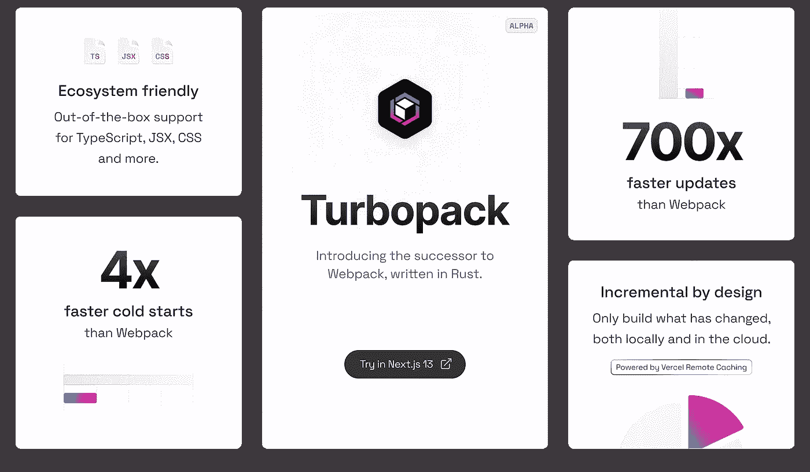
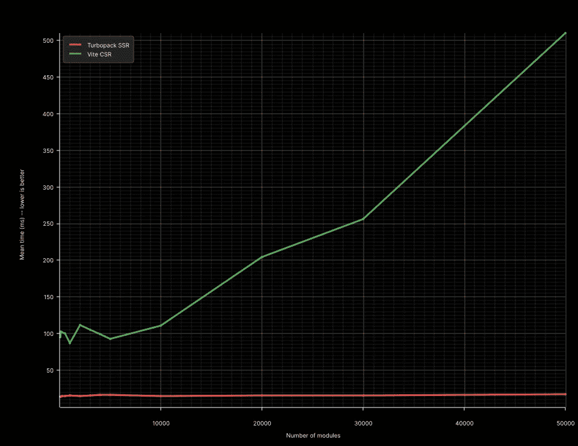
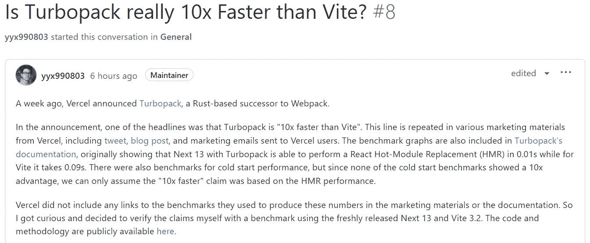

# Turbopack 真的比 Vite 快 10 倍吗？

> 原文：<https://javascript.plainenglish.io/is-turbopack-really-10x-faster-than-vite-bd9c70837990?source=collection_archive---------0----------------------->

## Turbopack 是一个增量捆绑器，构建了一个针对 JavaScript 和 TypeScript 优化的系统——看看它与 Vite 相比如何

Photo by [Joshua Aragon](https://unsplash.com/@goshua13?utm_source=medium&utm_medium=referral) on [Unsplash](https://unsplash.com?utm_source=medium&utm_medium=referral)

**vue . js 的创造者**尤玉玺认为，开源软件的竞争应该建立在开放交流、公平比较、相互尊重的基础上。因此，当他看到 Vercel 使用精心挑选、未经审查和误导的数据进行营销时，他感到失望和担忧，这种情况通常只会发生在商业竞争中。

Vercel 在上周的 Next.js Conf 大会上发布了 Next.js 13，宣布了其最新的开源项目: **Turbopack** 。Turbopack 是一个增量捆绑器，构建了一个针对 JavaScript 和 TypeScript 优化的系统，用 Rust 编写，并声称是 Webpack 的继任者。

Turbopack 来自 Webpack 作者 Tobias Koppers，这是他去年加入 Vercel 后领导的核心项目。Tobias 深入参与了 Turbopack 的开发。

官方在推广 Turbopack 时，强调了它的速度——号称热更新速度比 Webpack 快 700 倍，比 Vite 快 10 倍；冷启动速度比 Webpack 快 5 倍。这是因为 Turbopack 在捆绑时只拉入最少的所需资源，因此冷启动时间非常快。Turbopack 声称，在一个有 3000 个模块的应用程序中，冷启动时间为 1.8 秒，而 Vite 和 Webpack 的冷启动时间分别为 11.4 秒和 16.5 秒。

另外，根据 Turbopack 的官方解释，它是基于一个用 Rust 编写的增量计算引擎 Turbo。Turbo 可以实现细分到函数粒度的结果缓存，支持内存缓存，未来还会有持久缓存和远程缓存，以及支持按需编译，最大限度减少计算量。

Turbopack 声称热更新速度比 Vite 快 10 倍，但由于 Turbopack 在发布时并没有提供这些对比数据的基准， **Yuxi You** ，Vue.js 和 Vite 的创造者，在 HMR 创建了一个比较 Vite 和 Turbopack 的基准。(模块热加载)，并在 [GitHub 库](https://github.com/yyx990803/vite-vs-next-turbo-hmr)中公开测试方法和数据。

最终测试结果表明，涡轮包的热负荷速度比 Vite 快，但不是 10 倍。游于希承认两者的差距，希望 Vercel 能提供更透明的基准，在营销过程中使用更准确的表达方式。

就在今天，Turbopack 宣布了性能基准测试方法，并将其基准测试结果提供给公众进行验证。要运行基准测试，请查阅 Turbopack 基准测试文档。

下图是 Vite 和 Turbopack 的 HMR 性能测试对比。Turbopack 表示，当应用程序中的模块数量超过 30k 时，Turbopack 的 HMR 比 Vite 快 10 倍。而且随着模块数量的增加，差距更加明显——当模块数量超过 50k 时，Turbopack 比 Vite 快 20 倍。

关于 Turbopack 姗姗来迟的性能基准，**尤羽西**再次发声，说“Turbopack 真的比 Vite 快 10 倍吗？”

**游宇熙**看了 Turbopack 的基准测试后，发现他的测试方法和环境与 Turbopack 大相径庭。例如，Vite 使用默认的基于 Babel 的 React 插件，而不是 RSC，但在 Next.js RSC 中它是默认启用的。在这个前提下，这种性能比较缺乏一个公平的场景。即使是小数点，Turbopack 也选择了对自己有利的方式——turbo pack 的 15 毫秒四舍五入到 0.01 秒，Vite 的 87 毫秒四舍五入到 0.09 秒。

# 最后

**感谢阅读**。期待您的关注，阅读更多高质量的文章。

[omgzui](https://medium.com/@omgzui?source=post_page-----bd9c70837990--------------------------------)

## 更好的编程

[View list](https://medium.com/@omgzui/list/better-programing-9b4c9bb174aa?source=post_page-----bd9c70837990--------------------------------)109 stories

[omgzui](https://medium.com/@omgzui?source=post_page-----bd9c70837990--------------------------------)

## 新闻

[View list](https://medium.com/@omgzui/list/news-67ec0a972660?source=post_page-----bd9c70837990--------------------------------)23 stories

*更多内容请看*[***plain English . io***](https://plainenglish.io/)*。报名参加我们的* [***免费周报***](http://newsletter.plainenglish.io/) *。关注我们关于*[***Twitter***](https://twitter.com/inPlainEngHQ)[***LinkedIn***](https://www.linkedin.com/company/inplainenglish/)*[***YouTube***](https://www.youtube.com/channel/UCtipWUghju290NWcn8jhyAw)*[***不和***](https://discord.gg/GtDtUAvyhW) *。对增长黑客感兴趣？检查* [***电路***](https://circuit.ooo/) *。***