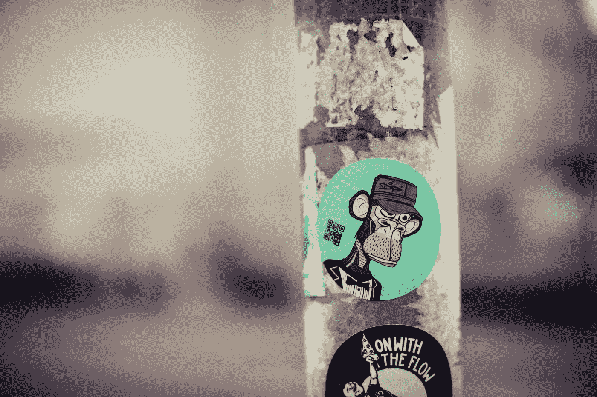

# Web 3.0 正在消失，甚至没有被注意到吗？

> 原文：<https://javascript.plainenglish.io/is-web-3-0-fading-away-without-even-being-noticed-4636e98cd96f?source=collection_archive---------10----------------------->

## 你可能已经看到了去年围绕 Web3 的大肆宣传，但现在情况似乎有很大不同。

Photo by [Markus Spiske](https://unsplash.com/@markusspiske?utm_source=medium&utm_medium=referral) on [Unsplash](https://unsplash.com?utm_source=medium&utm_medium=referral)

“互联网”这个词本身定义了人类知识的真正潜力，并显示了技术在当今时代的强大地位。

Web1 确实是向全球所有人介绍了互联网。这真是一个奇迹。这被证明是一场独一无二的革命。它允许用户在线阅读发布在不同网站上的信息。

因此，我们可以说 Web1 的引入是从只读模式开始的。它是动态的，网站不是交互式的。

为了克服这个缺点，我们推出了 Web2，它可以说是我们目前正在使用的互联网。Web2 充满了高端技术。

Web2 拥有一切。它包括所有的社交媒体平台到所有的信息网站。你今天在互联网上看到的一切都是基于 Web2 的。Web2 使用您的个人数据为您提供最佳推荐。

我们一直在使用 Web2，它对于像我们这样的普通用户来说非常强大。

## 那到底怎么了？

几年来，人们一直认为应该允许用户在互联网上做任何事情，因为没有人拥有互联网。

人们得到了这种意识形态的关注，因为这是完全真实的，“没有人拥有互联网”。

那么，像谷歌这样的大玩家为什么要控制不属于任何人的东西呢？为什么有一个权力机构来阻止人们说他们想说的话，除了所有非法的事情。

世界各地的人们问了两个“为什么”。

每个人都想要可以由每个人自由操作的东西。没有禁止你想看的合法内容。

人们想要一个没有统治者的自我管理的互联网，因此“去中心化”一词应运而生。

## Web 3.0

“Web3”这个词被许多技术爱好者抛出，它将在区块链工作，并将完全分散。“没有人会拥有 Web3”是探索 Web3 技术背后的座右铭。

因此，Web3 变得非常受欢迎，尤其是在所有认为自己有机会获得机会的新一代创作者中，因为当前的 Web2 被现有的大创作者完全饱和，只有少数新创作者有机会展示自己。

Web3 承诺的安全性是其他任何一代互联网都无法承诺的。它在以太坊区块链上工作，被证明是目前最安全可靠的技术。

## 然后发生了什么？

Web3 应该是 Web2 的继任者，但为什么没有发生，为什么我们还在使用 Web2。

再次有大量的“为什么”…

因为再一次没有人拥有 Web3，因此除了以太坊开发团队之外，没有强大的团体可以向用户承诺他们需要什么。但这并不是唯一的例子。

当事情开始分崩离析时，Web3 形象变得更糟。

我们在 Web2 中使用不同的支付方式，这些方式与我们的银行直接关联，很容易被跟踪。政府机构和用户可以看到交易的细节。这在现代社会是一件好事。

但是在 Web3 中，情况有所不同。要进行支付，你只需要被称为加密货币的代币。要付钱给某人，你只需要他们的身份证，仅此而已。没有名字，没有身份，什么都没有。

如果这里出了什么问题，那就很难了。要在 Web3 中进行交易，你需要向矿工支付一笔使用区块链技术的费用，称为天然气费。权力下放有好有坏，完全取决于具体情况。

## 事情变得更糟了

更糟糕的是，不仅加密货币，而且使用区块链技术的 NFT 也与 Web3 的名字联系在一起。

NFT 是一种在区块链的帮助下将数字资产的所有权交给某人的技术。老实说，这是一项令人印象深刻的革命性技术。

但是，这已经饱和了…

你听说过那些高价出售猿类图像的 NFT 大牌吗？许多艺术家实际上从这些公司购买了数千美元的 NFT，目前，如果炒作消失，它在现实生活中没有任何价值。

老实说，这完全因人而异，买一只猩猩来代表你的富有地位完全是你的想法。NFT 作为一个独立的是一个完全惊人的技术。

但是 Web3 还没有准备好，因为它似乎已经被经营 NFT 和其他资产的新的大玩家饱和了。

你也知道脸书更名为元宇宙，并将在区块链和 NFTs 的基础上创建一个元宇宙。这与之前承诺的没有大玩家会统治互联网完全不同，事实上，所有的大玩家都在创造 Web3 来间接统治互联网。

[*Web3 技术*](/what-is-web3-is-it-the-new-internet-and-why-should-you-know-about-it-1422195bf092) 似乎是一项非常有前途的技术，但它目前还没有准备好，因此甚至 [*埃隆·马斯克试图暗示与其相关的所有缺点*](https://medium.datadriveninvestor.com/does-elon-musk-hate-the-idea-of-web-3-0-nft-and-blockchain-technology-ff7b28601c17) ，这似乎是真的。如果我们将 Web3 视为一项独立的技术，那么毫无疑问，它是革命性的，但事情变得越来越糟糕。这就是它，希望你能发现它的信息。

关于我——我是*科技*和*自我提升、* [*的顶级作家点击这里*](https://aniketz.medium.com/) *阅读更多我的文章。*

如果你想购买 5 美元的中等会员， [*点击这里*](https://aniketz.medium.com/membership) (当你使用 [*这个链接*](https://aniketz.medium.com/membership) 购买中等会员，我会从你的会员费中抽取一小部分作为佣金，不需要你额外付费)。如果您想订阅我的电子邮件列表，请点击这里**。**

* [## 通过我的推荐链接加入 Medium-Aniket

### 作为一个媒体会员，你的会员费的一部分会给你阅读的作家，你可以完全接触到每一个故事…

aniketz.medium.com](https://aniketz.medium.com/membership)* 

*[**通过电子邮件获取我的文章点击这里**](https://aniketz.medium.com/subscribe) **|** [**购买 5 美元中等会员**](https://aniketz.medium.com/membership)*

**更多内容请看*[***plain English . io***](https://plainenglish.io/)*。报名参加我们的* [***免费周报***](http://newsletter.plainenglish.io/) *。关注我们*[***Twitter***](https://twitter.com/inPlainEngHQ)*和*[***LinkedIn***](https://www.linkedin.com/company/inplainenglish/)*。查看我们的* [***社区不和谐***](https://discord.gg/GtDtUAvyhW) *加入我们的* [***人才集体***](https://inplainenglish.pallet.com/talent/welcome) *。**