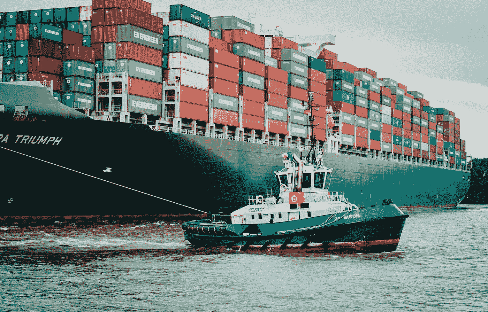

# 它又发生了——NPM 供应链攻击

> 原文：<https://javascript.plainenglish.io/it-happened-again-npm-supply-chain-attack-4ce6979e4296?source=collection_archive---------6----------------------->

Photo by [Mika Baumeister](https://unsplash.com/@mbaumi?utm_source=medium&utm_medium=referral) on [Unsplash](https://unsplash.com?utm_source=medium&utm_medium=referral)

几个月前，一位 NPM 的 2 个著名软件包的作者发布了新的补丁版本，删除了项目中的所有代码，除了一个控制台日志循环。这导致了一些问题，但最终与可能发生的情况相比还是相当温和的。然而，几个月后，我们现在有了第二个攻击 NPM 包裹的例子。这次是用恶意代码。

# **peacenotwar 和 node-ipc**

`node-ipc`包与第二个包`peacenotwar`捆绑在一起。`peacenotwar`软件包是一个将反战文件放在你桌面上的程序。此外，`node-ipc`还有一段额外的代码[,如果你身处一个卷入当前冲突的国家，这段代码就会运行。它会用红心表情符号递归替换你所有的文件(❤️).](https://gist.github.com/ckcr4lyf/6d96c2bf42ec31c6362053ea275d80d5)

似乎这不仅影响到个人，也影响到一个在白俄罗斯等国家与举报人合作的美国非政府组织。这是我们处理依赖性方式中的一个严重缺陷。

 [## 受你鲁莽影响的美国非政府组织第 45 期

### 此时您不能执行该操作。您已使用另一个标签页或窗口登录。您已在另一个选项卡中注销，或者…

github.com](https://github.com/RIAEvangelist/peacenotwar/issues/45) 

# **那么我们该如何预防呢？**

我以前写过一篇关于这个主题的文章，在那里我讨论了减轻这些问题的方法。我们开始看到更多这样的供应链攻击，我们需要开始保护自己免受其害。最简单的方法是锁定您的依赖项，并在升级之前在安全的环境中测试更改。

 [## 如何保护你的应用免受恶意依赖

### 早在一月份，两个流行的开源库的维护者发布了折衷的新版本库…

javascript.plainenglish.io](/how-to-protect-your-app-from-malicious-dependencies-da640f8c8143) 

如果您在企业环境中，您应该与您的团队讨论这一点，并根据您的威胁模型，寻找即使在开发环境中也能缓解这一问题的方法。

# **这对未来意味着什么**

多年来，我们一直对自己的做事方式沾沾自喜，但现在我们开始看到我们目前的做事方式实际上有多危险。我希望当涉及到第三方依赖时，人们开始认真对待他们的生产和开发环境的安全性。我认为有一个新的工具市场，可以帮助更好地跟踪依赖性及其潜在的权衡，这给了我一些未来项目的想法。

*更多内容请看*[***plain English . io***](https://plainenglish.io/)*。报名参加我们的* [***免费周报***](http://newsletter.plainenglish.io/) *。关注我们关于*[***Twitter***](https://twitter.com/inPlainEngHQ)*和*[***LinkedIn***](https://www.linkedin.com/company/inplainenglish/)*。加入我们的* [***社区不和谐***](https://discord.gg/GtDtUAvyhW) *。*