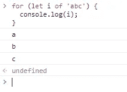
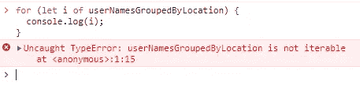
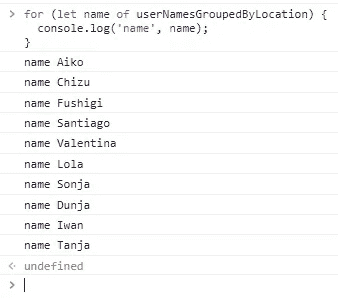
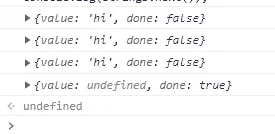
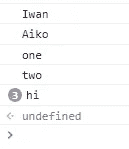
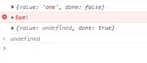

# JavaScript 中的迭代器和生成器:完全指南

> 原文：<https://javascript.plainenglish.io/iterators-and-generators-in-javascript-a-complete-guide-cd91566ae864?source=collection_archive---------7----------------------->

## 我们将深入探讨 JavaScript 迭代器和生成器


Photo by [Marc Schulte](https://unsplash.com/@marc_schulte?utm_source=medium&utm_medium=referral) on [Unsplash](https://unsplash.com?utm_source=medium&utm_medium=referral)

随着 [ES6](https://262.ecma-international.org/6.0/) 的出现，迭代器和生成器被正式添加到 JavaScript 中。迭代器和生成器内置于核心语言中，提供了一种定制`[for…of](https://developer.mozilla.org/en-US/docs/Web/JavaScript/Reference/Statements/for...of)`循环行为的方式。

**迭代器**让你可以遍历任何符合规范的对象。在第一节中，我们将学习如何利用迭代器使任何对象都是可迭代的。

在本文的第二部分，我们将深入探讨**生成器**:它们是什么，如何使用它们，以及它们什么时候有用。

## 什么是迭代器？

在理解生成器之前，我们必须先掌握 JavaScript 中的迭代器，因为这两个概念是交织在一起的。阅读完本节后，很明显生成器是编写迭代器的一种更安全的方法。

迭代器，顾名思义，允许你遍历一个对象(数组也是对象)。

您可能以前使用过 JavaScript 迭代器。例如，每次迭代数组时都会用到迭代器，但是它们也可以用来迭代`Map`对象甚至`string`。

```
for (let i of 'abc') {
  console.log(i);
}
```



`for…of`可用于迭代任何实现[可迭代协议](https://developer.mozilla.org/en-US/docs/Web/JavaScript/Reference/Iteration_protocols)的对象。

如果再深入一点，返回迭代器对象的`@@iterator`方法可以用来使任何对象可迭代。

## 使任何对象都是可迭代的

最好看一个构造常规对象 iterable 的例子来理解这一点。

我们从一个按城市组织的用户名集合开始，**就像 Money Heist :)** :

```
const userNamesGroupedByLocation = {
  *Tokyo*: [
    'Aiko',
    'Chizu',
    'Fushigi',
  ],
  'Nairobi': [
    'Santiago',
    'Valentina',
    'Lola',
  ],
  'Moscow': [
    'Sonja',
    'Dunja',
    'Iwan',
    'Tanja',
  ],
};
```

我选择这个例子的原因是很难用这种数据结构迭代用户；我们不得不使用许多循环来检索它们。

如果我们尝试在此对象的当前状态下对其进行迭代，我们将收到以下错误:



因为它明确指出`userNamesGroupedByLocation`是不可迭代的。

> 我们必须首先添加`@@iterator`函数来使这个对象可迭代。`Symbol.iterator`让我们接触到这个符号。

```
userNamesGroupedByLocation[Symbol.iterator] = function() {
  // ...
}
```

如前所述，迭代器函数返回一个迭代器对象。在`next`下，object 有一个函数，返回一个有两个属性的对象:`done`和`value`。

```
userNamesGroupedByLocation[Symbol.iterator] = function() {
  return {
    next: () => {
      return {
        done: true,
        value: 'hi',
      };
    },
  };
}
```

迭代的当前值存储在`value`中，`done`是一个布尔值，表示执行是否完成。

> 开发这个函数的时候，一定要非常注意`done`的值，好像总是`false`，就会出现无限循环。

上面的代码示例已经展示了如何正确实现 iterable 协议。我们可以通过调用迭代器对象的`next`函数来测试它。

```
// Calling the iterator function returns the iterator object
const iterator = userNamesGroupedByLocation[Symbol.iterator]();
console.log(iterator.next().value);
// "hi"
```

> 在底层，使用`for…of`迭代一个对象使用了`next`函数。

因为我们立即将`done`设置为`false`，在这种情况下使用`for…of`将不会产生任何结果。通过这样做，我们也不会获得任何用户名，这就是为什么我们首先要使这个对象可迭代。

## 实现迭代器函数

首先，我们必须能够访问表示城市的对象的键。这可以通过对`this`关键字执行`Object.keys`来获得，该关键字对应于函数的父对象，在本例中是`userNamesGroupedByLocation`对象。

如果我们用关键字`function`定义了 iterable 函数，我们只能通过`this`访问这些键。如果我们使用一个箭头函数，这将不起作用，因为它们继承了它们的父类的作用域。

```
const cityKeys = Object.keys(this);
```

我们还需要两个变量来跟踪我们的迭代:

```
let cityIndex = 0;
let userIndex = 0;
```

> 这些变量在迭代器函数中的`next`函数之外定义，允许我们在迭代中保存数据。

使用我们之前设置的索引，我们必须首先在`next`函数中收集当前城市和当前用户的用户数组。

我们现在可以使用这些信息来调整返回值。

```
return {
  next: () => {
    const users = this[cityKeys[cityIndex]];
    const user = users[userIndex];

    return {
      done: false,
      value: user,        
    };
  },
};
```

然后，索引必须随着每次迭代而递增，除非我们到达了特定城市的最后一个用户，在这种情况下，我们将`userIndex`设置为`0`，并递增城市索引。

```
return {
  next: () => {
    const users = this[cityKeys[cityIndex]];
    const user = users[userIndex];

    const isLastUser = userIndex >= users.length - 1;
    if (isLastUser) {
      // Reset user index
      userIndex = 0;
      // Jump to next city
      cityIndex++
    } else {
      userIndex++;
    }

    return {
      done: false,
      value: user,        
    };
  },
};
```

确保不要使用`for…of`来迭代这个对象。这将导致无限循环，因为`done`总是等于`false`。

最后一步是包含一个将`done`设置为`true`的退出条件。当我们遍历完所有的城市后，我们将离开这个循环。

```
if (cityIndex > cityKeys.length - 1) {
  return {
    value: undefined,
    done: true,
  };
}
```

在我们把所有的东西放在一起之后，我们的函数看起来会像这样:

```
userNamesGroupedByLocation[Symbol.iterator] = function() {
  const cityKeys = Object.keys(this);
  let cityIndex = 0;
  let userIndex = 0;

  return {
    next: () => {
      // We already iterated over all cities
      if (cityIndex > cityKeys.length - 1) {
        return {
          value: undefined,
          done: true,
        };
      }

      const users = this[cityKeys[cityIndex]];
      const user = users[userIndex];

      const isLastUser = userIndex >= users.length - 1;

      userIndex++;
      if (isLastUser) {
        // Reset user index
        userIndex = 0;
        // Jump to next city
        cityIndex++
      }

      return {
        done: false,
        value: user,        
      };
    },
  };
};
```

现在，使用一个`for…of`循环，我们可以有效地从我们的对象中提取所有的名字。

```
for (let name of userNamesGroupedByLocation) {
  console.log('name', name);
}
```

运行这个`for`循环后，我们将得到以下输出:



如你所见，构造一个对象 iterable 并不神奇。然而，必须小心，因为`next`函数中的错误很容易导致无限循环。

如果您想了解更多关于该行为的信息，我建议您尝试构建一个自己的 iterable 对象。

为了总结我们为实现可迭代所做的工作，我们采取了以下步骤:

*   `@@iterator`键(通过`Symbol.iterator`可用)可用于向对象添加迭代器函数。
*   这个函数返回一个带有`next`函数的对象。
*   `next`函数返回一个包含`done`和`value`属性的对象。

## 什么是发电机？

我们已经学习了如何迭代任何对象，但是这和生成器有什么关系呢？

虽然迭代器是一个有用的工具，但它们并不像我们在这个例子中那样经常被使用。当编程迭代器时，我们必须非常小心，因为缺陷可能有重大影响，并且管理内部逻辑可能很困难。

生成器是一个有用的特性，它允许我们定义一个函数并利用它来构建迭代器。

这种方法不容易出错，并且允许我们更快地生成迭代器。

生成器和迭代器最重要的特性之一是，它们允许您根据需要暂停和恢复执行。在这一部分中，我们将看一些如何使用这个特性的例子。

## 声明生成器函数

创建生成器函数的过程与创建普通函数的过程非常相似。我们现在要做的就是在名字前加一个星号`*`。

```
function *generator() {
  // ...
}
```

如果我们希望构建一个匿名的生成器函数，这个星号将被移到关键字`function`的末尾。

```
function* () {
  // ...
}
```

## 使用`yield`关键字

声明一个生成器函数只是工作的一半，并不是真的有用。

如前所述，生成器使得生成可迭代对象变得更加容易。然而，迭代器如何知道要迭代函数的哪一部分呢？有必要迭代每一行吗？

在这种情况下使用`yield`关键字。您可能认为它是 JavaScript Promises 中关键字`await`的特定于生成器的版本。

这个关键字可以添加到我们希望迭代结束的每一行。然后，`next`函数将返回该行语句的结果，作为迭代器对象`{ done: false, value: 'something' }`的一部分。

```
function* stringGenerator() {
  yield 'hi';
  yield 'hi';
  yield 'hi';
}

const strings = stringGenerator();

console.log(strings.next());
console.log(strings.next());
console.log(strings.next());
console.log(strings.next());
```

运行此代码后，您将看到以下输出:



`StringGenerator`不会自行执行任何操作，因为它会在第一条 yield 语句处停止执行。

> 当功能结束时，`value`等于`undefined`，自动将`done`设置为`true`。

## 使用产量*

如果我们给`yield`关键字添加一个星号，我们就把执行传递给另一个迭代器对象。

我们可以用它来委托给另一个函数或数组，例如:

```
function* nameGenerator() {
  yield 'Iwan';
  yield 'Aiko';
}

function* stringGenerator() {
  yield* nameGenerator();
  yield* ['one', 'two'];
  yield 'hi';
  yield 'hi';
  yield 'hi';
}

const strings = stringGenerator();

for (let value of strings) {
  console.log(value);
}
```

以下是代码的结果:



## 将值传递给生成器

迭代器用于生成器的`next`方法有一个额外的特性:它允许您覆盖返回值。

使用前面的例子，我们可以覆盖`yield`返回的值。

```
function* overrideValue() {
  const result = yield 'hi';
  console.log(result);
}

const overrideIterator = overrideValue();
overrideIterator.next();
overrideIterator.next('bye');
```

> 在提供一个值来启动发生器之前，我们必须首先调用`next`。

## 生成器方法

除了任何迭代器都需要的`next`方法之外，生成器还提供了一个`return`和`throw`函数。

## 1.返回函数

当在迭代器上调用`return`而不是`next`时，循环将在下一次迭代时结束。

调用`return`后，之后的每次迭代都会将`done`设置为`true`并将`value`设置为`undefined`。

如果我们给这个函数提供一个值，迭代器对象上的`value`属性将被替换。

这个来自 [Web MDN 文档](https://developer.mozilla.org/en-US/docs/Web/JavaScript/Reference/Global_Objects/Generator/return)的例子很好地说明了这一点:

```
function* gen() {
  yield 1;
  yield 2;
  yield 3;
}

const g = gen();

g.next(); // { value: 1, done: false }
g.return('foo'); // { value: "foo", done: true }
g.next(); // { value: undefined, done: true }
```

## 2.投掷功能

生成器额外提供了一个`throw`函数，该函数不是继续循环，而是抛出一个错误并结束执行:

```
function* errorGenerator() {
  try {
    yield 'one';
    yield 'two';
  } catch(e) {
    console.error(e);
  }
}

const errorIterator = errorGenerator();

console.log(errorIterator.next()); 
console.log(errorIterator.throw('Bam!'));
```

上面的代码产生以下结果:



如果我们在一个错误后继续迭代，结果值将是未定义的，并且`done`将被设置为`true`。

## 为什么要用发电机？

我们可以利用生成器来生成可迭代的对象，正如我们在本文中所展示的。这个主题可能看起来有点抽象，我必须承认我自己很少使用生成器。

但是，该功能在特定情况下非常有用。这些场景通常利用了生成器可以暂停和恢复的事实。

## 唯一 ID 生成器

这可能是生成器最适合的最佳用例之一。

在创建唯一和增量 id 时，您必须跟踪已经生成的 id。您可以使用生成器来创建一个无限循环，每次迭代都会生成一个新的 ID。

每当您需要一个新的 ID 时，您都可以调用下一个函数，生成器会处理剩下的事情:

```
function* idGenerator() {
  let i = 0;
  while (true) {
    yield i++;
  }
}

const ids = idGenerator();

console.log(ids.next().value); // 0
console.log(ids.next().value); // 1
console.log(ids.next().value); // 2
console.log(ids.next().value); // 3
console.log(ids.next().value); // 4
```

## 发电机的其他用例

还有许多其他的应用。正如我在这篇[文章](https://evan-brass.medium.com/finite-state-machines-and-js-c9b55fc3f8f9)中了解到的，发电机可以被有限状态机使用。

包括 [Mobx-State-Tree](https://mobx-state-tree.js.org/intro/welcome) 和 [Redux-Saga](https://redux-saga.js.org/) 在内的几个库都使用了生成器。

## 结论

虽然我们可能不需要每天都使用生成器和迭代器，但是当出现需要它们的特殊特性的情况时，知道如何使用它们是非常有益的。

在本文中，我们学习了迭代器以及如何使任何对象可迭代。在第二部分中，我们学习了什么是发电机，如何使用发电机，以及何时可以使用发电机。

## 资源

*   [JavaScript 迭代器和生成器](https://developer.mozilla.org/en-US/docs/Web/JavaScript/Guide/Iterators_and_Generators) — Web MDN 文档
*   [JavaScript 生成器的用例](https://dev.to/rfornal/use-cases-for-javascript-generators-1npc) —开发到
*   [JavaScript 中 ES6 迭代器的简单指南及示例](https://codeburst.io/a-simple-guide-to-es6-iterators-in-javascript-with-examples-189d052c3d8e) — CodeBurst.io

这就是这篇文章的内容。我希望你今天学到了一些新东西。你可以在[媒体](https://gouravkajal.medium.com/membership)上[关注我](https://gouravkajal.medium.com)或者在 LinkedIn 上与我联系。想看更多这样的文章，敬请期待！

感谢阅读！

*更多内容看* [***说白了就是***](http://plainenglish.io/) *。报名参加我们的* [***免费周报***](http://newsletter.plainenglish.io/) *。在我们的* [***社区获得独家访问写作机会和建议***](https://discord.gg/GtDtUAvyhW) *。*