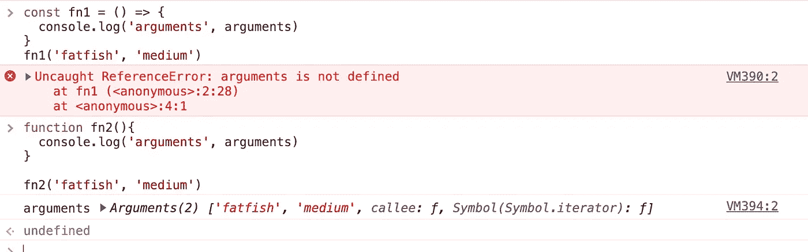
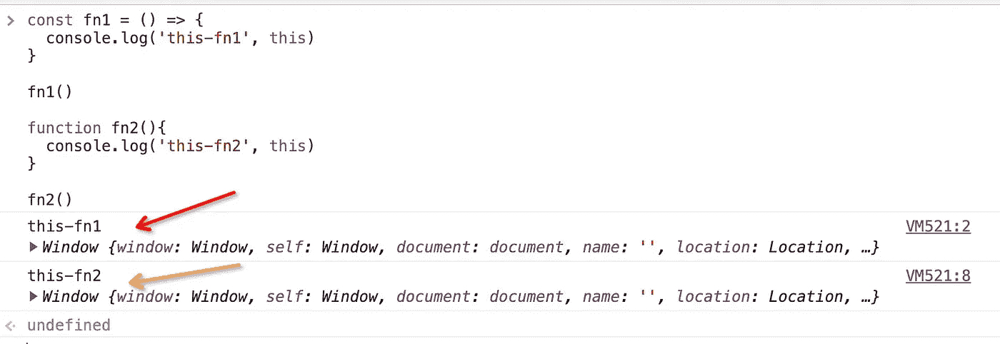
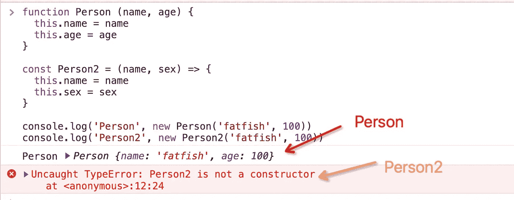
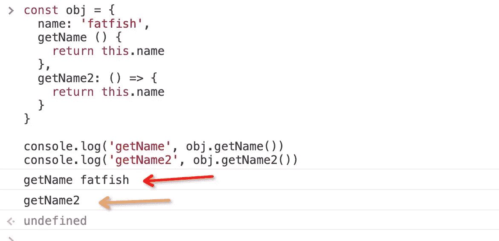

# 现在是 2022 年，不要再滥用箭头功能了

> 原文：<https://javascript.plainenglish.io/its-2022-don-t-abuse-the-arrow-function-anymore-905862a9c668?source=collection_archive---------0----------------------->

## 不应该使用箭头函数的 4 种情况。

Photo by [Kristina Yadykina](https://unsplash.com/@kristlisa?utm_source=medium&utm_medium=referral) on [Unsplash](https://unsplash.com?utm_source=medium&utm_medium=referral)

**箭头函数给我们的工作带来了很大的便利，但是它们有什么缺点呢？**

**我们应该一直使用箭头函数吗？**

朋友们，我们应该在以下场景中停止使用箭头函数。

# 箭头函数的一些缺点

# 1.不支持参数对象

在箭头函数中，我们不能像在普通函数中那样使用`arguments`对象。

如你所见，`fn1`箭头函数报告了一个错误，但是`fn2`可以正常读取`arguments`对象。

如何才能让 arrow 函数中的所有参数都传递给函数？

**对，没错，可以用 Spread 算子求解。**

# 2.没有办法通过应用、调用、绑定来改变`this pointer`

我相信你很容易就能看出下面的代码会输出什么。

我们想让`fn1`和`fn2`都打印下面的对象，应该怎么做？

**代号**

因为 arrow 函数在定义的时候就决定了它的`this`指向谁，所以没有办法再用`fn1.call(thisObj)`改变。

# 什么时候不能用箭头功能？

箭头函数不是万能的，至少有 4 种情况我们不应该使用它们。

# 1.请不要在构造函数中使用箭头函数

为什么`new Person2`会抛出错误？

> *构造器通过 new 关键字生成一个对象实例。生成对象实例的过程也是通过构造函数将其绑定到实例的过程*
> 
> *但是箭头函数没有自己的* `*this*` *，所以不能作为构造函数使用，也不能通过* `*new*` *运算符调用。*

# 2.请不要在点击事件中操作这个

我们经常在 click 事件中通过`this`读取元素本身。

但是如果使用箭头函数给 DOM 元素添加回调，`this`将等同于全局对象`window`。

# 3.请不要在对象的方法中使用箭头函数。

你知道这段代码会输出什么吗？

是的，`getName2`方法不会打印“fatfish”，因为此时`this`和`window`是等价的，不等于`obj`。

# 4.请不要在原型链中使用箭头函数。

# 最后

**感谢阅读。**我期待着您的关注和阅读更多高质量的文章。

 [## 采访者:“npm 跑 xxx”怎么了？

### 一个大多数人都不知道的秘密。

javascript.plainenglish.io](/interviewer-what-happened-to-npm-run-xxx-cdcb37dbaf44)  [## 每个开发人员都应该知道的 20 种 JavaScript 数组方法

### 你知道这 20 个数组方法是怎么实现的吗？

javascript.plainenglish.io](/20-javascript-array-methods-every-developer-should-know-6c04cc7a557d)  [## 让你看起来像高级开发人员的 8 个很酷的 GitHub 技巧

### 使用 GitHub 可以做的 8 件很酷的事情

javascript.plainenglish.io](/8-cool-github-tricks-to-make-you-look-like-a-senior-developer-ab8fe9ae9b14)  [## 面试官:可以“x！== x "在 JavaScript 中返回 True？

### 你可能不知道的五个神奇的 JavaScript 知识点！

javascript.plainenglish.io](/interviewer-can-x-x-return-true-in-javascript-7e1d1fa7b5cd)  [## 123['toString']。length + 123)用 JavaScript 打印出来？

### 95%的前端开发者回答错误的问题。

javascript.plainenglish.io](/what-does-123-tostring-length-123-print-out-in-javascript-2c804a414325) 

*更多内容看* [***说白了。报名参加我们的***](https://plainenglish.io/) **[***免费周报***](http://newsletter.plainenglish.io/) *。关注我们关于*[***Twitter***](https://twitter.com/inPlainEngHQ)*和*[***LinkedIn***](https://www.linkedin.com/company/inplainenglish/)*。查看我们的* [***社区不和谐***](https://discord.gg/GtDtUAvyhW) *加入我们的* [***人才集体***](https://inplainenglish.pallet.com/talent/welcome) *。***