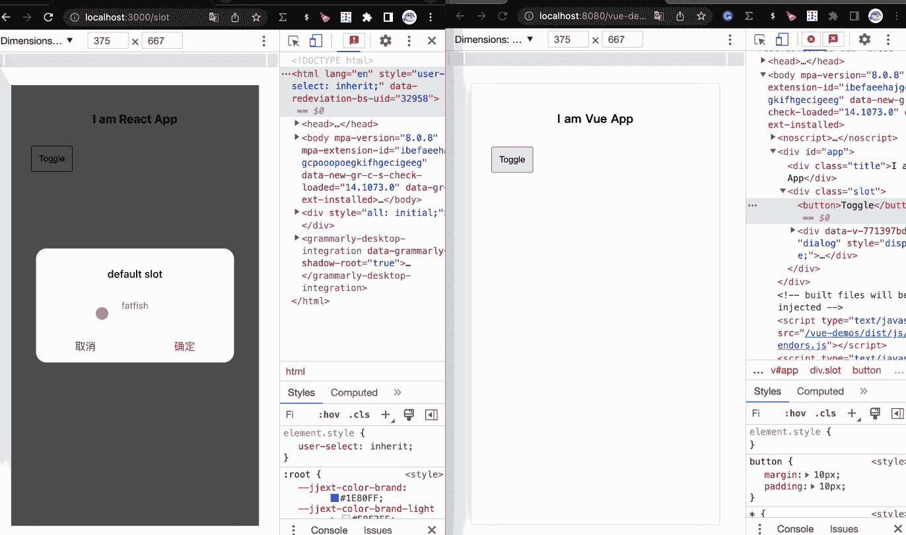

# 现在是 2022 年，不要再只用 React 了

> 原文：<https://javascript.plainenglish.io/its-2022-don-t-just-use-react-anymore-33659ed663c9?source=collection_archive---------0----------------------->

## 你只用 React 吗？你知道 Vue 吗？

Photo by [Kote Puerto](https://unsplash.com/es/@kotecinho?utm_source=medium&utm_medium=referral) on [Unsplash](https://unsplash.com?utm_source=medium&utm_medium=referral)

**最近，我的朋友因为不熟悉 Vue.js 而面试失败**

**她平时工作大部分时间都在用 React，所以也懒得去了解其他前端框架。**

我们应该熟悉世界上所有的前端框架吗？

不，那是极不合理的。

**但是为了生存，我朋友还是要学习 Vue 的框架。**

让我们看看如何使用 Vue 实现 React 的一些功能。

# 1.如何显示和隐藏一个元素？

控制元素或组件的显示和隐藏是我们最常做的事情之一，在 React 中，我们经常这样编码。

JavaScript 中的三元表达式和“&”也可以达到同样的目的。

**做出反应**

**Vue**

那么如何在 Vue 中实现同样的功能呢？

是的，我们可以使用`v-if`指令来控制元素的显示和隐藏，这很简单，不是吗？

# 2.如何显示和隐藏一个元素？

`v-if`导致元素或组件被重复删除和创建，如果我们只是想“显示”或“隐藏”它呢？

也许我们可以在 CSS 中的`display`属性的帮助下做到这一点。

**做出反应**

**Vue**

你可能已经猜到了，我们可以使用`v-show`来实现和它一样的功能。看起来 Vue 更简洁，你不觉得吗？

# 3.v-for:渲染一个列表？

在 React 中，我们可以使用数组的`map`方法创建一个列表，这真的很简单。

请看这段代码，它创建了一个包含三种不同职业的列表。

**做出反应**

**Vue**

你喜欢 Vue 里的`v-for`指令吗？

# 4.计算

如果要计算两个数的和，有什么好的方法吗？

我的意思是，当`num1`和`num2`发生变化时，它们的和会自动变化，我们不需要手动处理。

**做出反应**

哇，太好了，`useMemo`已经帮我们解决了一个问题。

**Vue**

那么在`Vue`中有没有更好的实现？它实际上提供了一种叫做“计算”的机制，更智能，更易用。

# 5.看

当我们需要监听数据变化，然后执行回调函数时，这可以在 React with `useEffect`中完成。

让我们试着模拟一个场景:

我们点击按钮`boy`或`girl`，当它被选中时发送请求，最后显示请求的结果(我们通过`setTimeout`模拟异步请求过程)。

**反应过来**

**Vue**

别担心，我们可以在 Vue 中用它做同样的事情，你知道它的秘密是什么吗？

是的，答案是`watch`。

# 6.风格

有时候我们需要动态地给元素添加样式，Vue 和 React 都给了我们一个方便的使用方式。

从用途上来说，基本差不多。

**相同点:**

CSS 属性名可以是 camelCase 或 kebab-case(记得用引号括起来)

**差异:**

1.  在 Vue 中，我们可以通过数组语法绑定多个样式对象，React 主要是以单个对象的形式(这点 Vue 也可以)
2.  在 React 中，它会自动将“px”(此点不由 Vue 自动处理)后缀添加到内联样式的数量属性中，其他单位需要手动手动指定
3.  在 React 中，样式不会自动加上前缀。当 v-bind:style 使用需要浏览器引擎前缀的 CSS 属性时，比如 transform，Vue.js 会自动检测并添加相应的前缀。

**反应**

**Vue**

# 7.班级

我们应该如何动态地给一个元素添加类？

在 Vue 中，我更喜欢使用数组语法(当然它也有 object 的方法)，在 React 中也可以使用一些第三方的包比如 classnames 来起到更方便的添加类的效果。

**反应**

**Vue**

# 8.提供/注入

Vue 和 React 对于全局状态的管理都有自己很好的解决方案，比如 Vue 中的 Vuex，Redux 和 Mobx 中的 React，但是当然这些小项目的引入有点大而不能小用，没有其他的解决方案吗？

**提供/注入可用于 Vue**

**React 可以使用上下文**

假设我们有一个用户信息的全局变量“userInfo”，它需要在每个组件中容易访问，如何在 Vue 和 React 中实现它？

**做出反应**

为了在 React 中实现这一点，您可以借助上下文将全局状态共享给任何子节点。

**context/index.js**

**App.js**

**provide.js**

**Vue**

在 Vue 中，我们可以使用“提供/注入”将顶级状态传递给任何子节点，假设我们在 app.vue 中声明了一个“userInfo”数据。

**App.vue**

**provide.vue**

# 9.时间

假设我们要实现一个简单的对话组件，基本功能是标题可以作为字符串传递，内容部分可以完全自定义，应该如何实现？

**反应过来**

虽然 React 中没有槽的概念，但是可以通过`props.children`获取组件内部的子元素，通过这个可以实现默认的槽。

**Dialog.js**

**slot.js**

**Vue**

同样的功能应该如何在 Vue 中实现？

**dialog.vue**

**slot.vue**

# 最后

**感谢阅读。**我期待着您的关注和阅读更多高质量的文章。

 [## “我失去了一个工作机会，只是因为承诺。所有”

### 一次让我好难过的面试经历。

javascript.plainenglish.io](/i-lost-a-job-opportunity-just-because-of-promise-all-be396f6efe87)  [## 采访者:“npm 跑 xxx”怎么了？

### 一个大多数人都不知道的秘密。

javascript.plainenglish.io](/interviewer-what-happened-to-npm-run-xxx-cdcb37dbaf44)  [## 面试官:可以“x！== x "在 JavaScript 中返回 True？

### 你可能不知道的五个神奇的 JavaScript 知识点！

javascript.plainenglish.io](/interviewer-can-x-x-return-true-in-javascript-7e1d1fa7b5cd)  [## 现在是 2022 年，不要再滥用箭头功能了

### 不应该使用箭头函数的 4 种情况。

javascript.plainenglish.io](/its-2022-don-t-abuse-the-arrow-function-anymore-905862a9c668) 

*更多内容看* [***说白了就是***](https://plainenglish.io/) *。报名参加我们的* [***免费每周简讯***](http://newsletter.plainenglish.io/) *。关注我们关于* [***推特***](https://twitter.com/inPlainEngHQ) ， [***领英***](https://www.linkedin.com/company/inplainenglish/) ***，*** *和* [***不和***](https://discord.gg/GtDtUAvyhW) ***。***