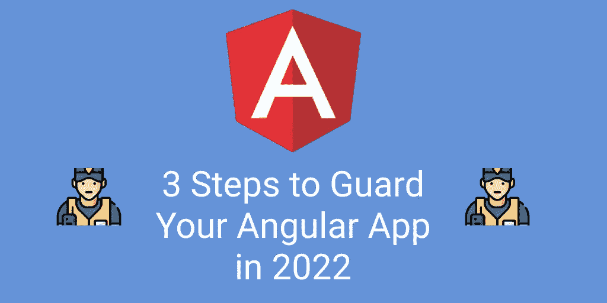
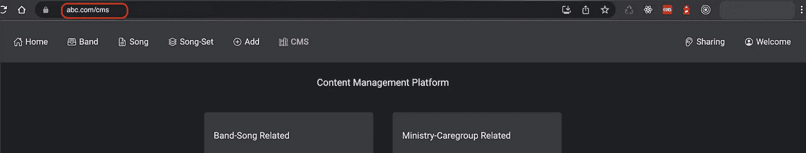
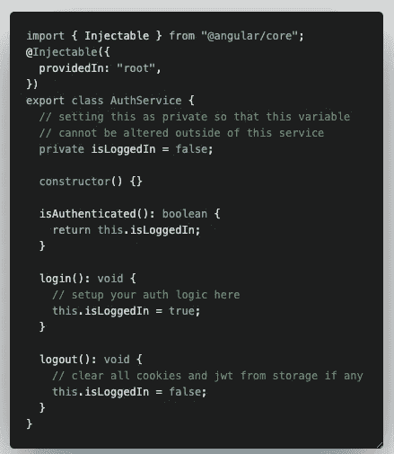
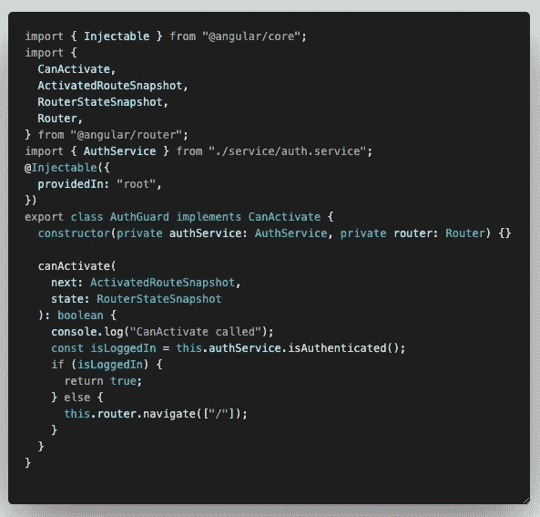
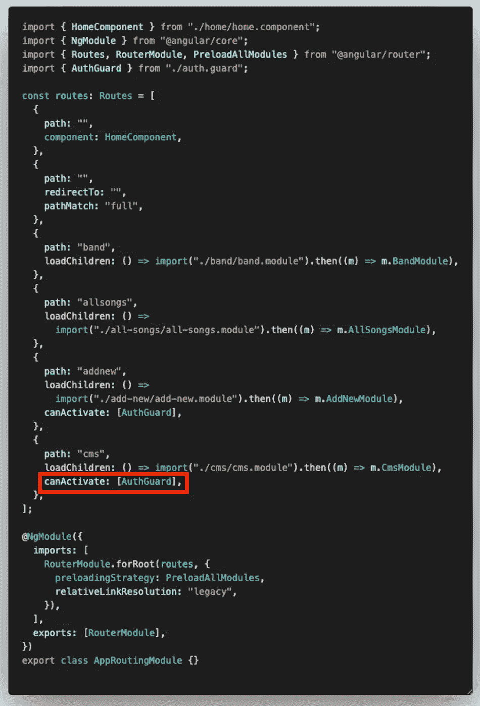
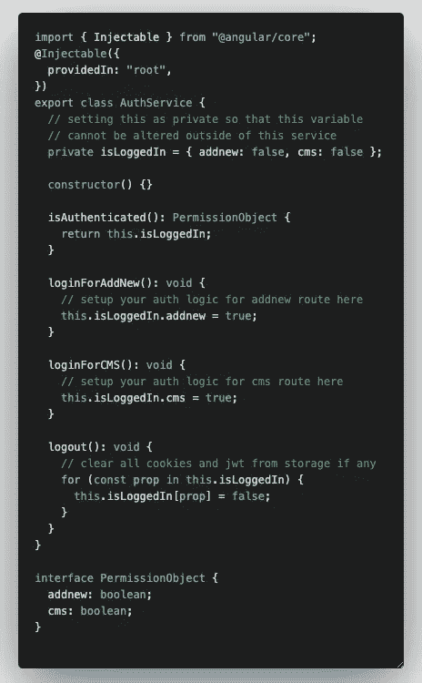
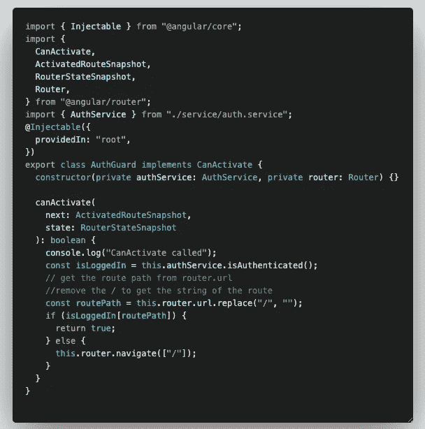

# 现在是 2022 年，不要让你的棱角路线无人看守

> 原文：<https://javascript.plainenglish.io/its-2022-don-t-leave-your-angular-routes-unguarded-a234343444cd?source=collection_archive---------1----------------------->

## 如何使用 Angular Route Guard 来保护未授权用户进入不同的页面/路径。

您知道吗，即使在您的应用程序中显示或隐藏不同页面的导航按钮，人们仍然可以通过操纵浏览器中的 URL 来访问您的页面。

With admin navigation buttons

Without admin navigation buttons

Route manipulation on the browser URL

许多网站由于没有在网站中正确地保护它们的路线而遭受安全问题！今天，我将向您展示如何使用 Angular Route Guard 来防止未经授权的用户进入不同的页面/路径。

Angular 提供了`5 guards`现成的功能— **可以激活、可以激活子对象、可以激活、解析、可以加载**。今天，我们将关注`**CanActivate**`以及它如何保护你的角度路线。

# 第一步

在应用程序中设置认证服务文件。它应该有`login`和`logout`方法，允许用户用他们的用户名和密码验证自己。一旦用户通过了身份验证，您就可以将**私有**变量`isLoggedIn`的状态更新为 true，以便稍后当您需要验证用户是否通过了身份验证以进入受保护的路由时，您可以调用`isAuthenticated`方法来获取`isLoggedIn`的最新状态。

auth.service.ts

我之所以将`isLoggedIn`声明为**私有**变量，是因为我只想让`login`和`logout`方法成为唯一两个可以改变`isLoggedIn`值的方法，其他可以访问 AuthService 文件的组件应该不能直接改变`isLoggedIn`的值。

# 第二步

您可以创建一个身份验证保护文件来实现`CanActivate`接口，以便使用它。一旦从@angular/router 实现了`CanActivate`,您就可以访问`canActivate`方法。在`canActivate`方法中，可以先获取`isLoggedIn`的最新状态，检查用户是否通过**认证**。如果是，你将允许应用程序的导航继续，否则你将**重定向**用户回到主页/登录页面。

auth.guard.ts

在我的例子中，如果用户试图在未经身份验证的情况下访问受保护的路由，我会将他们重定向到主页。

# 第三步

最后，您可以将 **AuthGuard** 添加到 **app-routing.module.ts** 文件中，以保护您的路线。在路由文件中，当声明路由路径和组件细节时，还可以添加另一个名为`canActivate`的属性，并传入刚刚创建的 AuthGuard。

app-routing.module.ts

现在，当您试图未经授权访问这些受保护的路由时，您将被自动重定向回主页/登录页面。除了在你的网站上显示和隐藏导航按钮，现在你有另一种机制来检查用户是否被允许访问受保护的路线。💯

只是 3️⃣快速的点出了亮点🌈。

1.  除了从客户端保护您的应用程序路由之外，还建议从服务器保护应用程序数据，以便万一由于任何原因在客户端验证失败，并且未授权用户设法访问受保护的路由，获取数据的 API 调用将返回**HTTP 401 unauthorized error**。
2.  如果您已经注意到路由文件中的`canActivate`字段正在接受一个数组。这意味着，如果某些路由需要更多的权限才能访问，那么您可以通过多个**身份验证守卫。**
3.  如果你已经注意到目前`isLoggedIn`变量被声明为一个**布尔**变量，那么这个安全措施如何保护具有不同权限的多条路径是非常有限的。另一种通过不同权限对不同路由进行身份验证的方式是将`isLoggedIn`变量转换为一个**对象**，该对象保存不同路由名称的**多个布尔**。

auth service for isLoggedIn as an object

auth guard to handle different permission for different protected routes

# 摘要

希望这篇文章能让你更好地了解如何为你的 Angular 应用程序设置认证保护，并保护你的网站免受未授权用户的攻击。这可能不是完美的实现，但我希望它能帮助您尽快开始并保护您的应用程序！如果你有其他有趣的方法来保护你的角度应用，请在下面的评论中告诉我。我很想了解它，并与他人分享。干杯！😎

 [## 用我的推荐链接- DevJo 加入媒体

### 阅读 DevJo 的每一个故事(以及 Medium 上成千上万的其他作者)。你的会员费直接支持 DevJo 和…

medium.com](https://medium.com/@devjo/membership) 

*更多内容请看*[***plain English . io***](https://plainenglish.io/)*。报名参加我们的* [***免费周报***](http://newsletter.plainenglish.io/) *。关注我们关于*[***Twitter***](https://twitter.com/inPlainEngHQ)[***LinkedIn***](https://www.linkedin.com/company/inplainenglish/)*[***YouTube***](https://www.youtube.com/channel/UCtipWUghju290NWcn8jhyAw)*[***不和***](https://discord.gg/GtDtUAvyhW) *。对增长黑客感兴趣？检查* [***电路***](https://circuit.ooo/) *。***