# 现在是 2022 年，请不要再用“console.log”了

> 原文：<https://javascript.plainenglish.io/its-2022-please-don-t-just-use-console-log-anymore-217638337c7d?source=collection_archive---------0----------------------->

## 你应该知道的 5 个 JavaScript 控制台对象方法和技巧。

Photo by [Gaelle Marcel](https://unsplash.com/@gaellemarcel?utm_source=medium&utm_medium=referral) on [Unsplash](https://unsplash.com?utm_source=medium&utm_medium=referral)

**作为一名前端工程师，你一定用过** `**console.log**` **，它可以帮助我们在控制台上打印辅助信息，排查问题。**

**但是你知道关于** `**console**` **物体的其他秘密吗？**

本文将介绍使用`console`对象的 5 个实用技巧，希望你会喜欢。

# 1.console.log()

**1.1 基本使用技巧**

`console.log()`是我们在工作中最常用的方法，你可以在 JavaScript 的任何地方使用它。

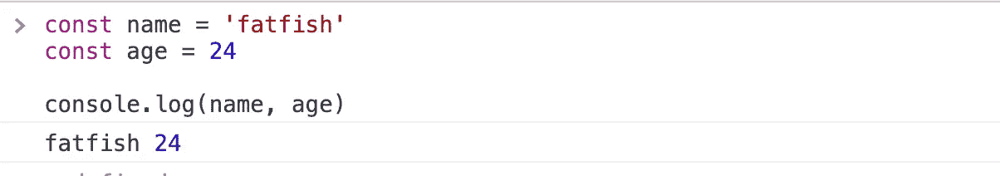

但是当打印的信息量变得非常大时，信息就变得不直观了。因为我们不知道它指的是什么！

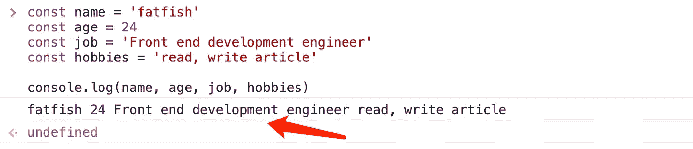

那么，有什么好的方法可以看得更清楚是什么呢？

是的，我们只需要一个对象。

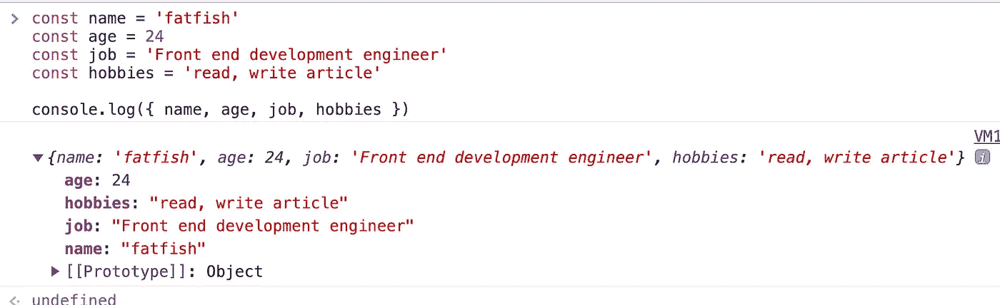

**1.2 CSS 样式**

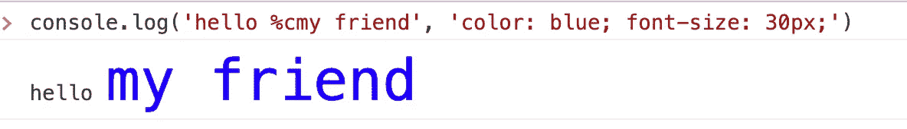

有趣的是`console.log`也可以定制。

# 2.console.warn()

当控制台打印出大量信息时，要准确找到我们想要的东西并不容易。别担心，`console.warn`可以帮助我们，因为它有一面特殊的黄色旗帜。

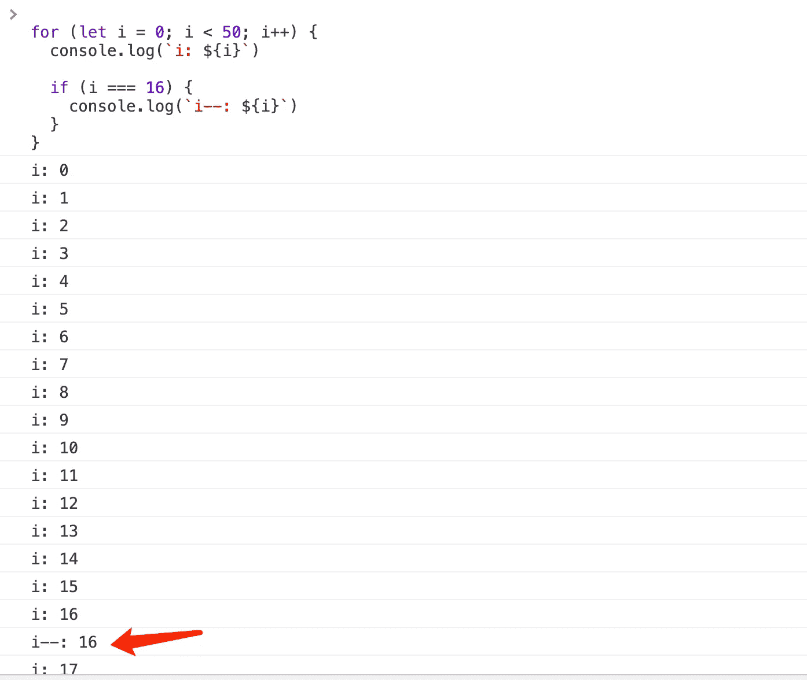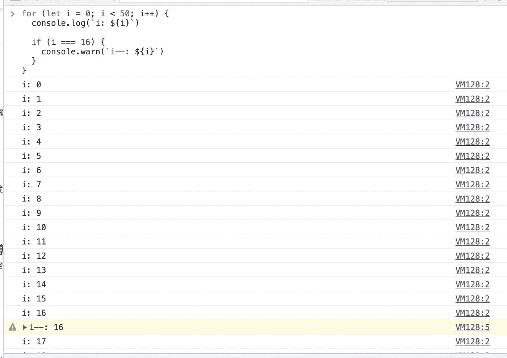

# 3.console.error()

在日常工作中，我们不可避免的会发送 HTTP 请求来获取数据，当请求出现错误时，我会习惯性的通过`console.log`打印一条错误信息。

但是我的朋友，相信我，这不是个好主意。使用`console.error`会明智得多。

因为它不仅有一个唯一的红色错误标志，还打印了函数调用的堆栈关系。

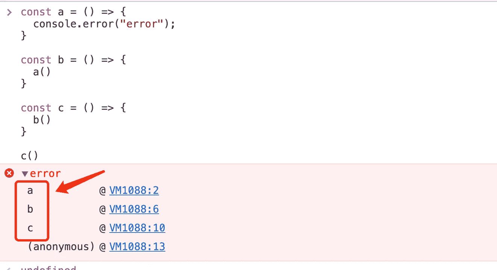

# 4.console.time() & console.timeEnd()

朋友们，你们一般是怎么统计一段代码的执行时间的？

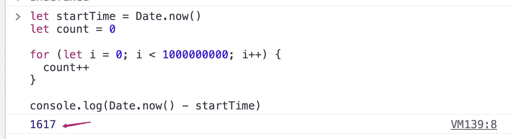

也许你也通过计算两个时间间隔得到了一段代码的执行时间，但是我们有一个更好的选择，要不要试试？

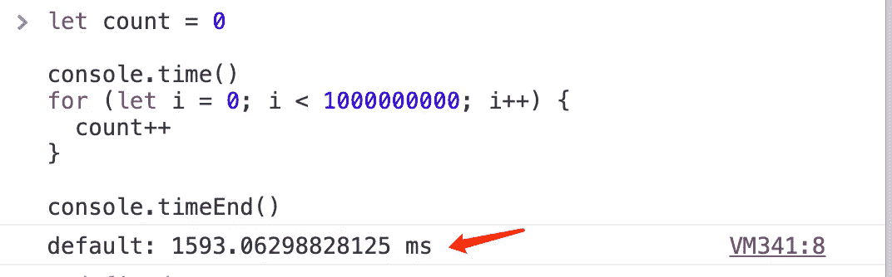

哇，太棒了，我太喜欢这种方式了。但这还不够，如果你想统计多段代码的执行时间，你需要给它一个标志。

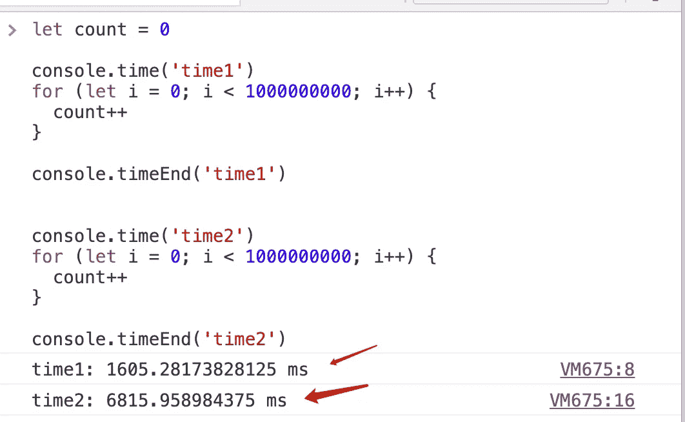

# 5.console.table()

我们经常用`console.log`打印一些信息，但有时候并不是那么直观。

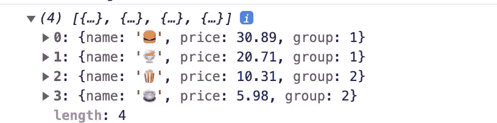

我们试试`console.table`。

👏🏻它看起来像一张桌子，简单明了。

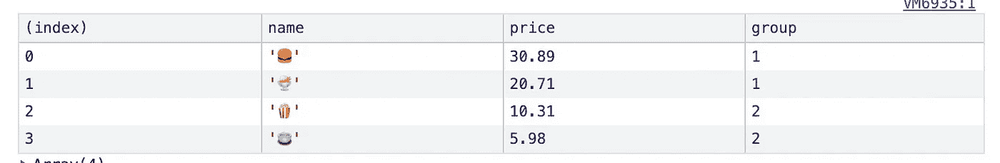

# 最后

感谢阅读。我期待着您的关注和阅读更多高质量的文章。

 [## “我失去了一个工作机会，只是因为承诺。所有”

### 一次让我好难过的面试经历。

javascript.plainenglish.io](/i-lost-a-job-opportunity-just-because-of-promise-all-be396f6efe87)  [## 采访者:“npm 跑 xxx”怎么了？

### 一个大多数人都不知道的秘密。

javascript.plainenglish.io](/interviewer-what-happened-to-npm-run-xxx-cdcb37dbaf44)  [## 面试官:可以“x！== x "在 JavaScript 中返回 True？

### 你可能不知道的五个神奇的 JavaScript 知识点！

javascript.plainenglish.io](/interviewer-can-x-x-return-true-in-javascript-7e1d1fa7b5cd)  [## 现在是 2022 年，不要再滥用箭头功能了

### 不应该使用箭头函数的 4 种情况。

javascript.plainenglish.io](/its-2022-don-t-abuse-the-arrow-function-anymore-905862a9c668) 

*更多内容请看*[***plain English . io***](https://plainenglish.io/)*。报名参加我们的* [***免费周报***](http://newsletter.plainenglish.io/) *。关注我们关于*[***Twitter***](https://twitter.com/inPlainEngHQ)[***LinkedIn***](https://www.linkedin.com/company/inplainenglish/)*[***YouTube***](https://www.youtube.com/channel/UCtipWUghju290NWcn8jhyAw)*[***不和***](https://discord.gg/GtDtUAvyhW) *。***