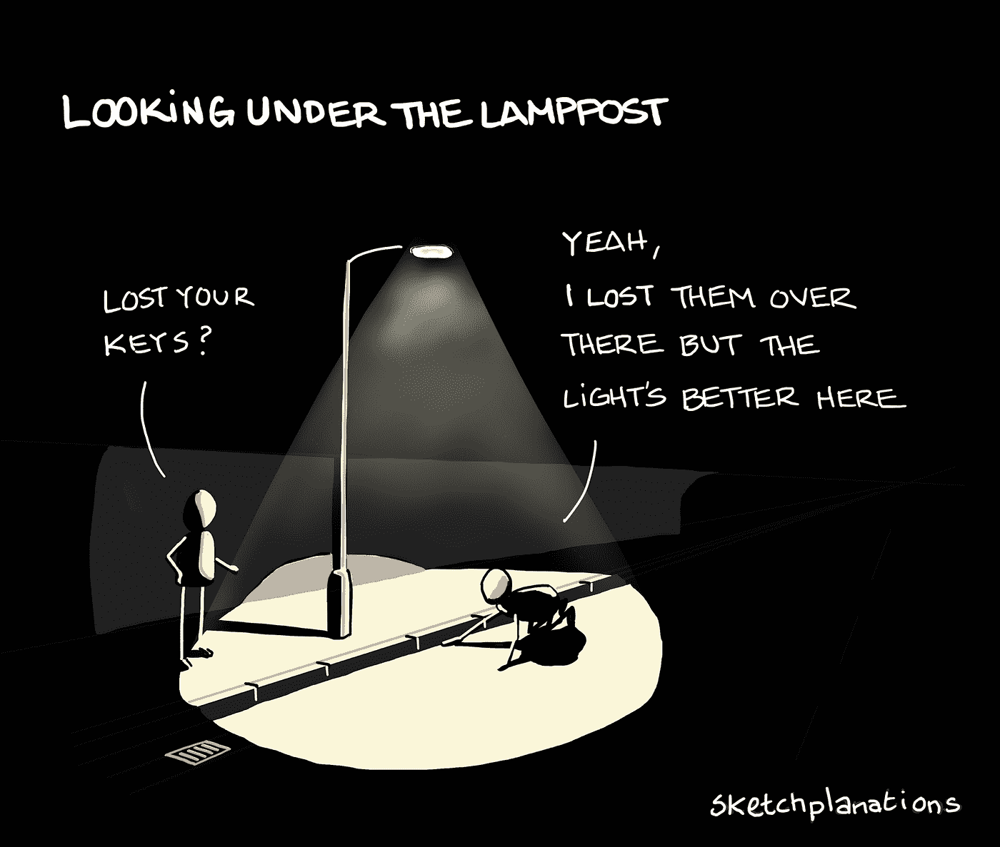

# 在软件开发中，这绝不仅仅是一只野鸭

> 原文：<https://javascript.plainenglish.io/its-never-just-a-mallard-in-software-development-d223fdc35ad7?source=collection_archive---------4----------------------->

## 当心过度简单化和野鸭。

[Photo by Ольга Дьякова from Pexels](https://www.pexels.com/photo/flock-of-mallard-ducks-on-water-3604976/)

软件从不做一件事，也不像你想的那么简单，即使你知道这一点。

假设需求很简单是开发人员经常陷入的一个陷阱，它会导致过度承诺和交付不足。这就像开发团队穿着绿头鸭的服装在起跑线后 2 英里处开始马拉松(用脚蹼打字很困难)。

# 这只是一只野鸭

我看到这个播客——[菲尔·拉夫雷斯基博士，只有一只野鸭？](https://www.youtube.com/watch?v=kOpUXwjizrM)而且事实是:

> “全世界有 13 种类似野鸭的物种，包括美国本土的野鸭、杂色鸭、黑鸭和墨西哥鸭。”

[从来不是“只是一只野鸭”](https://medium.com/@slaughteram/its-never-just-a-mallard-what-birding-can-teach-us-about-winning-the-war-in-ukraine-d574af653eb1)讲述的是人们发现鸟，有人看到鸟，然后说出“这只是一只野鸭”的犯罪台词，然后导致愤怒，有人解雇了强大的野鸭。

> “没有‘只是一只野鸭’或‘只是一只知更鸟、一只蓝松鸦或一只麻雀’这样的东西。”"

我们忘记了鸟类惊人的美丽，忘记了每一只鸟都是惊人而独特的。你可能只看到一只绿头鸭，但仔细观察就会发现这是一只美丽、独特的鸟，有着令人难以置信的属性。

如果你被要求开发绿头鸭软件，它将很快变得比一只绿头鸭更复杂(鳍状肢，飞行，13 种绿头鸭，雌性/雄性，防水羽毛，迁徙，等等)。

# 高级需求

> 有人点亮了灯，因为这里有更多值得关注的东西— [编辑—结束有开始](https://www.youtube.com/watch?v=UBpzJ-TLpbE)

当人们讨论高层需求时，这很简单，开发人员通常会提出一个潜在的解决方案。这是可爱的梦幻世界，简单明了。问题、限制和困难总是存在于细节中，设计几乎从来不会出现在高级阶段，

有一个故事说的是一个人看见一个人跪在灯柱下爬行。地板上的男人解释说他正在找他的钥匙。他问他把钥匙放在哪里了，回答是“哦，我把它们放在那里了，但是这里光线更好。”

[Sketchplanations](https://sketchplanations.com/looking-under-the-lamppost)

高层次的需求缺乏设计/估计可能不正确或被低估的细节。随着工作的继续，更多的需求、限制和标准被发现，软件变得越来越复杂。

最初被低估的高水平估计作为一个无用的锚，拖累了进一步的工作，增加了时间和成本估计。这增加了开发团队的压力，因为领导层的计划是基于最初的低估计。

# 被简单愚弄

> “当我们试图单独挑出任何东西时，我们会发现它与宇宙中的所有其他东西都联系在一起。”—约翰·缪尔

我们简化了软件需求，使每个人都能对软件的需求有一个共同的理解，但是这让人们陷入了低估的陷阱。

软件从来不仅仅做一件事，当集成和使不同的功能彼此协同工作的工作出乎意料时，这就产生了隐藏的复杂性。

这是[握手开销——软件开发中复杂性的成长之痛](https://itnext.io/handshake-overhead-growing-pains-of-complexity-in-software-development-d119c69bae9f)。你所拥有的功能是你所拥有的更具连接性和依赖性的代码。

代码是一种创建软件的工具，但是它需要思考和设计来让所有的东西一起工作。简单的方法忘记了这一步，发现有额外的工作作为 bug 出现。

# 软件开发的法则

有许多法律和原则提醒我们，创建软件总是比我们最初想象的要难，即使你知道这一点。

> [霍夫施塔特定律](https://en.wikipedia.org/wiki/Hofstadter%27s_law):它总是比你想象的要长，即使你考虑到了霍夫施塔特定律

软件开发的法则解释了为什么创建软件总是比预期的时间长

从来没有一个软件只做一件事，也从来没有一只野鸭。

不同的法则和原则有助于您从不同的角度来看待需求，并作为一个清单来阻止开发团队低估需求。

# 蜘蛛侠的感觉

当人们说一个新的功能只是一只野鸭时，高级开发人员的工作通常是阻止他们。高级开发人员有一种[蜘蛛的感觉](https://blog.devgenius.io/senior-developers-have-a-spidey-sense-52fc510e19da)，这有助于他们感知过度简化和低估。

对抗过度简化的最佳方法武器是一个过程和一个拥有独特经验、知识和视角的开发团队。何时进行评估对团队合作(Scrum 风格)很有用，因为这有助于你发现相关的代码/功能和所有的任务。

一份常见任务的清单很有用:

*   澄清要求/问题
*   密码
*   单元测试
*   安全性
*   构建/部署
*   数据
*   证明文件
*   连接的代码/功能
*   相关代码/功能
*   治理/批准

# 结论

假设你看到的只是一只野鸭。不要做出最初的估计或意见，这些估计或意见将被视为承诺。慢慢来，问问题，了解涉及的内容。

许多人的眼睛使 bug 变得容易工作，并创建更好的估计。测试人员通常通过理解什么应该工作，什么不应该工作，来为需求带来独特的视角。什么都不要假设，理清一切，找到细节。

开发中的过程是为了保护开发人员，帮助他们避免低估和获得人们对快速交付的希望。

# 相关文章

*   [解释软件开发的引言](https://blog.devgenius.io/quotes-that-explain-software-development-c1d503835c55)
*   [开发人员愚蠢的十大普遍法则](https://blog.devgenius.io/the-10-universal-laws-of-developer-stupidity-ccda23e91ee7)
*   [软件开发中的首要原则思维](https://itnext.io/first-principles-thinking-in-software-development-b0450447aa67)
*   [软件开发心智模型文章](https://thehosk.medium.com/list/software-development-mental-models-0c290661598c)
*   [软件开发人员和最省力原则](https://blog.devgenius.io/software-developers-and-the-principle-of-least-effort-727d1e5ded26)

*更多内容看* [***说白了。报名参加我们的***](https://plainenglish.io/) **[***免费周报***](http://newsletter.plainenglish.io/) *。关注我们上* [***推特***](https://twitter.com/inPlainEngHQ)[***领英***](https://www.linkedin.com/company/inplainenglish/)**和* [***不和谐***](https://discord.gg/GtDtUAvyhW) ***。******