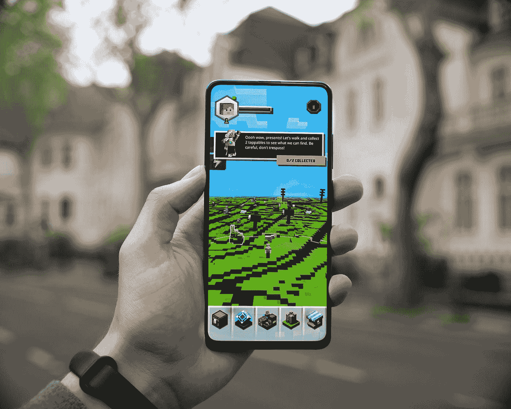

# 我一直计划开发自己的手机应用游戏

> 原文：<https://javascript.plainenglish.io/ive-been-planning-to-create-my-own-mobile-app-game-daf8b52096a7?source=collection_archive---------15----------------------->

## 我希望得到关于它如何为你工作的反馈。

Photo by [Mika Baumeister](https://unsplash.com/@mbaumi?utm_source=medium&utm_medium=referral) on [Unsplash](https://unsplash.com?utm_source=medium&utm_medium=referral)

自从我第一次发现街对面的电脑俱乐部，我就成了一名游戏玩家。二十年过去了，我不知道没有电脑游戏的生活。但是我尝试过创造它们吗？是的，当然，但是我的欲望总是很大。我想要大篷车、星系和行星地壳下的地质过程。

总的来说，游戏开发的世界充满了这样的例子，人们已经为这些梦想项目奋斗了几十年，有些甚至已经完成了。尽管如此，我以前经常对以下自制产品失去兴趣，原则上，你可以以某种方式开始玩它。

现在，经过几十个想法和尝试，20 年后，在经历了几十次否认、愤怒、讨价还价和接受的循环后，我决定立即停止制作梦想大片，而是做点什么。

但是它并没有马上达到期望的水平，为了得到这个问题中的游戏，我又花了大约六次 OATP 循环的迭代。

这个游戏不像 Flappy Bird 那样原始，但在这个阶段，它至少有一些成熟的游戏性，甚至在我要求测试它时抓住了我的妻子。

因为我是一名 web 开发人员，所以对 JavaScript 语言没有特别的疑问。在尝试独立开发游戏引擎的相似性并将其与物理引擎合并之后，包括我的物理引擎的开发，我仍然能够停下来，为自己选择一个开箱即用的 PlayCanvas 和 PhoneGap 的物理学。

## **游戏的本质**

游戏类似于 doodle jump，但是我们控制球，球必须通过点击它下面的屏幕才能踢起来，我们不能通过方块。在我看来，这个概念非常简单，也很容易实现。我会说，我从来没有错得这么离谱，但不幸的是，我错了很多。

首先，你需要生成关卡本身。一开始，我只是简单地开发了不同长度和位置的块，但如果它们都一次性放在世界上，那么这将在手机上变慢，迟早会用完。

结果，过了几天，我就来到了基于世界种子的区块生成，世界被分成了区块。当我们向上移动到这个世界时，从上面添加了一个新的块，从下面移除了这个块，这解决了手机上的刹车问题(但不完全是，它是包装器中的 JavaScript)。

接下来，有必要以某种方式增加游戏的强度和复杂性。为此，除了障碍，还需要一些地雷或敌人，是时候以某种方式装饰世界了。

总的来说，在短暂搜索免费资产后，游戏被修饰，又花了半天时间分析引擎中连接资产的过程)并添加了导致游戏结束的第一个障碍。

这就是打破游戏创作乐趣的事情开始的地方——引擎的问题。如果球飞得太快，那么它可能会飞过去，这是为了优化物理引擎的运行，这是显而易见的，但出于某种原因，一如既往，解决方案只能在搜索和论坛的肠子里找到。

此外，PlayCanvas 有一个在线构造函数，您可以在其中看到 API 设置是什么以及它们如何影响对象。尽管如此，没有为特定事物增加物理计算的准确性的设置，就好像没有人遇到过这种情况一样。一般来说，这种情况不会发生在任何需要的人身上。

总的来说，试图让一切都如你所愿是任何开发的主要问题，不仅仅是游戏。在我看来，开发过程就是没有正确构建，因为我们经常会遇到意想不到的问题，并且通常会产生 bug。也就是通过算法写程序的方法，在我看来，在道德上已经过时了，程序的创造在未来应该彻底改变。

也许随着量子计算机进入日常生活，创造东西的过程将归结为这样一个事实:计算机将像一个 Akinator 一样猜测我们的欲望，我们将回答是/否，直到我们得到我们想要的东西。

在我看来，一个非常现实的未来场景，将有一个直接连接到大脑的连接，计算机将选择选项，直到它收到大脑的反应，即屏幕上的图片和它最终匹配。

有一点是清楚的，开发过程现在是如何进行的，在有大量错误的情况下，游戏发布了——这不能永远继续下去。

回到游戏，我花了大约四天的时间弄清楚引擎的错综复杂，并解决了意想不到的问题。在那之后，我只需要几十分钟就可以最终实现我需要的功能。

## **好了，灵魂的哭泣似乎结束了。**

正如许多人希望向世界展示他们的想法一样，发展或财政的复杂性限制了他们，这就是问题所在。

总的来说，我希望从你那里得到关于它如何为你工作的反馈，也许你有关于优化用科尔多瓦包裹的画布上的游戏的提示，以及你认为还可以添加什么。

从游戏的路线图中，我看到的是:

临时奖金

整合谷歌服务

每个人每天受到一次种子攻击，并有一个等级表

让我知道。

*更多内容请看*[***plain English . io***](https://plainenglish.io/)*。报名参加我们的* [***免费周报***](http://newsletter.plainenglish.io/) *。关注我们关于*[***Twitter***](https://twitter.com/inPlainEngHQ)[***LinkedIn***](https://www.linkedin.com/company/inplainenglish/)*[***YouTube***](https://www.youtube.com/channel/UCtipWUghju290NWcn8jhyAw)*[***不和***](https://discord.gg/GtDtUAvyhW) *。***