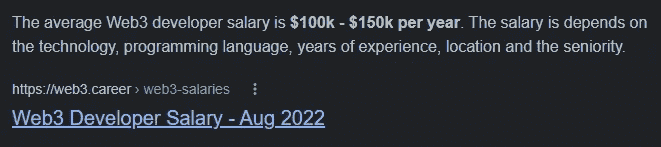

# 我看了大量的 Web3 YouTube 视频；以下是让你开始行动的 5 大要点

> 原文：<https://javascript.plainenglish.io/ive-watched-tonnes-of-web3-youtube-videos-here-are-the-top-5-to-get-you-going-ca35e7d7e3b1?source=collection_archive---------12----------------------->

## 通过学习 web3 技能赚取百万。

Photo by [CardMapr.nl](https://unsplash.com/@cardmapr?utm_source=medium&utm_medium=referral) on [Unsplash](https://unsplash.com?utm_source=medium&utm_medium=referral)

随着我对 Web3 的了解越来越多，我发现更多的企业正在进入 Web3 领域。Instagram、Stripe 和 Adidas 就是几个例子。而且，从字面上看，IBM 在 web3 领域投入了大量的努力。

此外，一个 web3 开发者的典型收入是每年 10 万到 15 万美元。

Source: web3.career

很疯狂，对吧？

这就是为什么我想帮助你开始使用 web3。相信我，有很多方法可以开始使用 Web3。

考虑以下场景:您是一名 web 开发人员。

相应地，你可以使用诸如 Django 或 Flask 这样的 Python 框架来构建一个网站。类似地，你可以使用 JavaScript 框架，比如 React(是的，它是一个库)、Vue、Angular 等等。

所以你明白我的意思吗？通过使用这些框架中的任何一个，你都有可能成为一名 web 开发人员。

类似地，随着 web3 技术的发展，新的技术和框架将会出现，但已经有许多开发人员用来完成工作的框架，如 Truffle、HardHat、Hyperledger Fabric 等等。

所以你选择什么完全取决于你自己。是的，我会在这篇文章中提供更多关于所有这些 web3 框架的信息。

激动吗？让我们开始吧。

1.  [**区块链是如何工作的——简单解释了一下**](https://youtu.be/SSo_EIwHSd4)

要开始你的 Web3 职业生涯，你必须首先了解支撑它的区块链技术。

简而言之，web3 专注于区块链概念。

所以，在深入 web3 世界之前，你必须先理解区块链的概念。这段视频将在这方面帮助你。

是的，这是一个简短的视频，将帮助您了解区块链的核心概念。

2.[**什么是 Web 3.0？**](https://youtu.be/nHhAEkG1y2U) (用动画解释)

到目前为止，我们已经了解到 web3 是建立在区块链之上的最新技术。

现在我们想了解更多关于 web3 的知识。这段视频将在这方面帮助你。

尽管这是一个短视频，但它清楚地展示了 web3。

还有一个视频你可能会看，即[web 3 都是炒作吗？Web 3.0 十大问题&答案](https://youtu.be/wHTcrmhskto)。

在短短几分钟内，创作者解释了更多。

**3。** [**Web3.0 教程带 JS**](https://youtu.be/gyMwXuJrbJQ)

现在是时候把手弄脏了。

到目前为止，我们只是简单地看了视频，了解了区块链和 web3。然而，众所周知，web3 开发人员赚了很多钱，因为他们必须用 web3 框架编写并掌握大量语言、框架和其他东西。

同样，通过观看这个视频，你可能会理解 javascript 中 web3 的所有细节。

一般来说，web3 编程可以使用多种语言来学习。然而，javascript 是最好的选择。如果你对编程语言一无所知，也不用担心；这门课会教你所有你需要知道的东西。

**4。** [**Web3.0 教程用 Python**](https://youtu.be/M576WGiDBdQ)

大多数新手(或开发人员)都喜欢 Python。

原因是它学起来容易多了，语法简单，可以用来做网站，成为一个数据科学家(甚至是一个 AI，ML 工程师)，现在帮助你成为一个 web3 开发者。

如果你是这些人中的一员，这个课程可能对你有用。

你会发现你需要知道的一切就在这里。

**5。** [**总账架构**](https://youtu.be/iTV89Tqfmgk)

如果你看了我上面描述的教程，你可以很容易地成为一名 web3 开发者，而不用花一分钱。

然而，前面所有的视频都讨论了公共区块链。简单地说，只要你建立了智能合同，它就会公开，任何人都可以访问它。

如果你在任何公司工作，你想隐藏一些公司秘密，你必须给观众提供他们需要的唯一权力，你想利用区块链。

如果您使用公共区块链，这是一个具有挑战性的过程。是的，你们有些人可能会问，权力下放是区块链存在的主要原因。

是的，我同意，我不是指那个。我指的是一个试图采用区块链技术来简化运营的集中化集团。

简而言之，想象你为亚马逊工作，他们想使用区块链为他们的客户提供完整的服务。

因此，亚马逊的数据可能会公开，这可能会产生一些影响，例如竞争对手很容易复制亚马逊正在开发的新功能，或者其他任何东西。

这就是 Hyperledger 结构发挥作用的地方。把它当成一个私人的区块链，每个公司都可以利用它的优势。

以下是一些帮助你开始使用 Web3 的其他资源。

*   [你应该知道的 Web3 词汇](/web3-vocabulary-you-should-be-aware-of-2e886c06a721)
*   [14 个免费教程，帮助您开始使用 Web3](/14-insanely-free-web3-tutorials-youll-ever-find-on-the-internet-no-bs-7e07e8690ced)
*   [我是一名自学的 Web3 开发者，以下是我使用的资源](/im-a-self-taught-web3-developer-and-here-are-the-resources-that-i-used-f64b1909fed1)

希望你喜欢。

就这样——谢谢。

[*如果你喜欢看这样的故事，并想帮助我成为一名作家，可以考虑成为一名中等会员*](https://nitinfab.medium.com/membership) *。它每月花费 5 美元，给你* [*无限制访问媒体内容*](https://nitinfab.medium.com/membership) *。如果你通过我的链接注册，我会得到一点佣金。*

 [## 9 个让你大吃一惊的侧推工具

### 无论你是程序员、员工还是创造者。

medium.com](https://medium.com/swlh/9-side-hustle-tools-that-will-blow-your-mind-6ebb57787eb6)  [## 7 个你可能不用的黑仔工具可以帮你节省 1000 多美元

### 无论你是学生、朝九晚五的员工还是自由职业者。

medium.com](https://medium.com/swlh/7-killer-tools-youre-probably-not-using-that-could-save-you-1-000-aecd9f37b216) 

*更多内容看* [***说白了就是***](https://plainenglish.io/) *。报名参加我们的* [***免费周报***](http://newsletter.plainenglish.io/) *。关注我们* [***推特***](https://twitter.com/inPlainEngHQ) ，[***LinkedIn***](https://www.linkedin.com/company/inplainenglish/)*，*[***YouTube***](https://www.youtube.com/channel/UCtipWUghju290NWcn8jhyAw)*，*[*不和*](https://discord.gg/GtDtUAvyhW) *。*