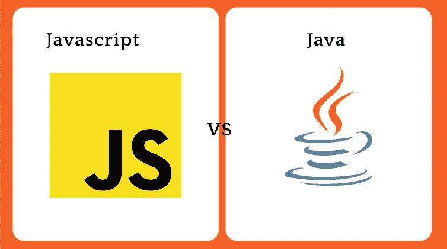
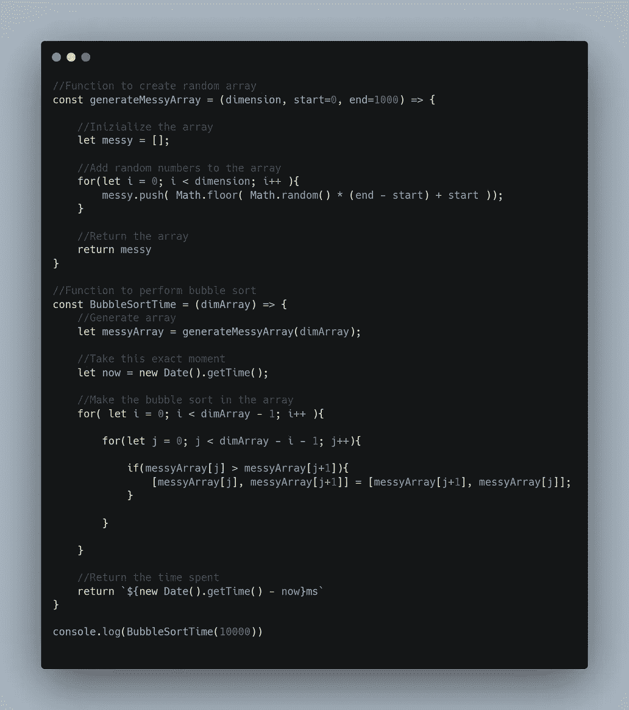
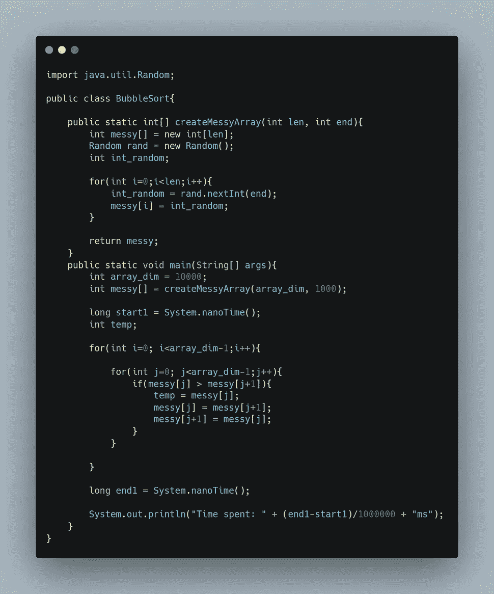
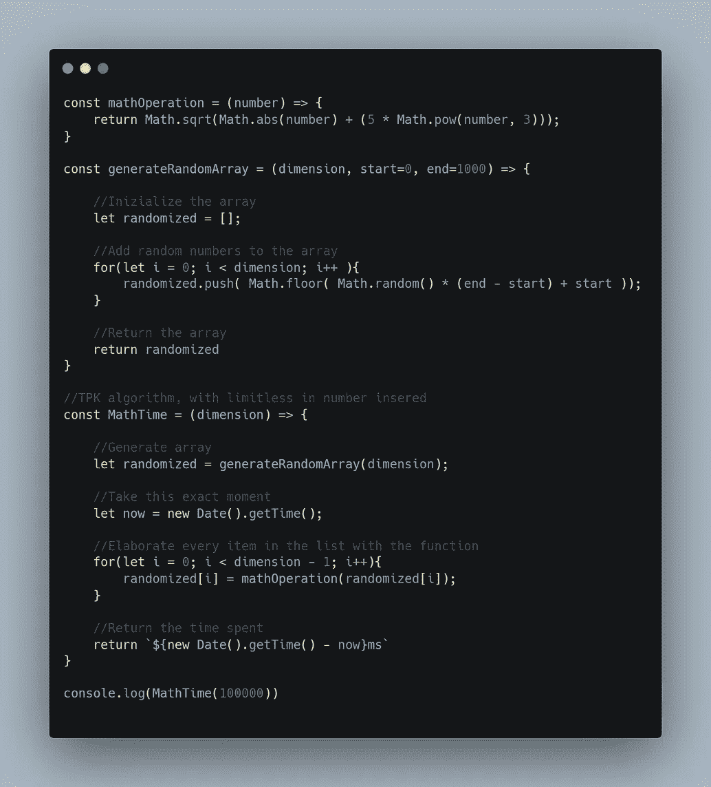
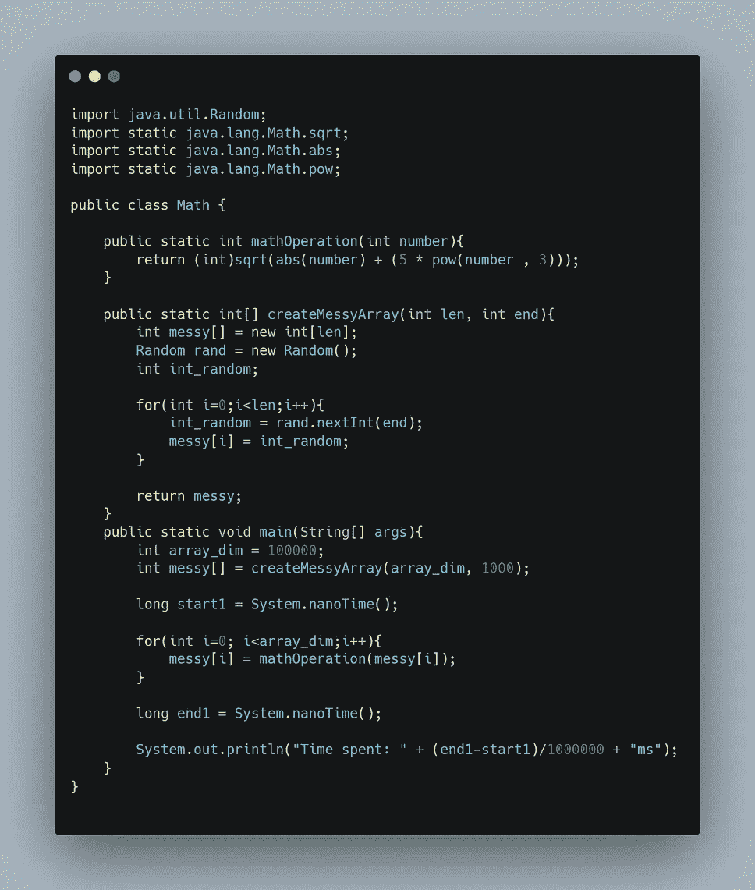
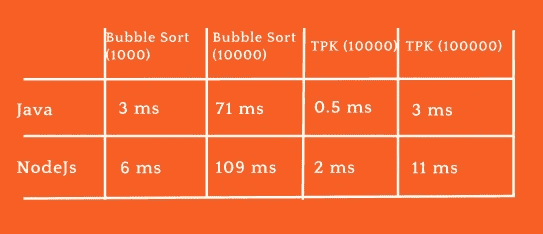

# Java 和 JavaScript:它们是一样的吗？

> 原文：<https://javascript.plainenglish.io/java-vs-javascript-are-they-the-same-88bbacd03386?source=collection_archive---------3----------------------->

在这个世界上，编程语言的形式和大小多种多样，对于初学者或没有经验的开发人员来说，只知道最著名的语言的名字可能会让人不知所措，有时甚至会感到困惑。因此，在本文中，我们将讨论当今最著名和最常用的两种编程语言。

剧透:不，它们不一样。

JavaScript VS Java

## **仿制历史**

Java 是由加拿大程序员詹姆斯·高斯林于 1995 年创造的。Java 的目标是创造一种性能语言，这种语言尽可能独立于机器的硬件，并且可以在任何地方使用。Java 的必备是:

> 一次编写，随处运行

JavaScript 于 1995 年发布(与 Java 同年)，由美国开发者 Brendan Eich 发布，他也是 Mozilla Firefox 之父。JavaScript 的创建是为了让 web 有更多的开发方式，用一种简单的语法语言可以轻松处理一切。为此，他们创建了 Mocha，这是 JavaScript 的第一个版本。

几次之后，Java 真的流行起来了，而摩卡却达不到他的目标。所以，JavaScript 的开发者决定把他的名字改成 JavaScript，让它看起来更吸引人，类似于令人难以置信的创新 Java。这个策略被证明是成功的。事实上，在那之后，JavaScript 也开始被广泛使用和认可。

Brendan Eich ( JavaScript ) and James Goslin ( Java )

## **差异**

现在让我们来谈谈一些不同之处:JavaScript 是弱类型的。这意味着变量的类型可以在运行时改变，除非你检查它，否则你不能确定它是什么类型。Java 仅是强类型的。这意味着变量的类型在程序的生命周期中永远不会改变。很多人认为 Java 方法更好，而其他人认为 JavaScript 的灵活性更方便。

哪个更好的问题没有答案，是个人选择。必须指出的是，Typescript 是一个 JavaScript 超集，因为它是强类型的，所以受到 JavaScript 开发人员的广泛喜爱和改编。这是因为使用这种特殊的方法可能会出现不容易预测和处理的异常，所以强类型语言可以节省开发人员为失败或太慢的小 API 调用进行调试的时间。因此，灵活性和安全性都很重要，但是大多数开发人员似乎更喜欢安全性。

在 Java 和 JavaScript 中，使用花括号和分号来分隔语句。两者中的注释都使用双斜线。JavaScript 文件的扩展名是。js 而 Java one 是。Java 语言（一种计算机语言，尤用于创建网站）

Javascript 支持函数式编程和面向对象编程，multiparadigm 也是如此，而 Java 则非常侧重于 OOP。这是他的优势之一。Java 的关键字 final 代表常量。它不像 JavaScript 中的 const 或其他什么东西那样使用。

继续下去，他们都有一个独特的执行方式，使他们的财富。JavaScript 是一种解释语言，在浏览器上工作，负责执行代码。它也可以在机器上执行，使用 Node.js 的运行时。Java 使用不同的方法，这使他成为一种革命性的语言。为了把自己从硬件中解放出来，Java 在第一次编译时就有了一个虚拟机。因此，从原始文件创建一个. class 文件，它将被编译成机器代码，可以在机器上执行。file 类是可以在任何有虚拟机可以编译它的地方运行的文件。虚拟机的名字叫 JVM，Java 虚拟机，很多比较年轻的编程语言比如 Kotlin 都是基于它的。

## **语言的使用**

Java 是为服务器端应用程序和后端语言而创建的。由于其各种各样的库和巨大而强大的社区，Java 有许多其他潜在的用例，这些年来一直在发展。例如，一般的移动开发，游戏开发，他的 OOP 概念的伟大实现，以及桌面应用，由于高性能。

JavaScript 既用于前端和后端开发，也用于移动，使用 React、React Native、Angular 和 Node.js 运行时等技术。Node.js 本质上是让 JavaScript 在您的机器上运行的一种方式。因此，JavaScript 几乎无处不在，甚至在某些情况下，它并没有发挥应有的作用。它几乎是制造一切的通用工具。

## **社区对 JavaScript 和 Java 的看法**

根据 Stack Overflow 2021 调查，JavaScript 的受欢迎程度高于 Java，使用这种技术的开发人员中有近 65%对 35%。它也是开发人员更喜欢的语言。事实上，根据爱恨比，几乎 61%的 JavaScript 开发人员热爱这种语言，只有 47%的 Java one 对他们的语言也是如此。JavaScript 的工资也更高，平均工资为 54049 美元，而 Java 为 51888 美元。如果你对编程社区对编程语言的看法感兴趣，我建议你阅读完整的堆栈溢出调查，链接:【https://insights.stackoverflow.com/survey/2021*T4*

## **性能**

Bubble sort in JavaScript and Java

那么，现在我们讨论了很多差异，但是这两种语言的性能呢？如前所述，Java 的主要目标是性能，它也是一种编译语言，而 JavaScript 是解释型的。所以，很容易猜到 Java 比 JavaScript 快。但是理论还不够。我需要证明这一点，所以我为这两者开发了两种算法，并进行测试，以获得切实的数据并证明我的论点。

Alternative TPK in JavaScript and Java

第一种是简单的冒泡排序，第二种是 TPK 算法的替代方案。TPK 算法是这样一种算法，给定一个数组，根据选择的操作返回带有修改元素的数组。我选择这些算法是因为它们很简单，其中一个算法的复杂度为 O(n)，而 TPK 的复杂度为 O(n)。这就是事情的经过。必须说明的是，我用的是 NodeJs runtime，所以两种语言都在同一台机器上工作，没有对平台做什么区别。对 1000 个元素进行冒泡排序，Java 需要 3 毫秒，而 JavaScript 需要 6 毫秒。对 10000 个元素进行排序，Java 只用了 71 毫秒，而 JavaScript 用了 109 毫秒。在 TPK 中，对 10000 个元素进行排序，Java 用了 0.5 毫秒，而 JavaScript 用了 2 毫秒。在 10 万个元素中，Java 在 3ms 内结束，而 JavaScript 用了 11ms。现在我们确信 Java 比 JavaScript 快得多，正如所料。你也可以在你的机器上做这个测试。

Time spent

## **利弊**

而现在，是时候分析一下这些语言的利弊了。多年来，Java 一直是一个受欢迎的选择，现在它无处不在。从游戏到服务器端应用，你几乎可以在科技的每个领域找到使用 Java 的工作。他也有出色的表现。另一方面，JavaScript 是网络标准，你可以用它做任何事情。这可能就是为什么它有一个伟大的社区。它也有很多框架和其他语言来增强它，比如 TypeScript。

现在，让我们来谈谈缺点。Java 是一种已经衰落多年的语言，很难学也很难写，现在有了像 Kotlin 这样更完整、更容易、更受欢迎的替代语言。Java 不会消失，但肯定会被重新定义。另一方面，JavaScript 解决了渲染问题，单一继承，几乎就像一个线程，浏览器中的代码可见性，这导致了安全问题，以及缺乏调试工具。

## **你应该在什么时候使用哪一个？**

正如我们之前谈到的，JavaScript 中有一些用例并不像其他用例那样适合，Java 也是如此。那么，什么时候应该使用其中的一种呢？如果你想使用前端或全栈，建议使用 JavaScript。如果你想处理几乎所有的事情，包括只使用一种语言的手机，情况也是如此。相反，如果您在后端工作，并且性能是必需的，那么 Java 是您的选择。如果你想构建原生的 Android 应用程序或强大的桌面应用程序，也是一样。对于初学者或早期程序员来说，学习 JavaScript 肯定更容易、更灵活，所以建议这样做。

## **结论**

两者都是伟大的语言，谁也不能说相反。几乎大部分基础设施都是由他们构建的，缺乏他们的开发者对每个公司来说都是一场灾难。如果你学好了这些语言中的一种，你就可以过上好一辈子。请记住，在开发世界中，总是会有更新，所以您总是需要通知自己。反正两个都很棒，不能选不正确的。

感谢阅读。如果你对 Python 和 JavaScript 的比较感兴趣，请点击这里:[*https://JavaScript . plain English . io/Python-vs-JavaScript-e 8590d 346 c3b*](/python-vs-javascript-e8590d346c3b)

如果您喜欢，请订阅

*更多内容看* [***说白了就是 io***](http://plainenglish.io/) *。报名参加我们的* [***免费周报***](http://newsletter.plainenglish.io/) *。在我们的* [***社区获得独家访问写作机会和建议***](https://discord.gg/GtDtUAvyhW) *。*