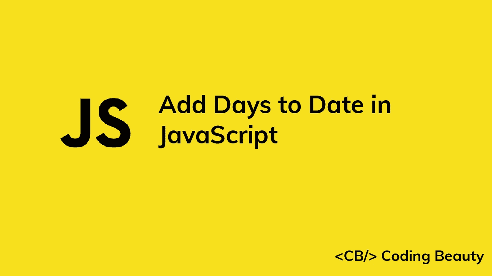

# 如何在 JavaScript 中给日期添加天数

> 原文：<https://javascript.plainenglish.io/javascript-add-days-to-date-d14273031533?source=collection_archive---------5----------------------->



# 1.Date setDate()和 getDate()方法

要在 JavaScript 中将日期添加到一个`Date`中，调用`Date`上的`getDate()`方法来获取一个月中的某一天，然后调用`Date`上的`setDate()`方法，传递`getDate()`的总和以及要添加的天数。

例如:

```
function addDays(date, days) {
  date.setDate(date.getDate() + days);
  return date;
}const date = new Date('2022-05-15T00:00:00.000Z');const newDate = addDays(date, 5);// 2022-05-20T00:00:00.000Z
console.log(newDate);
```

我们的`addDays()`函数将一个`Date`对象和要添加的天数作为参数，并返回相同的`Date`和新添加的天数。

`Date` `getDate()`方法返回一个 1 到 31 之间的数字，表示特定日期是一个月中的哪一天。

`Date` `setDate()`方法将`Date`对象中的日期更改为作为参数传递的数字。

如果您指定的数字会改变`Date`的月份或年份，`setDate()`会自动更新`Date`信息以反映这一点。

```
// April 25, 2022
const date = new Date('2022-04-25T00:00:00.000Z');date.setDate(40);// May 10, 2022
console.log(date); // 2022-05-10T00:00:00.000Zconsole.log(date.getDate()); // 10
```

四月只有 30 天，所以将`40`传递给`setDate()`会使月份增加 1，并将月份的日期设置为`10`。

## 避免副作用

`setDate()`方法改变了它所调用的`Date`对象。这给我们的`addDays()`函数带来了一个副作用。为了避免修改传递的`Date`并创建一个纯函数，制作一个`Date`的副本并在这个副本上调用`setDate()`，而不是原始的。

```
function addDays(date, days) {
  const dateCopy = new Date(date);
  dateCopy.setDate(date.getDate() + days);
  return dateCopy;
}const date = new Date('2022-05-15T00:00:00.000Z');const newDate = addDays(date, 5);console.log(newDate); // 2022-05-20T00:00:00.000Z// original not modified
console.log(date); // 2022-05-15T00:00:00.000Z
```

不修改外部状态的函数(即纯函数)更容易预测，也更容易推理。这使得限制程序中副作用的数量成为一个好习惯。

# 2.date-fns addDays()函数

或者，您可以使用 date-fns NPM 包中的纯`addDays()`函数来快速将日期添加到`Date`中。

```
import { addDays } from 'date-fns';const date = new Date('2022-05-15T00:00:00.000Z');const newDate = addDays(date, 5);console.log(newDate); // 2022-05-20T00:00:00.000Z// original not modified
console.log(date); // 2022-05-15T00:00:00.000Z
```

*更新于:*[*codingbeautydev.com*](https://codingbeautydev.com/blog/javascript-add-days-to-date/)

# JavaScript 做的每一件疯狂的事情

一本关于 JavaScript 微妙的警告和鲜为人知的部分的迷人指南。


[**报名**](https://cbdev.link/d3c4eb) 立即免费领取一份。