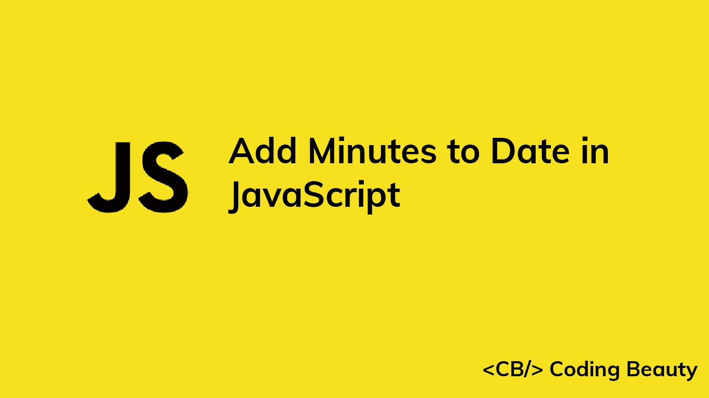

# 如何在 JavaScript 中给日期添加分钟数

> 原文：<https://javascript.plainenglish.io/javascript-add-minutes-to-date-5d5267d057e0?source=collection_archive---------15----------------------->

## 了解在 JavaScript 中向日期对象添加分钟的多种方法。



# 1.Date setMinutes()和 getMinutes()方法

要在 JavaScript 中给一个`Date`添加分钟，调用`Date`上的`getMinutes()`方法来获取分钟，然后调用`Date`上的`setMinutes()`方法，传递`Date`分钟和要添加的分钟之和。

```
function addMinutes(date, minutes) {
  date.setMinutes(date.getMinutes() + minutes); return date;
}const date = new Date('2022-05-15T00:00:00.000Z');const newDate = addMinutes(date, 10);// 2022-05-15T00:10:00.000Z
console.log(newDate);
```

我们的`addMinutes()`函数将一个`Date`和要添加的分钟数作为参数，并返回相同的`Date`和新添加的分钟数。

`Date` `getMinutes()`方法返回一个介于 0 和 59 之间的数字，表示`Date`的分钟数。

`Date` `setMinutes()`方法采用一个代表分钟的数字，并将`Date`的分钟设置为该数字。

如果您指定的分钟会改变`Date`的小时、日、月或年，`setMinutes()`会自动更新`Date`信息以反映这一点。

```
const date = new Date('2022-05-15T00:00:00.000Z');date.setMinutes(date.getMinutes() + 150);
console.log(date);
```

在本例中，将`150`传递到`setMinutes()`会使`Date`小时增加 2 (120 分钟)，并将分钟设置为`30`。

## 避免副作用

`setMinutes()`方法改变了它所调用的`Date`对象。这给我们的`addMinutes()`函数带来了一个副作用。为了避免修改传递的`Date`并创建一个纯函数，制作一个`Date`的副本并在这个副本上调用`setMinutes()`，而不是原来的:

```
function addMinutes(date, minutes) {
  const dateCopy = new Date(date);
  dateCopy.setMinutes(date.getMinutes() + minutes); return dateCopy;
}const date = new Date('2022-05-15T00:00:00.000Z');const newDate = addMinutes(date, 10);console.log(newDate); // 2022-05-15T00:10:00.000Z// Original not modified
console.log(date); // 2022-05-15T00:00:00.000Z
```

## 小费

不修改外部状态的函数(即纯函数)更容易预测，也更容易推理。这使得限制程序中副作用的数量成为一个好习惯。

# 2.日期-fns 添加分钟数()

或者，你可以使用`date-fns` NPM 包中的纯`addMinutes()`函数来快速给`Date`增加分钟数。

```
import { addMinutes } from 'date-fns';const date = new Date('2022-05-15T00:00:00.000Z');
const newDate = addMinutes(date, 10);console.log(newDate); // 2022-05-15T00:10:00.000Z// Original not modified.
console.log(date); // 2022-05-15T00:00:00.000Z
```

*更新于:*[*codingbeautydev.com*](https://cbdev.link/866ed8)

# JavaScript 做的每一件疯狂的事情

一本关于 JavaScript 微妙的警告和鲜为人知的部分的迷人指南。


[**报名**](https://cbdev.link/d3c4eb) 立即免费领取一份。