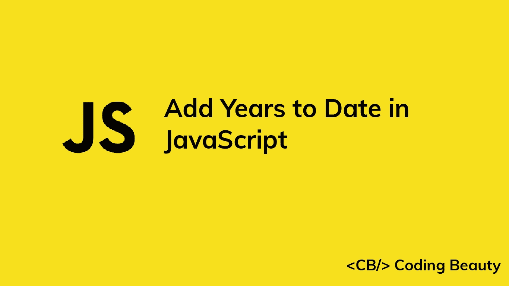

# 如何在 JavaScript 中给日期添加年份

> 原文：<https://javascript.plainenglish.io/javascript-add-years-to-date-61fd0b3c1149?source=collection_archive---------12----------------------->

## 了解如何在 JavaScript 中轻松地向日期对象添加年份。



# 1.Date setFullYear()和 getFullYear()方法

要在 JavaScript 中给一个`Date`加上年份，调用`Date`上的`getFullYear(`方法得到年份，然后调用`Date`上的`setFullYear()`方法，将`getFullYear()`和要加的年数之和作为参数传递，即`date.setFullYear(date.getFullYear() + years)`。

例如:

```
function addYears(date, years) {
  date.setFullYear(date.getFullYear() + years);
  return date;
}// May 15, 2022
const date = new Date('2022-05-15T00:00:00.000Z');const newDate = addYears(date, 3);// May 20, 2025
console.log(newDate); // 2025-05-20T00:00:00.000Z
```

我们的`addYears()`函数接受一个`Date`对象和要添加的年数作为参数，并返回相同的对象和新添加的年数。

[Date getFullYear()](https://developer.mozilla.org/en-US/docs/Web/JavaScript/Reference/Global_Objects/Date/getFullYear) 方法返回一个表示特定日期的年份的数字。

方法将日期的年份设置为一个指定的数字。

## 避免副作用

`setFullYear()`方法改变了它所调用的`Date`对象。这在我们的`addYears()`函数中引入了一个[副作用](https://en.wikipedia.org/wiki/Side_effect_(computer_science))。为了避免修改传递的`Date`并创建一个纯函数，制作一个`Date`的副本并在这个副本上调用`setFullYear()`，而不是原始的。

```
function addYears(date, years) {
  const dateCopy = new Date(date);
  dateCopy.setFullYear(dateCopy.getFullYear() + years);
  return dateCopy;
}// May 15, 2022
const date = new Date('2022-05-15T00:00:00.000Z');const newDate = addYears(date, 3);// May 20, 2025
console.log(newDate); // 2025-05-20T00:00:00.000Z// Original not modified
console.log(date); // 2022-05-15T00:00:00.000Z
```

不修改外部状态的函数(即纯函数)更容易预测，也更容易推理。这使得限制程序中副作用的数量成为一个好习惯。

# 2.date-fns addYears()函数

或者，我们可以使用`date-fns` NPM 包中的纯`addYears()`函数来快速给`Date`添加年份。

```
import { addYears } from 'date-fns';// May 15, 2022
const date = new Date('2022-05-15T00:00:00.000Z');const newDate = addYears(date, 3);// May 20, 2025
console.log(newDate); // 2025-05-20T00:00:00.000Z// Original not modified
console.log(date); // 2022-05-15T00:00:00.000Z
```

*更新于:*[*codingbeautydev.com*](https://cbdev.link/a520a0)

# JavaScript 做的每一件疯狂的事情

一本关于 JavaScript 微妙的警告和鲜为人知的部分的迷人指南。


[**报名**](https://cbdev.link/d3c4eb) 立即免费领取一份。