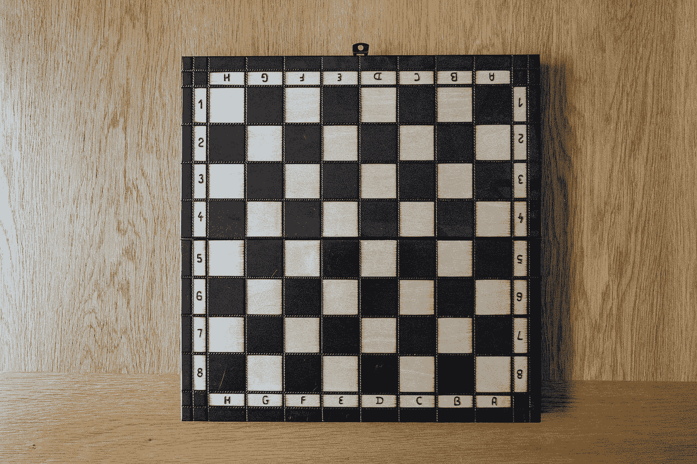

# JavaScript 算法:棋盘

> 原文：<https://javascript.plainenglish.io/javascript-algorithm-chessboard-889d01612fe5?source=collection_archive---------5----------------------->

## 创建 8×8 网格棋盘



Photo by [Nick Fewings](https://unsplash.com/@jannerboy62?utm_source=medium&utm_medium=referral) on [Unsplash](https://unsplash.com?utm_source=medium&utm_medium=referral)

今天我们要创建一个程序，输出一个代表 8×8 网格的字符串。我们将使用换行符来分解该字符串，以帮助构建网格。

在棋盘上，方格在黑色和空白或白色之间交替出现。我们对这个程序做了同样的事情，但是我们在空格和井号之间交替使用。

最后，程序应该打印出以下内容:

```
# # # #
 # # # #   
# # # #
 # # # #   
# # # #
 # # # #   
# # # #
 # # # #
```

首先，我们将创建一个变量`size`，并将值`8`赋给它。这是决定网格大小的变量。您可以创建 3x3 或 12x12 的网格，但对于本程序，它将是 8x8。

我们将创建另一个变量`board`，它将保存一个空字符串。这个变量将在程序结束时包含我们的棋盘。

```
let size = 8;
let board = "";
```

接下来，我们从外部 for 循环开始。

```
for (let y = 0; y < size; y++) {
    // more to add here
}
```

想象一个真实的棋盘。外部 for 循环创建棋盘的主体，而不是内部的单个方块或图案。我们需要用棋盘图案填充那个空白方块。这就是我们创建内部 for 循环的地方。

```
for (let y = 0; y < size; y++) {
  for (let x = 0; x < size; x++) {
    // more to add here
  }
}
```

现在我们可以开始用棋盘图案填充每一行。我们还需要告诉我们的程序何时在`#`和`" "`之间切换。如果我们没有检查到这一点，我们的程序将输出一个空白的棋盘。

为了检查这一点，我们将创建一个 if 语句。if 语句将检查字符位置号是偶数还是奇数。如果是奇数，加一个`#`。如果是偶数，加一个`" "`。

```
for (let y = 0; y < size; y++) {
  for (let x = 0; x < size; x++) {
    if ((x + y) % 2 == 0) {
      board += " ";
    } else {
      board += "#";
    }
  }
  board += "\n";
}
```

我们将适当的字符连接到 board 变量。在我们进入下一个外部循环之前，我们添加了一个新的行字符。这样我们就不会在程序结束时输出一个很长的连续字符串。

一旦我们程序中所有的 for 循环都完成了。我们控制日志板并输出上面例子中的棋盘模式。

```
console.log(board);
```

就是这样。以下是完整的代码:

如果您觉得这个算法有帮助，请查看我的其他 JavaScript 算法解决方案文章:

[](https://levelup.gitconnected.com/javascript-algorithm-convert-string-to-camel-case-9a72da82287f) [## JavaScript 算法:将字符串转换为骆驼大小写

### 将破折号和/或下划线分隔的单词转换为骆驼大小写

levelup.gitconnected.com](https://levelup.gitconnected.com/javascript-algorithm-convert-string-to-camel-case-9a72da82287f) [](/javascript-algorithm-how-to-split-strings-cd0d6be0b8b1) [## JavaScript 算法:如何拆分字符串

### 将一个字符串拆分成数组中的两个字符。

javascript.plainenglish.io](/javascript-algorithm-how-to-split-strings-cd0d6be0b8b1) [](/javascript-algorithm-list-filtering-5ad64fa2d264) [## JavaScript 算法:列表过滤

### 从数组中移除所有字符串

javascript.plainenglish.io](/javascript-algorithm-list-filtering-5ad64fa2d264) 

*更多内容请看*[***plain English . io***](https://plainenglish.io/)*。报名参加我们的* [***免费周报***](http://newsletter.plainenglish.io/) *。关注我们关于*[***Twitter***](https://twitter.com/inPlainEngHQ)*和*[***LinkedIn***](https://www.linkedin.com/company/inplainenglish/)*。查看我们的* [***社区不和谐***](https://discord.gg/GtDtUAvyhW) *加入我们的* [***人才集体***](https://inplainenglish.pallet.com/talent/welcome) *。*