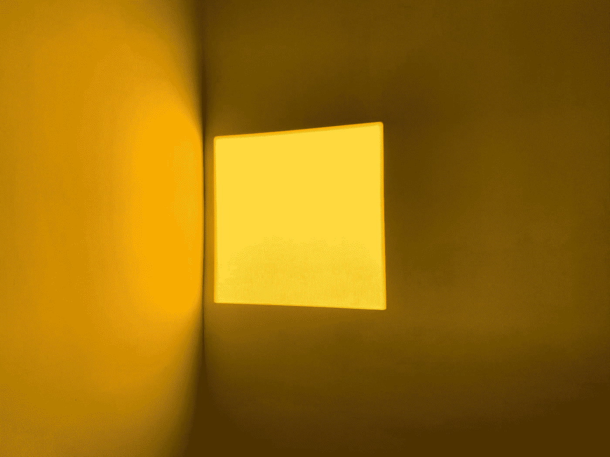

# 检查完美平方数的 JavaScript 算法

> 原文：<https://javascript.plainenglish.io/javascript-algorithm-to-check-for-a-perfect-square-number-52cfd83c0757?source=collection_archive---------1----------------------->

## 检查一个数字是否是正方



Photo by [Vincent LaVigna](https://unsplash.com/@vinnylav?utm_source=medium&utm_medium=referral) on [Unsplash](https://unsplash.com?utm_source=medium&utm_medium=referral)

我们将编写一个名为`isSquare`的函数，它将接受一个整数`n`作为参数。

在这个函数中，你将检查一个数字是否是一个完美的正方形。完美的正方形是整数的平方。换句话说，如果你对一个整数求平方根，结果应该是另一个整数。如果是这样的话，那么这个整数(你开平方的数)就是一个完美的平方。

为了知道一个数是否是完美的平方，我们计算给定数的平方根。如果结果是一个整数，那么给定的数就是一个完美的平方。

如果我们要检查`18`是否是一个完美的正方形，我们将平方根这个数字，得到`4.24264068712`。因为那不是一个整数，我们可以断定`18`不是一个完美的正方形。

但是，如果我们对`16`做同样的处理，并对该数字求平方根，我们将得到`4`。由于`4`是一个整数，我们知道`16`是一个正方。

该函数的目标是，如果给定值是完美的正方形，则返回`true`，如果不是完美的正方形，则返回`false`。

首先，我们检查数字是否是正数。完美的正方形不能是负数，所以如果是负数，返回`false`。

```
if (n < 0) {
    return false;
}
```

如上所述，知道一个数是否是完美的平方将取决于该值的平方根。我们将使用`Math.sqrt()`对输入求平方根。

```
Math.sqrt(n)
```

为了检查结果是否是一个整数，我们将使用`Number.isInteger()`并使用我们的`Math.sqrt(n)`作为参数。

```
Number.isInteger(Math.sqrt(n))
```

记住这一点，我们现在可以检查`n`是否是一个完美的正方形。如果平方根结果是整数，该函数将返回`true`，如果不是，则返回`false`。

```
if (Number.isInteger(Math.sqrt(n))) {
    return true;
} else {
    return false;
}
```

就是这样。下面是该函数的其余部分:

如果您发现这个算法很有帮助，请查看我的其他 JavaScript 算法解决方案文章:

[](https://levelup.gitconnected.com/javascript-algorithm-convert-string-to-camel-case-9a72da82287f) [## JavaScript 算法:将字符串转换为骆驼大小写

### 将破折号和/或下划线分隔的单词转换为骆驼大小写

levelup.gitconnected.com](https://levelup.gitconnected.com/javascript-algorithm-convert-string-to-camel-case-9a72da82287f) [](/javascript-algorithm-square-every-digit-932de6046c54) [## JavaScript 算法:平方每个数字

### 将一个数字的每一个数字平方，然后连接起来

javascript.plainenglish.io](/javascript-algorithm-square-every-digit-932de6046c54) [](https://levelup.gitconnected.com/javascript-algorithm-calculate-sum-of-all-numbers-in-a-jagged-array-94230951d726) [## JavaScript 算法:计算交错数组中所有数字的和

### 创建一个计算交错数组中所有数字之和的函数。

levelup.gitconnected.com](https://levelup.gitconnected.com/javascript-algorithm-calculate-sum-of-all-numbers-in-a-jagged-array-94230951d726) 

*更多内容请看*[***plain English . io***](http://plainenglish.io/)*。报名参加我们的* [***免费周报***](http://newsletter.plainenglish.io/) *。在我们的* [***社区***](https://discord.gg/GtDtUAvyhW) *获得独家获得写作机会和建议。*