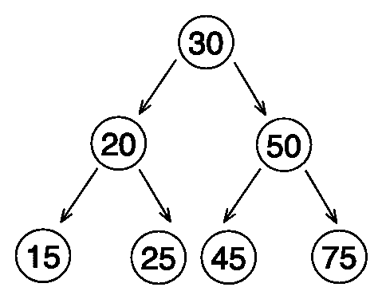

# JavaScript 算法:二叉树遍历(BFS，DFS)

> 原文：<https://javascript.plainenglish.io/javascript-algorithms-binary-tree-traversal-bfs-dfs-dc9801cba8cb?source=collection_archive---------3----------------------->

Photo by [Simon Wilkes](https://unsplash.com/@simonfromengland?utm_source=unsplash&utm_medium=referral&utm_content=creditCopyText) on [Unsplash](https://unsplash.com/s/photos/tree?utm_source=unsplash&utm_medium=referral&utm_content=creditCopyText)

树是最流行的数据结构。与普通的树不同，二叉树看起来像这样:

balanced binary tree

二叉树是这样一种树，在这种树中，对于任何节点，以下规则都是正确的:这个节点左边的后代总是小于它，右边的后代总是大于它。所以把这样的树变成一个排序的数组，找到最小和最大的值，或者只找到需要的值，是非常容易的。

考虑如何创建二叉树节点

高度最小的搜索树称为*。使得左右子树的高度相差不超过 1。*

*对于具有最小高度的树，左右子树中的节点数必须尽可能接近。我们按照这个原理来建一棵树:数组每一个分段的中间部分成为根节点，左右部分成为它对应的子树。因为数组是排序的，所以结果树匹配二叉查找树的定义。*

*从数组创建二叉平衡树*

*树是没有圈的连通图。连通性意味着从一个顶点到另一个顶点都有一条沿着边的路径。没有循环意味着这条路是唯一的。图的遍历是对所有顶点的一次系统访问。*

*有两种类型的图遍历:*

1.  ***深度优先搜索***
2.  ***广度优先搜索(BFS)***

*这些算法也适用于二叉树*

## ***BFS 穿越***

*广度优先搜索(BFS)从起始顶点开始，首先访问距离起始顶点一条边的所有顶点，然后访问距离起始顶点两条边的所有顶点，依此类推。广度优先搜索算法本质上是非递归的(迭代的)。为了实现它，使用了队列数据结构(FIFO)。*

*让我们尝试遍历我们的二叉树*

*BFS traversal*

*遍历树后，结果将是一个数组，顺序如下:***【30，20，50，15，25，45，75】****

## *DFS 遍历*

*深度优先搜索(DFS)从初始顶点开始，访问尚未被访问的顶点，而不考虑与初始顶点的距离。深度优先搜索算法本质上是递归的。为了在算法的迭代版本中模拟递归，使用了堆栈数据结构。深度优先遍历也包括 3 种类型的顺序遍历:*

*   *有序遍历(左-根-右)*
*   *前序遍历(根-左-右)*
*   *后序遍历(左-右-根)*

*让我们尝试遍历我们的二叉树*

## ****预订单****

*DFS pre order traversal*

*遍历完树，结果会是一个数组，顺序如下:***【30，20，15，25，50，45，75】****

## *中根次序*

*DFS in order traversal*

*遍历完树，结果会是一个数组，顺序如下:***【15，20，25，30，45，50，75】****

## *后期订单*

*DFS post order traversal*

*遍历树后，结果将是一个按以下顺序排列的数组:***【15，25，20，45，75，50，30】****

> *DFS **inOrder** 遍历按排序顺序遍历所有节点。如果我们要以反向排序的顺序访问节点，那么在递归**的代码中，为了**遍历函数，应该交换*和 ***左*** 子节点。**

**希望对你有用！**

**感谢阅读！回头见。😊**

***更多内容请看* [***说白了就是***](https://plainenglish.io/) *。***

***报名参加我们的* [***免费每周简讯***](http://newsletter.plainenglish.io/) *。关注我们* [***推特***](https://twitter.com/inPlainEngHQ) ，[***LinkedIn***](https://www.linkedin.com/company/inplainenglish/)*，*[***YouTube***](https://www.youtube.com/channel/UCtipWUghju290NWcn8jhyAw)*，* [***不和***](https://discord.gg/GtDtUAvyhW) ***。*****

*****有兴趣缩放你的软件启动*** *？检查* [***电路***](https://circuit.ooo?utm=publication-post-cta) *。***