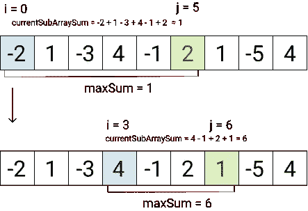
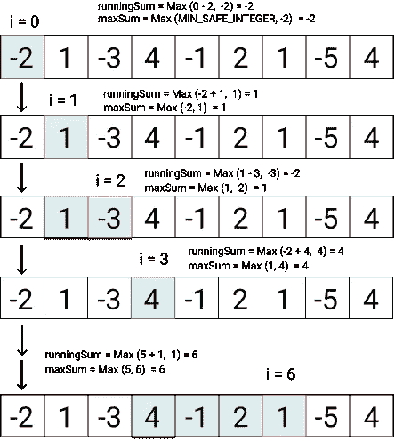
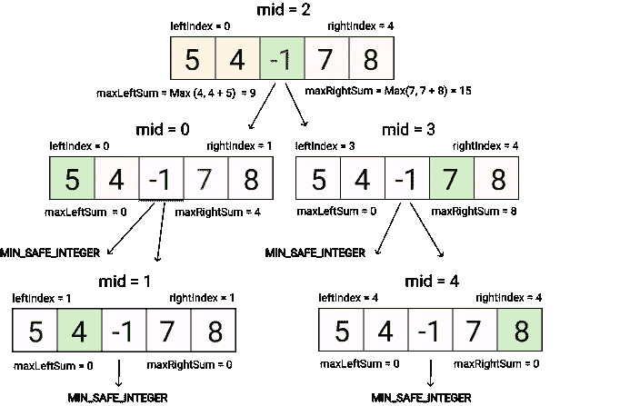

# JavaScript 算法:最大子数组(LeetCode)

> 原文：<https://javascript.plainenglish.io/javascript-algorithms-maximum-subarray-leetcode-15812b95bc4?source=collection_archive---------6----------------------->


Photo by [Bogdan Kupriets](https://unsplash.com/@kupriets?utm_source=unsplash&utm_medium=referral&utm_content=creditCopyText) on [Unsplash](https://unsplash.com/explore?utm_source=unsplash&utm_medium=referral&utm_content=creditCopyText)

# 描述

给定一个整数数组`nums`，找到具有最大和的连续子数组(至少包含一个数),并返回其和*。*

一个**子数组**是一个数组的**连续**部分。

**例 1:**

```
**Input:** nums = [-2,1,-3,4,-1,2,1,-5,4]
**Output:** 6
**Explanation:** [4,-1,2,1] has the largest sum = 6.
```

**例 2:**

```
**Input:** nums = [1]
**Output:** 1
```

**例 3:**

```
**Input:** nums = [5,4,-1,7,8]
**Output:** 23
```

**约束:**

*   `1 <= nums.length <= 105`
*   `-104 <= nums[i] <= 104`

# 解决办法

解决这个问题有几种选择:*蛮力方法，Kadane 的算法*和*分而治之方法。*

## 强力方法

我们可以计算每一个可能的子阵列的和，其中的最大值就是解。非常明显，但是不太好解，因为它有时间复杂度 *O(n)和 s* 步复杂度: *O(1)* 。

在 Chrome 浏览器中的开始位置 ***i = 0*** 和***j = 0******maxSum =-9007199254740991***。此外，当我们与***currentsubraysum***的总和进行比较时，我们将覆盖变量 ***maxSum。***



Brute Force Approach

枚举完所有选项后， ***maxSum*** 将存储顺序子数组的最大和。

## *卡丹的算法*

我们将从数组 ***nums*** 的第一个元素开始，计算以元素 ***nums[i + n]结尾的每个可能的子数组的总和。*** 更难理解的解但具有更好的时间复杂度 *O(n)和相同的 s* 步复杂度: *O(1)。*

当数组的下一个元素大于 prev 子数组与 current 元素之和(***running sum = math . max(running sum+nums[I]，nums[i]*** )时，我们改变子数组的开头，从当前元素开始。示例 ***i =1*** 和 ***i = 3*** 如下图所示。



在计算的最后，我们将得到 max sum = 6。

## ***分而治之***

这种方法比 *Kadane 的算法*慢，比*蛮力方法快。*有 *t* 时间复杂度:*)*空间复杂度: *O(log(n))* 。

这个解决方案很难理解，因为它使用了递归调用自身的函数*findmaxsubaraysum*。对于每个递归函数，必须有一个条件，在这个条件下递归调用被中断。在我们的例子中，这是比较左和右数组的索引( ***左>右)*** )。

考虑一个更简单的数组作为例子**【5，4，-1，7，8】*。***



在我们第一次调用*findmaxsubaraysum*时，我们在数组中搜索 mid，并使用 for 循环从 mid 开始访问左侧和右侧的每个元素，并检查最大和。然后，我们将数组分成两半，每一半调用*findmaxsubaraysum*。这两个调用都将遍历这一半中的每个元素，这又组合成了 nums 的每个元素。当数组的开始索引大于数组的结束索引(***left>right***)时，我们返回可能的最小值。

计算结束时，我们的函数返回数组的最大和，包括其中间的 **max *Sum*** ，或者数组右侧或左侧的和，如果和也较大(*math . max(****left half****，****right half****)。*

希望对你有用！

感谢阅读！回头见。😊

*更多内容请看*[***plain English . io***](https://plainenglish.io/)*。报名参加我们的* [***免费周报***](http://newsletter.plainenglish.io/) *。关注我们关于*[***Twitter***](https://twitter.com/inPlainEngHQ)*和*[***LinkedIn***](https://www.linkedin.com/company/inplainenglish/)*。查看我们的* [***社区不和谐***](https://discord.gg/GtDtUAvyhW) *加入我们的* [***人才集体***](https://inplainenglish.pallet.com/talent/welcome) *。*