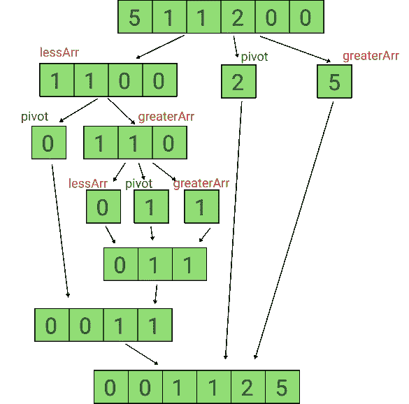
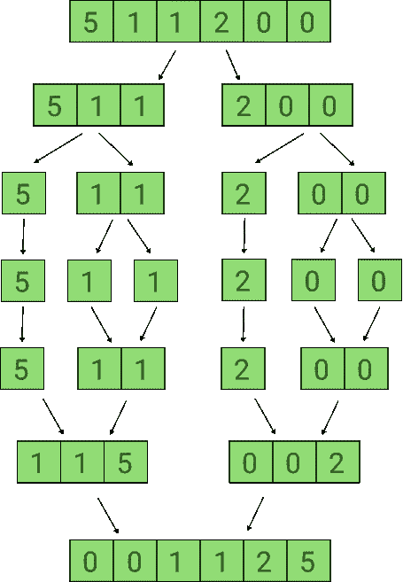

# JavaScript 算法:对数组排序(LeetCode)

> 原文：<https://javascript.plainenglish.io/javascript-algorithms-sort-an-array-leetcode-9eb6126d465d?source=collection_archive---------5----------------------->


Photo by [Yukitaka Iha](https://unsplash.com/@utakaha?utm_source=unsplash&utm_medium=referral&utm_content=creditCopyText) on [Unsplash](https://unsplash.com/s/photos/sorting-array?utm_source=unsplash&utm_medium=referral&utm_content=creditCopyText)

排序算法是一种排列列表元素的算法。最常用的顺序是数字顺序和字典顺序，以及升序或降序。

在这篇文章中，我们将探索不同的排序算法，并考虑问题[排序来自 Leetcode 的数组](https://leetcode.com/problems/sort-an-array/)

## 描述

给定一个整数数组`nums`，按升序对数组排序。

**例 1:**

```
**Input:** nums = [5,2,3,1]
**Output:** [1,2,3,5]
```

**例二:**

```
**Input:** nums = [5,1,1,2,0,0]
**Output:** [0,0,1,1,2,5]
```

**约束:**

*   `1 <= nums.length <= 5 * 104`
*   `-5 * 104 <= nums[i] <= 5 * 104`

**解决方案**

解决这个问题有几种选择:

# 冒泡排序

冒泡排序是最简单的排序算法，如果相邻元素的顺序不对，它会重复交换相邻元素。该算法不适合大数据集，因为它具有时间复杂度 *O(n)和空间复杂度*:*O(1)*。

正如我们前面讨论过的没有优化的冒泡排序的实现。即使数组被排序，代码运行的复杂度也是 O(n)。让我们看看如何实现一个优化的冒泡排序算法。

# 快速排序

快速排序是一种基于[分治算法](https://en.wikipedia.org/wiki/Divide-and-conquer_algorithm)原理的排序算法。

*   通过选择参考元素(从阵列中选择的元素)将阵列分成子阵列。分割数组时，必须定位锚点元素，使小于锚点的元素留在锚点的左侧( ***小于*** )，大于锚点的元素留在锚点的右侧( ***大于*** )。
*   少于*和多于*的右侧也使用相同的方法分割。这个过程一直持续到每个子阵列包含一个元素。**
*   **最后，这些元素被连接成一个有序的数组。**

****

**时间复杂度 *O(n⋅log(n))和 s* 步速复杂度: *O(* l *og(n))* 。**

# ****合并排序****

**合并排序是最流行的排序算法之一，也是基于[分治算法](https://en.wikipedia.org/wiki/Divide-and-conquer_algorithm)的原理。**

**这里，一个问题被分成多个子问题。每个子问题单独解决。最后将子问题组合起来形成最终解。**

****

**时间复杂度 *O(n⋅log(n))和 s* 步速复杂度: *O(n)* 。**

**还有其他排序算法也可以解决这个问题，但今天我们考虑了最流行的方法。**

**希望对你有用！**

**感谢阅读！回头见。😊**

***更多内容看* [***说白了就是***](https://plainenglish.io/) *。报名参加我们的* [***免费周报***](http://newsletter.plainenglish.io/) *。关注我们关于* [***推特***](https://twitter.com/inPlainEngHQ)[***领英***](https://www.linkedin.com/company/inplainenglish/)**和* [***不和***](https://discord.gg/GtDtUAvyhW) ***。******