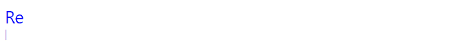

# 2022 年 13 个最佳 JavaScript 动画库

> 原文：<https://javascript.plainenglish.io/javascript-animation-libraries-7686027a1040?source=collection_archive---------2----------------------->

## 这 13 个强大的库使得创建令人惊叹的效果变得更加容易，从而带来令人愉快的用户体验。

动画是让你的网站脱颖而出并吸引访问者注意力的好方法。借助富有创意的对象运动和流畅的页面过渡，您可以给用户留下丰富、迷人的体验，给他们留下良好的第一印象。

有时候你想要添加的动画会很简单，CSS 足以创建它们。然而，对于更复杂和交互式的效果，JavaScript 将是更好的选择。使用 JavaScript 创建动画可以让你更好地控制它们，并且可以让你很容易地协调位置、颜色、大小等的变化。多个物体同时出现。另外，您将能够利用变量、函数和控制结构来实现复杂的逻辑，并避免重复。在 JavaScript 中创建动画的典型方法是使用经典的`setInterval()`函数、更平滑的`requestAnimationFrame()`函数或者更新的`Element.animate()`方法。

本文列出了 13 个强大而流行的 JavaScript 库，它们简化了动画制作过程。其中一些库是通用的，因为它们可以在广泛的场景中使用，而另一些库专注于特定的用例，做一件事情并做好。

# 1. [Anime.js](https://animejs.com/)

An animation created with Anime.js.

Anime.js 是最受欢迎的动画库之一，GitHub 上有超过 43k 个明星。这是一个轻量级的 JavaScript 动画库，带有一个简单的 API，可用于动画 CSS 属性、SVG、DOM 属性和 JavaScript 对象。使用 Anime.js，您可以播放、暂停、重新启动或反转动画。该库还提供了交错功能，可以通过后续和重叠动作来制作多个元素的动画。还有各种动画相关的事件也包括在内，我们可以使用回调和承诺来听。

[访问 Anime.js 网站](https://animejs.com/)

# 2.[洛蒂](https://airbnb.io/lottie/)

Animation rendered with Lottie.

Lottie 是一个库，它解析用 Bodymovin 插件导出为 JSON 的 Adobe After Effects 动画，并在移动和网络应用程序上自然呈现它们。这消除了由专业设计人员手动重新创建在 After Effects 中创建的高级动画的需要。仅网页版在 GitHub 上就有超过 27k 颗星。

[访问洛蒂网站](https://airbnb.io/lottie/)

# 3.[速度](http://velocityjs.org/)

An animation created with Velocity.

使用 Velocity，您可以创建彩色动画、变换、循环、动画效果、SVG 动画等等。它被设计成使用与 jQuery 库中的`$.animate()`方法相同的 API，如果 jQuery 可用，它可以与 jQuery 集成。该库提供淡入淡出、滚动和幻灯片效果。除了能够控制动画的持续时间和延迟，您还可以在动画完成后的某个时间反转它，或者在动画进行过程中完全停止它。它在 GitHub 上有超过 17k 颗星星，是 Anime.js 的一个很好的替代品。

[访问 Velocity 网站](http://velocityjs.org/)

# 4.[粗略符号](https://roughnotation.com/)

Some Rough Notation annotation styles.

Rough Notation 是一个 JavaScript 库，用于在网页上创建彩色注释并制作动画。它使用 [RoughJS](https://roughjs.com/) 来创建手绘的外观和感觉。您可以创建多种批注样式，包括下划线、方框、圆圈、突出显示、删除线等。，并控制每个注释样式的持续时间和颜色。

[访问粗略符号网站](https://roughnotation.com/)

# 5. [Popmotion](https://popmotion.io)

An animation created with Popmotion.

Popmotion 是一个函数库，用于创建引人注目的动画。让它脱颖而出的是，它没有对您想要制作动画的对象属性做任何假设，而是提供了可以在任何 JavaScript 环境中使用的简单、可组合的函数。

该库支持数字、颜色和复杂字符串上的关键帧、弹簧和惯性动画。它经过了良好的测试，得到了积极的维护，在 GitHub 上拥有超过 19k 颗星。

[访问 Popmotion 网站](https://popmotion.io)

# 6.[活着](https://maxwellito.github.io/vivus/)

An animation created with Vivus.

Vivus 是一个 JavaScript 库，允许您将 SVG 制作成动画，给它们一种被绘制的外观。它是快速和轻量级的，因为它没有依赖性。它提供了三种不同的方式来激活 SVG:延迟、同步和一对一。您还可以使用自定义脚本以您喜欢的方式绘制 SVG。

Vivus 还允许您自定义持续时间、延迟、定时功能和其他动画设置。查看 [Vivus Instant](https://maxwellito.github.io/vivus-instant/) 获取现场实践示例。

[访问 Vivus 网站](https://maxwellito.github.io/vivus/)

# 7.[绿巨人动画平台(GSAP)](https://greensock.com/)

An animation created with GSAP.

GreenSock 动画平台(GSAP)是一个库，让您创建精彩的动画，工作在所有主要的浏览器。您可以在 React、Vue、WebGL 和 HTML 画布中使用它来制作颜色、字符串、运动路径等动画。它还带有一个 ScrollTrigger 插件，可以让你用很少的代码创建令人印象深刻的基于滚动的动画。

在超过 1100 万个网站上使用，GitHub 上有超过 15000 颗星星，GSAP 是这个列表中最受认可的动画工具之一。您可以使用 GreenSock 的 GSDevTools 轻松调试用 GSAP 创建的动画。

[访问 GSAP 网站](https://greensock.com/)

# 8. [Three.js](https://threejs.org/)

An animation created with Three.js

Three.js 是一个轻量级的库，用于显示复杂的 3D 对象和动画。它利用 WebGL、SVG 和 CSS3D 渲染器来创建引人入胜的三维体验，可在各种浏览器和设备上工作。它是 JavaScript 社区中的知名库，GitHub 上有超过 85k 颗星。

[访问 Three.js 网站](https://threejs.org/)

# 9.[滚动显示](https://scrollrevealjs.org/)

Animations created with ScrollReveal.

ScrollReveal 库允许您在 DOM 元素进入或离开浏览器视口时轻松地对其进行动画处理。它提供了各种优雅的效果，可以在多种浏览器中显示或隐藏滚动元素。它是一个易于使用的库，在 GitHub 上具有零依赖性和超过 21k 的星星。

[访问 ScrollReveal 网站](https://scrollrevealjs.org/)

# 10. [Barba.js](https://barba.js.org/)

Page transitions created with Barba.js.

让你的网站与众不同的一个创造性的方法是，当你的用户在页面之间导航时，在页面之间添加生动的过渡。这比简单地显示新网页或重新加载浏览器产生了更好的 UX。

Barba.js 是一个库，通过使站点像 SPA(单页应用程序)一样运行，让您创建这样的页面过渡。它减少了页面之间的延迟，并最小化了浏览器发出的 HTTP 请求的数量。它在 GitHub 上获得了近万颗星。

[访问 Barba.js 网站](https://barba.js.org/)

# 11. [Mo.js](https://mojs.github.io/)

An animation created with Mo.js.

Mo.js 是一个用于创建引人注目的运动图形的优秀库。它提供了简单的声明式 API，可以毫不费力地创建流畅的动画和效果，在各种屏幕尺寸的设备上看起来都很棒。您可以移动 HTML 或 SVG DOM 元素，也可以创建一个特殊的 Mo.js 对象，它具有一组独特的功能。它是一个可靠且经过充分测试的库，编写了超过 1500 个测试，GitHub 上有超过 17k 颗星。

[访问 Mo.js 网站](https://mojs.github.io/)

# 12. [Typed.js](https://mattboldt.com/demos/typed-js/)

An animation created with Typed.js.

Typed.js 可以简单地描述为一个动画类型库。它一个字符一个字符地打出一个特定的字符串，就像有人在实时打字一样。您可以自定义键入速度，甚至暂停键入一段特定的时间。通过智能退格，它可以打出与当前字符串相同的字符开始的连续字符串，而不用退格整个前面的字符串。

还包括对批量输入的支持，这使得一组字符可以同时在屏幕上输入，而不是一个接一个地输入。Typed.js 在 GitHub 上有超过 12k 颗星，受到 Slack 和 Envato 的信任。

[访问 Typed.js 网站](https://mattboldt.com/demos/typed-js/)

# 13. [Parallax.js](https://matthew.wagerfield.com/parallax/)

An animation created with Parallax.js.

使用 Parallax.js，您可以使网页上的元素对智能设备的方向做出反应。如果它无法检测陀螺仪或运动检测硬件，那么这些元素将对光标的位置做出响应。对输入的响应可以成就一个杰出的、高度互动的网站。这一有趣的功能使该库在 GitHub 上获得了近 16k 颗星。

[访问 Parallax.js 网站](https://matthew.wagerfield.com/parallax/)

# 结论

有了这些强大而灵活的 JavaScript 动画库，您会发现创建令人惊叹的效果更加容易，从而带来令人愉快的用户体验。

*原载于*[*codingbeautydev.com*](https://cbdev.link/51fe77)

# JavaScript 做的每一件疯狂的事情

一本关于 JavaScript 微妙的警告和鲜为人知的部分的迷人指南。

[**报名**](https://cbdev.link/d3c4eb) 立即免费领取一份。