# JavaScript 数组方法—迭代

> 原文：<https://javascript.plainenglish.io/javascript-array-methods-iteration-82241f681f4b?source=collection_archive---------12----------------------->

## 迭代数组，没有循环，变得简单！

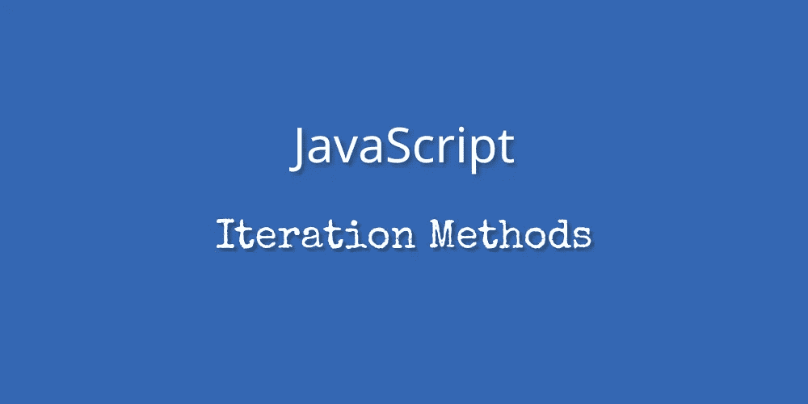

每个人都或多或少地使用过 *for loops* 来迭代一个数组，如果你刚刚开始使用 JavaScript，很有可能你仍然是这样。虽然这没有什么错，但是数组类定义的方法有助于用*清理*，更*简洁的* & *可读的*代码。

迭代方法的主要前提是按顺序遍历数组元素，并将它们传递给我们提供的函数。这个函数可以是内联定义的，也可以是已经声明的，或者是一个箭头函数。

**迭代方法**

*   **地图()**

*map()* 方法将每个数组元素传递给提供的函数，并返回一个*新数组*，其中包含该函数返回的值。

如果数组是*稀疏的*，将不会对缺少的元素调用该函数。然而，新数组也将是**稀疏的**。

这里需要注意的一个**重要的**事情是*而不是*使用返回的数组是一个*反模式*，在这种情况下，我们最好使用 forEach()方法。

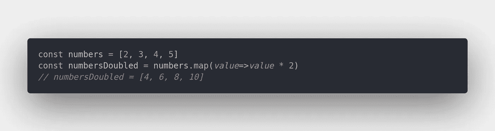

Generating a new array, consisting of the original values, **multiplied** by 2.

*   **forEach()**

使用这种方法，我们可以遍历一个数组并为每个元素调用一个函数，*而不需要*返回一个新的数组。它最多接受三个*参数，数组元素是唯一需要的*——然而，我们可以将元素的索引和要迭代的数组作为可选参数传递。**

*值得**注意**的是，在为所有数组元素调用提供的函数之前终止迭代是不可行的。*

*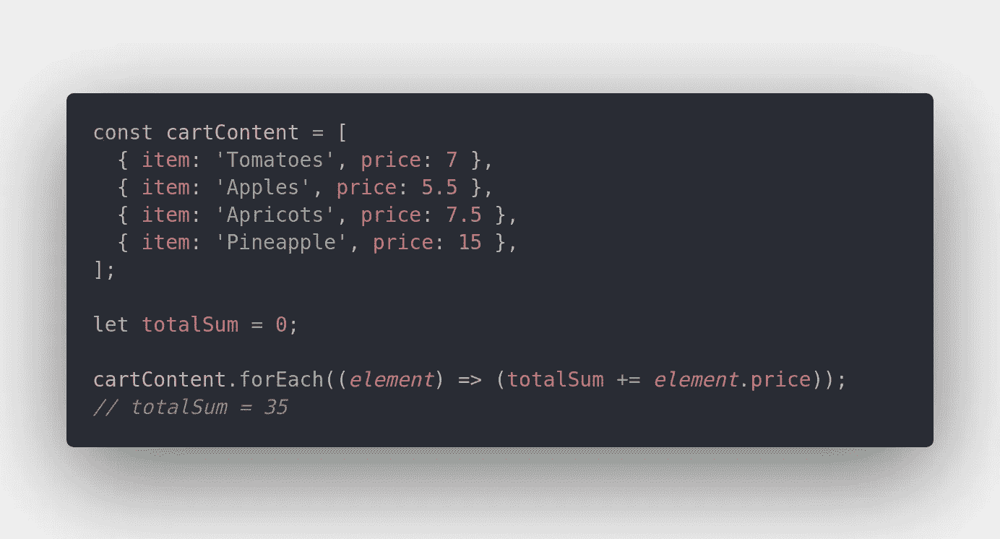*

*Deriving the **sum** of all items’ prices.*

*   ***过滤器()***

*顾名思义， *filter()* 创建一个*新数组*，包含通过指定条件的元素。*

*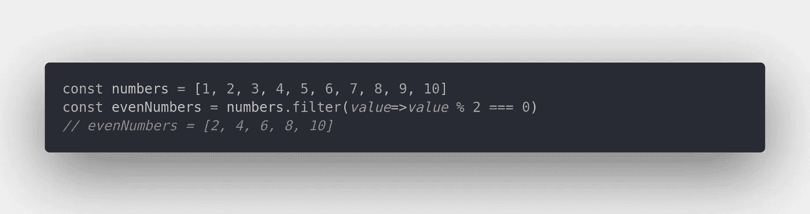*

*Filtering the original array and getting back a new one, consisting of solely **even** numbers.*

*这个方法的一个有趣的用例是，我们可以在*稀疏*数组上使用它来返回它们的**密集**等价数组。*

*下面的过滤基于 JavaScript 的*类型转换*，作为稀疏数组索引——否则孔将是未定义的，因此默认为 falsy。*

*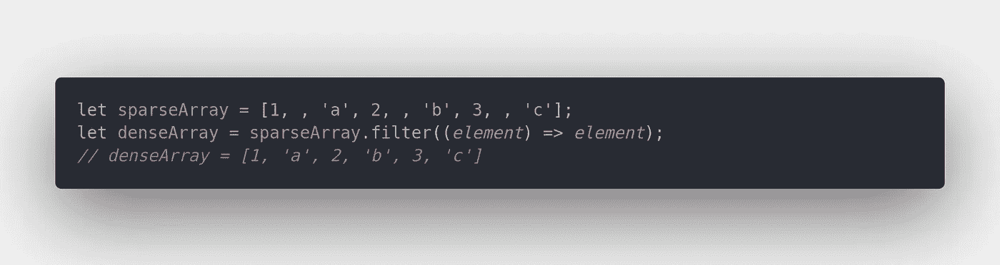*

*Filtering based on whether each element is truthy — returns a **dense** array.*

*   ***reduce()&reduce right()***

*这两种方法都迭代数组&根据提供的函数返回一个值。这里它们的关键区别是 **reduce()** 从左到右工作，意思是从第一个数组元素到最后一个，而 **reduceRight()** 走的是与相反的*路——从最后一个元素一直到第一个。**

*它们接受两个参数——一个*函数*指示数组将如何减少，以及一个函数的初始值，它是*可选的*。如果没有提供初始值，那么初始值将是第一个数组元素。*

**在函数*中，我们最多可以传递 4 个参数——前一个值、当前值、当前索引和要迭代的数组，最后两个参数是可选的*。**请记住**，如果已经提供了初始值，*回调的前一个值将与第一次函数调用*时的初始值相同。**

**在下面的例子中，你可以看到我们是如何把所有商品的价格加起来的。由于初始值为 0，在第一次调用*时，*和将等于 0。**

**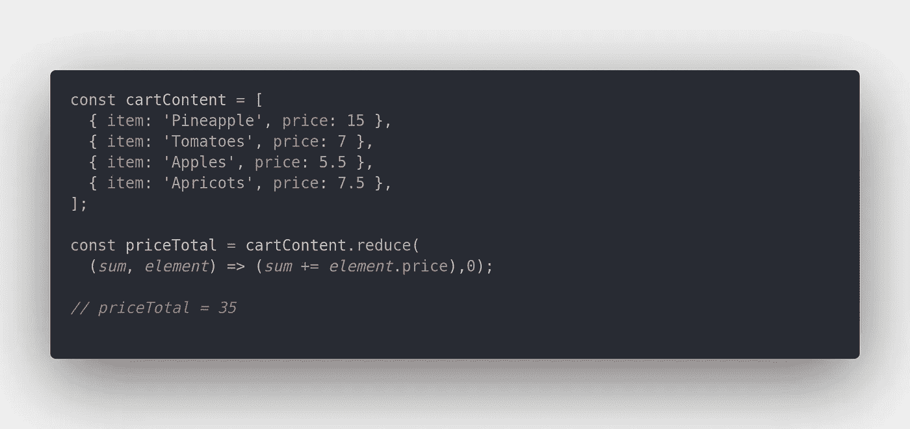**

**Reducing an array of objects to a single value, the **sum** of all objects’ prices.**

**基于同样的前提，我们也可以使用 reduce()根据指定的条件派生出一个完整的对象——比如最昂贵的对象。**

**在下面的例子中，我们将前一个商品的价格与当前价格进行比较，并返回最高价格。在第一次调用时，将 7 赋给 initialValue.price，将 5.5 赋给 currentValue.price，而在最后一次调用时，initialValue.price 等于 7.5，然后与 current value . price(15)进行比较。**

**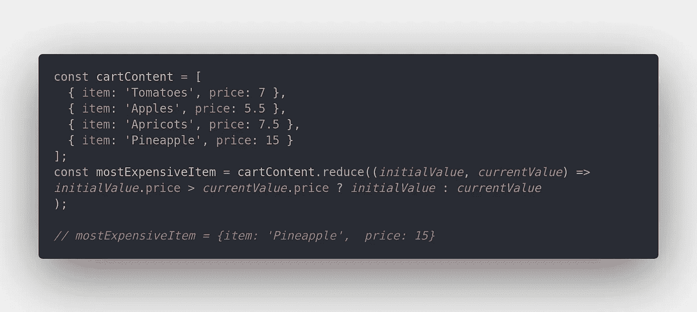**

**Reducing an array of objects by comparing each, to find the **highest** value.**

**为了使我们的代码更具可读性和模块化，我们还可以向 reduce 方法传递一个预定义的函数:**

**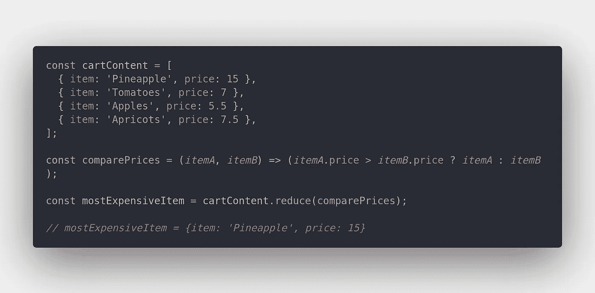**

**Passing a **pre-defined** function to reduce().**

*   ****凡()&有的()****

**这两种方法都迭代数组并返回一个布尔值，这取决于是否每个或某些元素都通过了指定的测试。**

**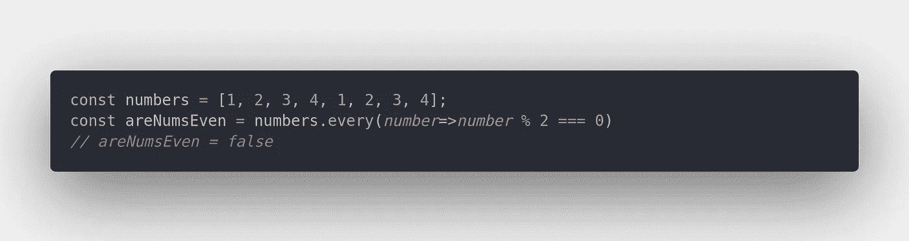**

**Checking if every single array element is even — since they are not, **false** is returned.**

**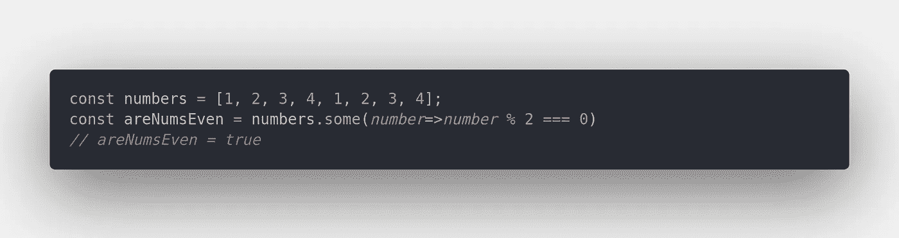**

**Checking if some array elements are even — since some are, **true** is returned.**

*   ****find()** ，**find index()&lastIndexOf()****

**三种非常相似的方法，但本质上不同。一旦满足指定的条件，所有这些函数*都停止迭代，find()返回匹配元素，而 findIndex() & lastIndexOf()返回匹配元素的索引。这两者之间的*差异*在于它们如何迭代数组——find index()从*开始的*开始，返回第一个出现的结果，而 lastIndexOf()向后*搜索*，返回最后一个出现的结果。***

*值得**注意的是**如果没有出现，*findIndex()和 lastIndexOf()都将返回-1。**

*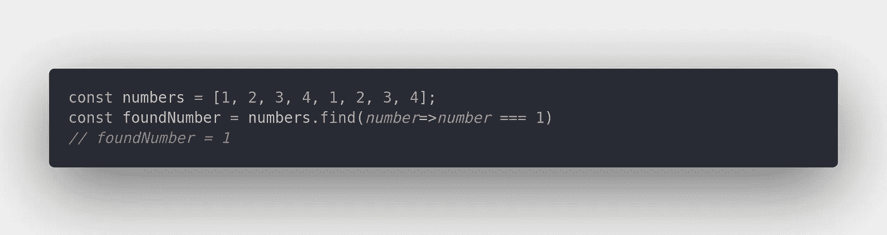*

*As soon as the condition is met, the iteration **stops**.*

*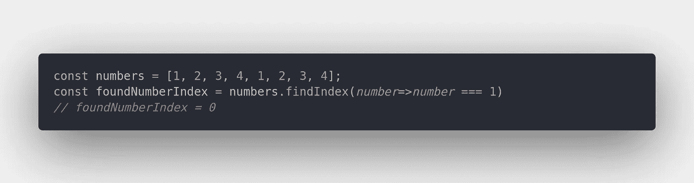*

*Index 0 is returned, as findIndex is executed until the predicate function returns **true**.*

*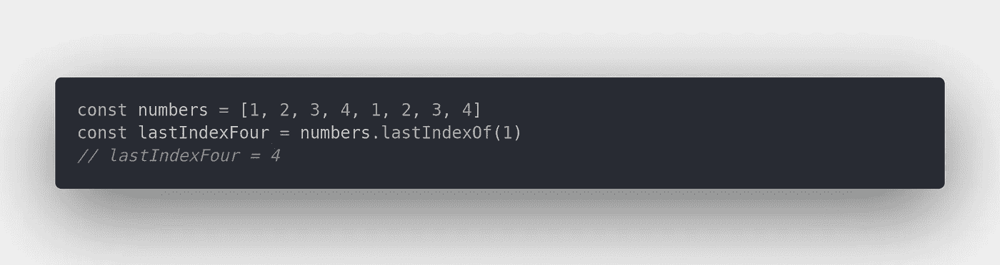*

*Index 4 is returned, as lastIndexOf() searches **backwards**.*

*要了解更多关于数组方法的信息，我强烈推荐以下内容:*

*   *[MDN 网络文档](https://developer.mozilla.org/en-US/docs/Web/JavaScript/Reference/Global_Objects/Array)*
*   *[W3Schools](https://www.w3schools.com/js/js_array_methods.asp)*

*现在你知道了！ **9 个 JavaScript 方法**，迭代数组，有各种用例，不需要‘for*循环’*。感谢你花时间阅读这篇文章，我希望在下一篇文章中见到你！*

**更多内容看* [*说白了。报名参加我们的*](http://plainenglish.io/) [*免费周报*](http://newsletter.plainenglish.io/) *。在我们的* [*社区*](https://discord.gg/GtDtUAvyhW) *获得独家写作机会和建议。**