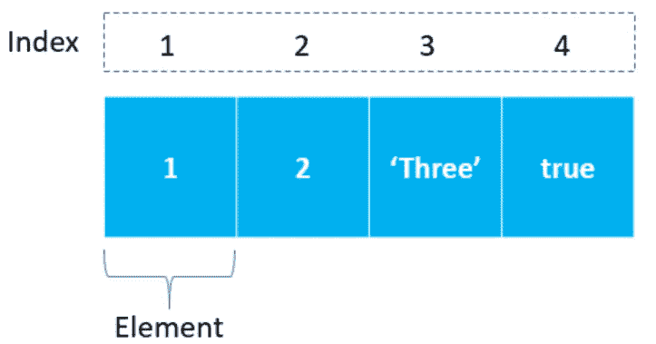

# 常用的 JavaScript 数组方法

> 原文：<https://javascript.plainenglish.io/javascript-arrays-commonly-used-methods-b8d7c23037e7?source=collection_archive---------23----------------------->

## *本文将深入探讨 JavaScript 中一些常用的(日常)数组方法。*



JavaScript 在`Array.prototype`上有很多很棒的方法，允许我们通过正确使用它们来过滤、查找、操作和转换数据。

`Array.prototype.some`方法允许我们检查数组中是否至少有一个元素通过了提供给该方法的函数中实现的条件。

```
const arr = [1, 2, 3, 4, 5];const someItemLargerThenTwo = arr.some(x => x > 2);
console.log(someItemLargerThenTwo); // trueconst someItemEqualToSix = arr.some(x => x === 6);
console.log(someItemEqualToSix); // false
```

我们还可以通过使用`Array.prototype.every`方法来检查数组中的每个元素是否都通过了所提供的函数中实现的条件。

```
const arr = [1, 2, 3, 4, 5];const everyitemLessThenSix = arr.every(x => x < 6);
console.log(everyitemLessThenSix); // trueconst everyitemLessThenfive = arr.every(x => x < 5);
console.log(everyitemLessThenfive); // false
```

另一个有用的方法是`Array.prototype.find`，它返回满足所提供函数中实现的条件的第一个元素的值。如果没有找到这样的元素，它将返回`undefined`。

```
const arr = [1, 2, 3, 4, 5];const findItemLargerThenTwo = arr.find(x => x > 2);
console.log(findItemLargerThenTwo); // 3const findItemLargerThenSeven = arr.find(x => x > 7);
console.log(findItemLargerThenSeven); // undefined
```

如果我们实际上只想得到满足所提供函数中实现的条件的第一个元素位置，我们可以使用`Array.prototype.findIndex`方法。如果没有找到符合条件的元素，它将返回-1。

```
const arr = [1, 2, 3, 4, 5];const findItemIndexLargerThenTwo = arr.findIndex(x => x > 2);
console.log(findItemIndexLargerThenTwo); // 2const findItemIndexLargerThenSeven = arr.find(x => x > 7);
console.log(findItemLargerThenSeven); // -1
```

如果我们想获得满足所提供函数中实现的条件的所有元素，我们可以使用`Array.prototype.filter`方法。

```
const arr = [1, 2, 3, 4, 5];const filteritemsLargerThenTwo = arr.filter(x => x > 2);
console.log(filteritemsLargerThenTwo); // [3, 4, 5]const filteritemsLargerThenSeven = arr.filter(x => x > 7);
console.log(filteritemsLargerThenSeven); // []
```

现在，让我们来看看`Array.prototype.map`和`Array.prototype.forEach`

`Array.prototype.map`方法接收一个提供的函数作为参数，然后将它应用于每个数组元素，之后返回一个填充了提供的函数的结果的新数组，同时不改变原始数组。

```
const arr = [1, 2, 3, 4, 5];const mapped = arr.map(x => x * 2);
console.log(mapped); // [2, 4, 6, 8, 10];
console.log(arr); // [1, 2, 3, 4, 5];
```

那`Array.prototype.forEach`呢？这个方法接收一个提供的函数作为参数，并在每个数组元素上执行一次，就像`map`一样。不同之处在于，`forEach`不像`map`那样返回一个新数组，而是返回`undefined`。

```
const arr = [1, 2, 3, 4, 5];const forEached = arr.forEach(x => x * 2);
console.log(forEached); // undefined;
console.log(arr); // [1, 2, 3, 4, 5];
```

这也意味着，在对一个数组使用了`map`方法之后，虽然可以附加其他数组方法(就像我们上面讨论的那些方法)，比如`filter`、`find`、`some`和其他数组方法，但是在使用`forEach`时就不能这样做了，因为它将返回`undefined`。

关于可变性，虽然两种方法都没有改变原始数组，但是仍然有可能在提供的函数中改变原始数组。

```
const arr = [1, 2, 3, 4, 5];arr.forEach((x, idx) => arr[idx] = x * 2);
console.log(arr); // [2, 4, 6, 8, 10];
```

我要介绍的最后一个方法是`Array.prototype.reduce`，它对数组中的每个元素执行一个提供的函数，从前面的元素传入最后一次计算的返回值。它返回一个值，该值代表在数组的所有元素上运行 reducer 的结果。让我们来看一个总结所有数组元素的例子。

```
const arr = [1, 2, 3, 4, 5];const res = arr.reduce((acc, current) => acc + current);
console.log(res); // 15
```

这是一些重要的日常使用的阵列方法的总结。我希望你喜欢它，如果你喜欢的话，我会感谢下面的一些掌声。

您也可以关注我以获得更多类似的文章(:

*更多内容尽在* [***说白了. io***](https://plainenglish.io/) *。报名参加我们的* [***免费周报***](http://newsletter.plainenglish.io/) *。关注我们关于* [***推特***](https://twitter.com/inPlainEngHQ) *和*[***LinkedIn***](https://www.linkedin.com/company/inplainenglish/)*。查看我们的* [***社区不和谐***](https://discord.gg/GtDtUAvyhW) *加入我们的* [***人才集体***](https://inplainenglish.pallet.com/talent/welcome) *。*