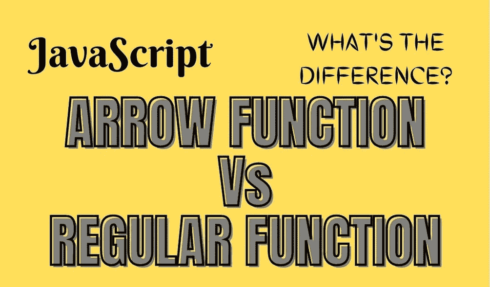

# JavaScript 箭头函数与常规函数的区别？

> 原文：<https://javascript.plainenglish.io/javascript-arrow-function-vs-regular-function-whats-the-difference-fast-understanding-cda1a162a355?source=collection_archive---------17----------------------->

## 探讨 JavaScript 中箭头函数和常规函数的区别。



大家好，我叫 Nissim Zarur，是一名手机和软件工程师。今天我要解释一下最流行的创建函数方法之间的区别。

如今，任何 JavaScript 项目中都使用箭头函数，这是 ES6(JavaScript 版本)提供的最常用的特性之一。这是非常重要和有用的。继续阅读，看看为什么…

# 箭头功能减少代码行

让我们创建一个新的常规函数，并将其命名为`calc(a, b)`函数。该函数可以接收两个参数，`a`和`b`。现在让我们在里面做一个简单的计算，类似于`a+b`的东西。

让我们看看下面的例子:

```
function calc(a, b){
  return a+b;
} 
```

现在，让我们用箭头函数做同样的事情:

```
const calc = ()=>a+b;
```

如您所见，对于一个常规函数，这个简单的函数只需要 3 行代码，相比之下，arrow 函数只用 1 行代码就能完成同样的事情。

# 匿名函数

当传递匿名函数时，箭头函数非常有用，只需键入`()`字符，而不是`function`的完整单词，例如:

```
// Regular function:
document.addEventListener('onClick',function(){
  console.log("Clicked");
});// Arrow function:
document.addEventListener('onClick',()=>console.log("Clicked"));
```

正如你所看到的，它对我们来说更容易阅读和理解，当然，你可以注意到代码也更短了。

# 最大和最重要的区别

到目前为止，我们看到了箭头函数是创建与常规函数相同的函数的一种更短更好的方法。但这还不是它如此受欢迎的原因。现在我将举例说明最大的区别。

假设我们有一个包含属性`name`的`Person`类，我们想从两个不同的常规函数中访问这个属性，让我们调用第一个函数`_getName()`和第二个函数`_getName2()`。两个函数都包含一个内部函数，`_getName()`函数包含箭头函数，`_getName2()`包含常规函数。

```
class Person{
  contractor(name){
    this.name = name;
  }_getName(){
    setTimeout(()=>{
      console.log(this.name); 
    },1000)
  } _getName2(){
    setTimeout(function(){
      console.log(this.name); 
    },1000)
  }
}const p = new Person("Nissim Zarur");p._getName(); //Will print "Nissim Zarur".p._getName2(); //Will print empty string.
```

正如你在上面的例子中看到的，我们创建了一个`Person`的实例并调用了两个函数，但是接下来会发生什么呢？函数`_getName()`打印了字符串`“Nissim Zarur”`而`_getName2()`没有，为什么会这样？

这里我们可以看到箭头函数的威力，每个箭头函数都包含了类的范围，这样我们就可以访问类的属性，而如果我们使用常规函数，我们就不能。

那么怎样才能仍然用正则函数访问函数的性质呢？我们将不得不使用`bind`方法，让我们看看下面的例子。

```
_getName2(){
  setTimeout(function(){
    console.log(this.name); 
  }.**bind(this)**,1000)
}
```

我们需要附加方法`bind()`并传递给它`this`。术语`this`意味着我们将所有范围传递给`setTimeout`函数。现在你明白为什么大多数人使用 ES6 箭头功能，这是一个非常简单的方法。

**感谢您迄今为止的阅读，**如果您喜欢这样的内容，并且您想支持我作为一名程序员和作家撰写更多这样的文章， [***请使用我的链接注册 Medium 成为会员(每月订阅 5 美元)，您将可以无限制地访问 Medium 上的所有内容。***](https://medium.com/membership/@nissimzarur)

*   如果你想了解更多关于 [***范围***](https://towardsdev.com/4-types-of-javascript-scopes-all-you-need-to-know-about-207598da120e) 以及“各范围之间的差异”你可以在这里阅读[](https://towardsdev.com/4-types-of-javascript-scopes-all-you-need-to-know-about-207598da120e)*。*
*   *如果你想了解更多关于 [***闭包***](https://nissimzarur.medium.com/what-is-closures-how-it-works-in-javascript-step-by-step-real-life-example-eb4a97c7120d) 和“它是如何在 JavaScript 中与现实生活中的例子一起工作的”你可以在这里 阅读它们。*

*谢谢，希望对你有帮助。请继续关注更多 JavaScript 解释、示例和技巧。*

**更多内容请看*[***plain English . io***](https://plainenglish.io/)*。报名参加我们的* [***免费周报***](http://newsletter.plainenglish.io/) *。关注我们关于*[***Twitter***](https://twitter.com/inPlainEngHQ)*和*[***LinkedIn***](https://www.linkedin.com/company/inplainenglish/)*。查看我们的* [***社区不和谐***](https://discord.gg/GtDtUAvyhW) *加入我们的* [***人才集体***](https://inplainenglish.pallet.com/talent/welcome) *。**