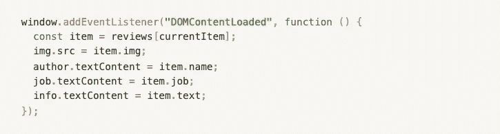

# JavaScript 项目:卡片滑块

> 原文：<https://javascript.plainenglish.io/javascript-bitesize-card-slider-ee3ab8b179d8?source=collection_archive---------2----------------------->

> **厌倦了视频教程？然后，让我们通过一个不同的镜头来探索事情，并通过一个显示客户反馈的基本而生动的滑块来修改一些棘手的问题！**

Link between the Mind & AI (Illustration by Envato)

连续创业家莫·格达特在他的书《可怕的智能:人工智能的未来和你如何拯救我们的世界》中暗示，最先进的计算机已经内置于我们体内——大脑，一个充满艺术魅力却又神秘莫测的实体。事实上，人工智能和大脑之间的密切联系已经吸引了[认知科学家](https://psu.pb.unizin.org/ist110/chapter/5-3-emotional-design/)的注意。仔细观察，两者都非常奇特和神秘。

考虑到每种思维的独特性，我们知道人们的学习方式是不同的。一些人通过视频学习，而另一些人更喜欢通过阅读学习。我肯定属于第二类，因为经常看视频有时会让我不堪重负。这就是为什么我总是寻找未知/复杂概念的书面解释，尤其是在涉及计算机科学的时候。

也就是说，类似手册的文本也可能是相当机器人化的，如此乏味。在我看来，总有办法让事情变得更有趣。假设可能会有像我一样的人，我决定以项目的形式准备一系列简短的教程。通过这种方式，我打算加快新手的学习过程，并完善自己在相关零件方面的现有知识。

但是，请注意，这个 bitesize 系列教程是为那些已经掌握了一些 HTML、CSS 和 JavaScript 知识，并且希望通过不复杂的项目测试他们的 JS 技能的人准备的。最重要的是，我计划检查那些让 JS 学习过程变得难以忍受的棘手的部分，但是好消息是我们将简单地触及关键部分。希望我不会用没完没了的细节来烦你。这样，您就可以从容不迫地编写自己的项目版本。毕竟，最好的学习方法是跳上车，亲自试驾。

Terminator’s Archenemy? Sounds odd? :-)

当你阅读代码中的文本时，你会遇到一堆奇怪的细节，我故意选择了这个策略。名为“[记忆宫殿](https://www.zmescience.com/medicine/mind-and-brain/memory-palace/)法”和[记忆增强策略](https://courses.lumenlearning.com/waymaker-psychology/chapter/ways-to-enhance-memory/)的古老技巧强调，细节越古怪，就越容易记住。既然编码有时真的很烦人，那么让我们试着享受乐趣，并希望找到克服基于 JavaScript 的恶魔的方法。也许，我们最终会发现，他们并没有那么可怕。

这个项目中的所有图像都来自 [unsplash](https://unsplash.com/) ，这是一个非常棒的免费图像资源，但也有另一个名为 [UI faces](https://www.uifaces.co/) 的免费资源，供那些寻找头像的人在像这样的项目中使用。最后但同样重要的是，最终产品在下面的 codePen 链接中。

事不宜迟，我们开始吧！

# **1-创建一组对象(评论)**

An array of Objects (Imaginary Reviews / Feedback)

创造这种数组就像是巫术。为什么？这些细节实际上不是来自 HTML 或 CSS。我们所做的是在 JS 文件中从头开始生成这些对象/虚构的人留下的反馈，以便我们可以在适当的时候动态地集成它们。这是一个提醒。不要在对象之间使用“分号”。这是一个常见的错误。两个对象之间的逗号是我们在对象数组中需要的。大多数人一开始觉得这很容易，但是如果我们没有受益于被称为“[间隔重复](https://www.smashingmagazine.com/2014/08/mastering-a-programming-language-using-spaced-repetition/#:~:text=Spaced%20repetition%20is%20a%20system,digital%20flashcards%20organized%20by%20deck.)”的奇妙技巧，我们就容易忘记事情。你可能会将这种方法与定期收缩肌肉以增强体质的过程进行类比，但事实是，这一次，我们这样做是为了在编码方面拥有更好的认知技能。

幸运的是，当你犯这个错误时，VS 代码(希望它的对应物也一样)会对你大喊大叫，把错误的‘分号’变成红色，所以这在 JavaScript 领域是一个相对容易修复的错误。

# 2-从 HTML 中选择项目

HTML & JS are spotted hand in hand at times :-)

**棘手的比特= >** 这一步表面上看起来是小菜一碟。然而，出于粗心，我们可能很容易从一开始就碰壁(去过那里很多次)，并沮丧地看着控制台中的以下警告。但是为什么这个错误会突然出现呢？

Warning… Warning… Red alert!

让我这么说吧。通常，您可以通过两种流行的/主要的方式从 DOM 中选择元素(也有其他方法，但我们暂时不考虑它们。)并且以下没有一个比另一个优越。

第一个是通过***document . query selector******document . getelementbyid***第二个是*。*也就是说，如果要选择的元素是 id，则前者需要精确的模式***document . query selector(' # job ')***，而***document . query selector('。job’)***如果是项目的 HTML 段中的类。在某种程度上，这些是子类别。

另一方面，通过后一种方法，您只能选择一个 id，而不能选择一个类，这一点从其名称就可以看出，因此这种选择方式需要语法***document . getelementbyid(' job ')***——可以说没有 **#** 符号。换句话说，如果你把 ***#*** 放到 getElementById 版本中，那么代码就会断掉。

幸运的是，我们的 JS 控制台在通知我们这些错误背后的原因方面很有帮助。正如您在上面的视频中所看到的，它会友好地通过弹出以下消息来要求您选择正确的样式，“ ***无法设置 null…*** 的属性”，这实际上是一个微小但非常重要的语法问题的迹象。此时，我们的调试技能至关重要。换句话说，如果你掌握了控制台的语言，那么你很快就可以轻松解决这些问题，你可以开始了！请记住，控制台从不说谎，最好的一点是，它甚至会通过告诉您发生了不必要错误的特定代码行来找出罪魁祸首。您所要做的就是重新访问该行并注意有问题的部分。

# 3-设置起始项目

currentItem to be manipulated

**Tricky bits = >** 通过“let”变量，我们可以临时确定我们的“当前项目”——需要时要更改的项目(卡片)，我们需要在[全局范围](https://www.programiz.com/javascript/variable-scope)而不是在[局部范围](https://www.thatjsdude.com/jsConcepts/concepts/scope.html#:~:text=In%20JavaScript%20local%20scope%20is,will%20get%20a%20reference%20error.)中这样做，以便它可以在其他任何地方访问。既然我们有时需要处理这些信息，那么全局范围内的单词“let”将在以后的阶段给我们带来很大的灵活性。

# 4-加载初始项目

The page is to be renewed soon!

**Tricky bits = >** 这里，表达式“DOMContentLoaded”表示当页面(DOMContent)被加载时，代码块内的排列将立即发生。它附加到基于窗口的事件监听器的事实确保了页面上的初始内容(图像、作者、工作、信息)将在每次用户更新页面时动态更新。

# 5-显示人物

Repeating the code in various places is not a good idea & functions can save us from this burden.

**Tricky bits = >** 在这个阶段，我们将遵循[干代码原则](https://codinglead.co/javascript/what-is-DRY-code)，希望不要重复自己。就编码而言，代码越短，功能越好。为了确保这一点，我们将创建名为' ***showPerson*** 的上述函数，如果您已经注意到了，它还有一个名为' ***person*** 的[参数](https://dmitripavlutin.com/javascript-function-parameters/)，用括号括起来。基本上，它就像一个占位符，你可以选择任何你想要的名字。然而，为了以后能够记住它所指的内容，更明智的做法是坚持上下文，在我们的代码中，将这个参数/占位符称为' **person** '是有意义的，它将在按钮功能部分中使用几次，尽管它的新形状将自然地更改为 currentItem。

# 6-显示下一个人

Button Functionality

是时候赋予我们的按钮功能了。首先，我们将把元素 ***nextBtn*** 附加到一个事件处理程序。然后，在块内，我们将做一点数学运算，以便当用户触发下一个按钮时，我们的数组中的所有人(卡片)将一个接一个地显示出来。不要忘记调用 ***showPerson*** 函数来启动最终流程。不用说，这次的参数/占位符是用括号内的 ***currentItem*** 代替 ***person*** 。这样，只要单击“下一步”按钮，页面就会用数组中的一个新人(卡片)进行更新。

# 7-显示上一个人

Button Functionality

**Tricky bits = >** 上一个按钮的实现和它的姊妹窗体——下一个按钮非常相似。也就是说，数学部分有点不同，因为用户每次按下按钮都需要返回。也就是说，如果 currentItem 小于零，上述公式将被激活。最后，您知道要调用 drill—***【show person(current item)***函数，以便用户可以访问我们数组中前面的项目(卡片)。

# 8-显示随机人和创建随机数

Button Functionality

**刁钻的比特= >** 瞧！您已经成功到达最终目的地，这又是关于另一个按钮的功能。

如果用户希望从列表(数组)中随机选择一个人(卡片)，而不是按照特定的顺序查看他们，该怎么办？在 UI 方面，她/他只需点击页面下方的黑色大按钮。至于发生在幕后的计算，javascript 有一个预先确定的方法来显示数组中的随机项。好吧，假设两个面向数学的方法将合作完成这个任务。

Darth Vader? Seriously? :-)

Math.random 方法通常会生成一个数字，在我们的项目中，这个数字会乘以数组的 length / reviews.length，以便从预先设计的对象数组中随机选取项目。

给你提个醒。Math.random 本质上是一个函数，所以它应该像下面这样写**math . random()**——带括号——就像我们在其他函数中做的那样。然而，为了能够创建随机整数， **Math.random()** 需要一些来自 **Math.floor** 方法的帮助来创建整数。

简单地说，下面的**math . floor(math . random()* n)**是 javascript 开发人员需要随机数/整数时使用的标准语法。在我们的例子中， ***reviews.length*** 代表上式中的 ***n*** 。乍一看可能有点复杂，但是相信我，一点也不复杂。你在不同的项目中使用得越多，它就会成为你的第二天性。

嗯，我想这是一个总结！现在创建你自己的卡片滑块怎么样？只是玩玩设计，让它成为你自己的，然后试着一点一点地应用 javascript 部分。尽你所能形成一种思维地图，以便能够记住这些步骤/算法，如果有必要的话，可以试一试。俗话说，熟能生巧。

编码快乐！

测试项目的功能&查看其 HTML & CSS 部分= >

*更多内容看* [***说白了。***](https://plainenglish.io/)

*报名参加我们的* [***免费每周简讯***](http://newsletter.plainenglish.io/) *。关注我们关于* [***推特***](https://twitter.com/inPlainEngHQ) ，[***LinkedIn***](https://www.linkedin.com/company/inplainenglish/)*，*[***YouTube***](https://www.youtube.com/channel/UCtipWUghju290NWcn8jhyAw)*，以及* [***不和***](https://discord.gg/GtDtUAvyhW) ***。***

***有兴趣缩放你的软件启动*** *？检查出* [***电路***](https://circuit.ooo?utm=publication-post-cta) *。*