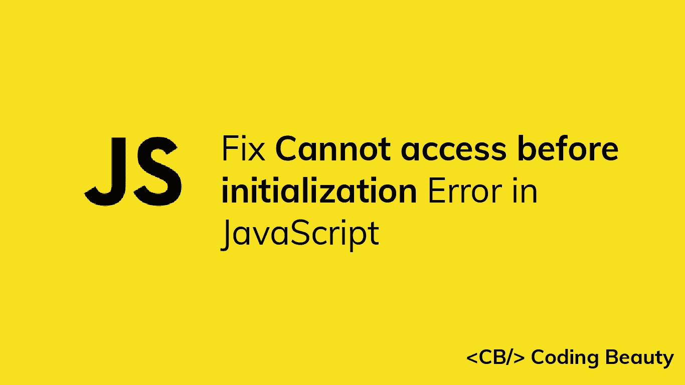
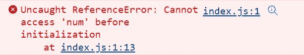

# 如何修复 JavaScript 中的“初始化前不能访问”引用错误

> 原文：<https://javascript.plainenglish.io/javascript-cannot-access-before-initialization-78a6559da896?source=collection_archive---------0----------------------->



当您试图在变量用`let`或`const`声明并在同一范围内初始化之前访问变量时，JavaScript 中会出现“初始化之前不能访问”引用错误。要解决这个问题，请在访问变量之前对其进行初始化。



以下是发生错误的一些示例:

`index.js`

```
// ❌ ReferenceError: Cannot access 'num' before initialization
console.log(num);
let num = 2;

// ❌ ReferenceError: Cannot access 'name' before initialization
console.log(name);
const name = 'Coding Beauty';

// ❌ ReferenceError: Cannot access 'arr' before initialization
arr = [7, 8, 9];
let arr = [3, 4, 5];
```

为了解决这个错误，您需要在访问变量之前对其进行初始化。

`index.js`

```
// ✅ No error
let num = 2;
console.log(num); // 2

// ✅ No error
const name = 'Coding Beauty';
console.log(name); // Coding Beauty

// ✅ No error
let arr = [3, 4, 5];
arr = [7, 8, 9];
```

# `var` vs `let`

该错误的发生显示了`var`和`let`关键字之间的重要差异。如果您用`var`声明变量，就不会发生错误。

`index.js`

```
// No error

console.log(num); // undefined
var num = 2;

// No error
console.log(name); // undefined
var name = 'Coding Beauty';
// No error
arr = [7, 8, 9];
var arr = [3, 4, 5];
```

这是因为用`var`关键字声明的变量被**提升** -它们被 JavaScript 解释器移动到当前范围的顶部(当前脚本或当前函数的顶部)。

基本上，这就是我们用`var`声明的变量的情况:

`index.js`

```
var num;
var name;
var arr;

console.log(num); // undefined
num = 2;

console.log(name); // undefined
name = 'Coding Beauty';

arr = [7, 8, 9];
arr = [3, 4, 5];
```

**注:**声明已挂起，初始化未挂起。

由于这种提升，即使在非功能块中声明变量，如`if`块，如果您试图从`if`语句之外访问变量，错误仍然不会发生。

`index.js`

```
// No error!

console.log(num); // undefined

if (true) {
  var num = 2;
}
```

只有全局范围和函数范围被用于提升，所以像以前一样，变量声明被移到文件的顶部。

`index.js`

```
var num;

console.log(num); // undefined

if (true) {
  num = 2;
}
```

*原为发表于*[*codingbeautydev.com*](https://cbdev.link/5c5198)

# JavaScript 做的每一件疯狂的事情

JavaScript 微妙的警告和鲜为人知的部分的迷人指南。


[**签约**](https://cbdev.link/d3c4eb) 立即免费获得一份。