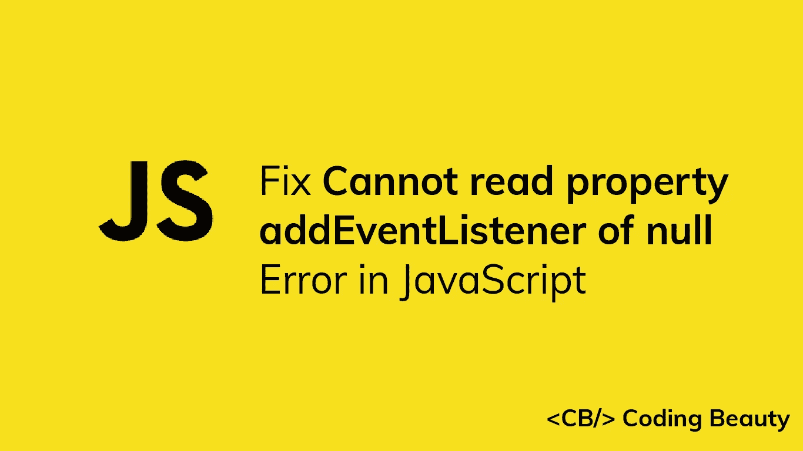
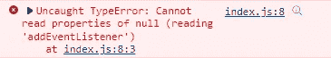

# 如何修复 JavaScript 中的“无法读取 null 的属性‘addevent listener’”错误

> 原文：<https://javascript.plainenglish.io/javascript-cannot-read-property-addeventlistener-of-null-8e83d1bc74eb?source=collection_archive---------5----------------------->

## 了解 JavaScript 中的“无法读取 null 的属性‘addevent listener’”错误以及如何修复它。



当您尝试对在 DOM 中找不到的元素调用`addEventListener()`方法时，JavaScript 中会出现“无法读取 null 的属性‘addevent listener’”错误。发生这种情况有两个主要原因:

1.  在 DOM 中不存在的元素上访问`addEventListener()`方法。
2.  在 HTML 中 DOM 元素声明的上方插入引用 JavaScript 文件的`script`标签。

在本文中，我们将学习如何处理这两种情况下的错误。



# 原因 1:在 DOM 中不存在的元素上访问`addEventListener()`

`index.js`

```
const btn = document.getElementById('does-not-exist');console.log(btn); // null// ❌ Cannot read property 'addEventListener' of null
btn.addEventListener('click', () => {
  alert('You clicked the button');
});
```

当使用类似于`getElementById()`或`querySelector()`的方法来搜索 DOM 中不存在的元素时，它会返回`null`。试图对一个`null`值调用`addEventListener()`方法将导致错误。

# 解决方案:确保正确的选择器

若要修复“无法读取 null 的属性‘addevent listener’”错误，请确保正确定义了用于访问元素的选择器。确保 ID 或类名中没有错误，并且使用了正确的符号。

# 解决方法:检查`null`

要修复“无法读取 null 的属性‘addevent listener’”错误，请在对其调用`addEventListener()`方法之前检查元素是否不是`null`。

我们可以用一个`if`语句来实现:

```
const btn = document.getElementById('does-not-exist');console.log(btn); // null// ✅ Check if element exists before calling addEventListener()
if (btn) {
  // Not called
  btn.addEventListener('click', () => {
    alert('You clicked the button');
  });
}
```

当一个值被放在一个`if`语句的括号中时，它在被求值之前被强制转换为`Boolean`，即真值变成`true`，假值变成`false`。`null`是一个 falsy 值，所以它被强制为`false`，并且`if`语句块中的代码永远不会运行。

**注:**在 JavaScript 中，有六个 falsy 值:`undefined`、`null`、`NaN`、`0`、`''`(空字符串)和`false`。其他所有的价值都是真实的。

我们也可以使用[可选的链接操作符(？。)](https://developer.mozilla.org/en-US/docs/Web/JavaScript/Reference/Operators/Optional_chaining)检查元素是否为`null`。

```
const btn = document.getElementById('does-not-exist');console.log(btn); // null// ✅ Check if element exists before calling addEventListener()// Not called
btn?.addEventListener('click', () => {
  alert('You clicked the button');
});
```

可选的链接操作符(`?.`)是访问属性或调用对象方法的`null-safe`方式。如果对象是 nullish ( `null`或`undefined`)，操作符会阻止成员访问并返回`undefined`，而不是抛出一个错误。

# 原因 2:在 DOM 元素上插入脚本标记

该错误的另一个常见原因是将引用 JavaScript 文件的`<script>`标记放在声明目标元素的位置上方。

例如，在这个 HTML 标记中:

`index.html`

```
<!DOCTYPE html>
<html lang="en">
  <head>
    <title>Coding Beauty Tutorial</title>
    <!-- ❌ Script is run before button is declared -->
    <script src="index.js"></script>
  </head>
  <body>
    <button id="btn">Sign up</button>
  </body>
</html>
```

`script`标签放在`head`标签中，在声明`button`元素的位置之上，因此`index.js`文件将不能访问`button`元素。

`index.js`

```
const btn = document.getElementById('btn');console.log(btn); // null// ❌ TypeError: Cannot read properties of null
btn.addEventListener('click', () => {
  alert('You clicked the button');
});
```

# 解决方案:将`script`标签移到主体底部

要修复这种情况下的错误，在声明了所有 HTML 元素之后，将`script`标签移动到`body`的底部。

`index.html`

```
<!DOCTYPE html>
<html lang="en">
  <head>
    <title>Coding Beauty Tutorial</title>
  </head>
  <body>
    <button id="btn">Sign up</button> <!-- ✅ Script is run after button is declared -->
    <script src="index.js"></script>
  </body>
</html>
```

现在，`index.js`脚本文件将可以访问`button`元素和所有其他 HTML 元素，因为它们在脚本运行时已经被声明了。

`index.js`

```
const btn = document.getElementById('btn');console.log(btn); // HTMLButtonElement object// ✅ Works as expected
btn.addEventListener('click', () => {
  alert('You clicked the button');
});
```

# 解决方案:访问`DOMContentLoaded`事件监听器中的元素

修复 JavaScript 中“无法读取 null 的属性‘addevent listener’”错误的另一种方法是在文档中添加一个`DOMContentLoaded`事件侦听器，并访问该侦听器中的元素。使用这种方法，我们将脚本放在 HTML 中的什么位置并不重要。

`index.html`

```
<!DOCTYPE html>
<html lang="en">
  <head>
    <title>Coding Beauty Tutorial</title> <!-- Script placed above element accessed -->
    <script src="index.js"></script>
  </head>
  <body>
    <button id="btn">Sign up</button>
  </body>
</html>
```

当浏览器已经完全加载了 HTML，并且 DOM 树已经构建，但是像图像和样式表这样的外部资源可能还没有加载时，触发`DOMContentLoaded`事件。所以不管我们把脚本放在哪里，只有在所有声明的 HTML 元素都被添加到 DOM 之后，监听器中的代码才会被调用。

`index.js`

```
document.addEventListener('DOMContentLoaded', () => {
  const btn = document.getElementById('btn'); console.log(btn); // HTMLButtonElement object // ✅ Works as expected
  btn.addEventListener('click', () => {
    alert('You clicked the button');
  });
});
```

# 结论

我们可以修复 JavaScript 中的“无法读取属性 addEventListener' of null”错误，方法是确保定义了正确的选择器，在调用`addEventListener()`之前向元素添加 null 检查，将`script`标记移动到主体的底部，或者访问添加到文档的`DOMContentLoaded`事件侦听器中的元素。

*原载于*[*【codingbeautydev.com】*](https://cbdev.link/ea642e)

# JavaScript 做的每一件疯狂的事情

一本关于 JavaScript 微妙的警告和鲜为人知的部分的迷人指南。


[**报名**](https://cbdev.link/d3c4eb) 立即免费领取一份。