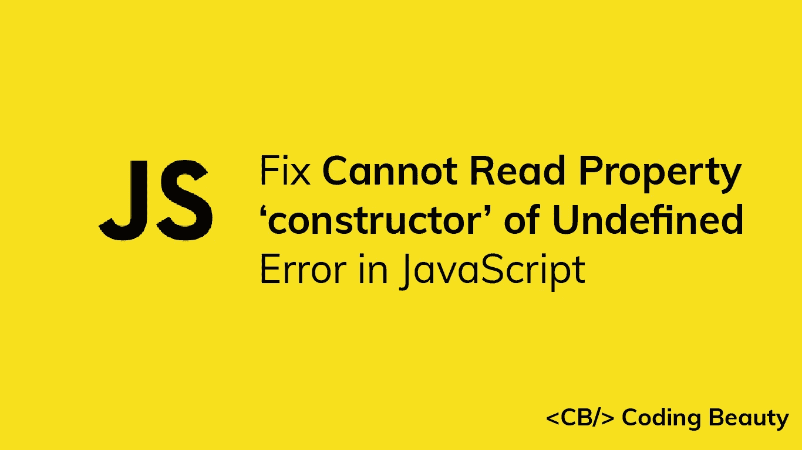

# 修复:无法读取 JavaScript 中未定义错误的属性“构造函数”

> 原文：<https://javascript.plainenglish.io/javascript-cannot-read-property-constructor-of-undefined-bb6bb6fd96a7?source=collection_archive---------3----------------------->



当您试图访问变量`undefined`的`constructor`属性时，会出现“无法读取 undefined 的属性‘构造函数’”错误。要修复它，在尝试访问`constructor`属性之前，对变量执行一个`undefined`检查。

```
const user = undefined;// TypeError: Cannot read properties of undefined (reading 'constructor')
const User = user.constructor;
const newUser = new User();
```

在这个例子中，`user`变量是`undefined`，所以当我们试图从它那里访问一个属性时会得到一个错误。我们通过在访问`constructor`属性之前检查变量是否为 nullish 来修复它。我们可以用可选的链接操作符(`?.`)来实现:

```
const user = undefined;// Optional chaining in if statement
if (user?.constructor) {
  const User = user?.constructor;
  const newUser = new User();
}
```

在变量上使用可选的链接操作符将返回`undefined`，如果变量是 nullish ( `null`或`undefined`)，将阻止属性访问。

我们还可以使用一个`if`语句来检查变量是否真实:

```
const user = undefined;// Check if 'user' is truthy
if (user && user.constructor) {
  const User = user.constructor;
  const newUser = new User();
}
```

## 小费

在 JavaScript 中，实例对象的`constructor`属性返回对创建该对象的`Object`构造函数的引用。

```
let obj1 = {};
obj1.constructor === Object; // -> truelet obj2 = new Object();
obj2.constructor === Object; // -> truelet arr1 = [];
arr1.constructor === Array; // -> truelet arr2 = new Array();
arr2.constructor === Array; // -> truelet num = new Number(3)
num.constructor === Number; // -> true
```

*更新于:*[*codingbeautydev.com*](https://cbdev.link/0b5c4b)

# JavaScript 做的每一件疯狂的事情

一本关于 JavaScript 微妙的警告和鲜为人知的部分的迷人指南。


点击 免费获得 [**。**](https://codingbeautydev.com/crazy-js-book/)