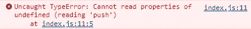

# 修复 JavaScript 中“无法读取未定义的属性‘push’”错误的 4 种方法

> 原文：<https://javascript.plainenglish.io/javascript-cannot-read-property-push-of-undefined-54f11b080272?source=collection_archive---------7----------------------->

## 了解如何轻松修复 JavaScript 中的“无法读取未定义的属性‘push’”错误。


当您试图对一个旨在包含数组但实际上包含值`undefined`的变量调用`push()`方法时，会出现 JavaScript 中的“无法读取未定义的属性‘push’”错误。



这可能是由多种原因造成的:

1.  在变量上调用`push()`方法，而不是先用数组初始化它。
2.  对数组元素而不是数组本身调用`push()`方法。
3.  对先前设置为`undefined`的变量调用`push()`方法。
4.  对不存在或值为`undefined`的对象属性调用`push()`方法。

在本文中，我们将探索所有这些可能原因的实际解决方案。

# 1.对变量调用 push()方法，而不先用数组初始化它

要修复“无法读取 undefined 的属性‘push’”错误，请确保在对变量调用`push()`方法之前，变量已经用数组初始化。

```
let doubles;let nums = [1, 2, 3, 4, 5];for (const num of nums) {
  let double = num * 2; // ❌ TypeError: cannot read properties of undefined (reading 'push')
  doubles.push(double);
}console.log(doubles);
```

在上面的例子中，我们在没有初始化变量`doubles`的情况下调用了`push()`方法。

```
let doubles;console.log(doubles); // undefined
```

因为在 JavaScript 中未初始化的变量有一个默认值`undefined`，调用`push()`会导致抛出一个错误。

要修复这个错误，我们所要做的就是将`doubles`变量分配给一个数组(在我们的用例中为空):

```
// ✅ "doubles" initialized before use
let doubles = [];let nums = [1, 2, 3, 4, 5];for (const num of nums) {
  let double = num * 2; // ✅ push() called - no error thrown
  doubles.push(double);
}console.log(doubles); // [ 2, 4, 6, 8, 10 ]
```

# 2.对数组元素而不是数组本身调用 push()方法

要修复“无法读取 undefined 的属性‘push’”错误，请确保在调用`push()`之前没有从数组变量访问元素，而是在实际数组变量上调用了`push()`。

```
const array = [];// ❌ TypeError: Cannot read properties of undefined (reading 'push')
array[0].push('html');
array[0].push('css');
array[0].push('javascript');console.log(array);
```

用括号索引访问属性`0`会给我们数组中索引`0`处的元素。该数组没有元素，所以`arr[0]`计算为`undefined`，对其调用`push()`会导致错误。

为了解决这个问题，我们需要在`array`变量上调用 push，而不是它的一个元素。

```
const array = [];// ✅ Call push() on "array" variable, not "array[0]"
array.push('html');
array.push('css');
array.push('javascript');console.log(array); // [ 'html', 'css', 'javascript' ]
```

# 3.对先前设置为未定义的变量调用 push()方法

要修复“无法读取未定义的属性‘push’”错误，请确保最后分配给变量的值不是`undefined`。

```
let arr = ['orange'];arr.push('watermelon');arr = undefined;// hundreds of lines of code...// ❌ TypeError: Cannot read properties of undefined (reading 'push')
arr.push('apple');console.log(arr);
```

这里的问题是，我们曾经明确地将变量设置为`undefined`,但是后来我们对变量调用了`push()`。此 will 变量的修复将根据您的场景而有所不同。

也许您忘记了在再次使用之前将变量设置为一个定义的值:

```
let arr = ['orange'];arr.push('watermelon');// ✅ Fixed: variable re-assigned
arr = ['banana'];// hundreds of lines of code...arr.push('apple');console.log(arr); // [ 'banana', 'apple' ]
```

或者可能你犯了一个错误，根本没打算把变量赋给`undefined`:

```
let arr = ['orange'];arr.push('watermelon');// arr = undefined; ✅ Fixed: line removedarr.push('apple');console.log(arr); // [ 'orange', 'watermelon', 'apple' ]
```

# 4.对不存在或值未定义的对象属性调用 push()方法

要修复 JavaScript 中的“无法读取未定义的属性‘push’”错误，请确保正在调用`push()`方法的对象属性存在，并且不是`undefined`。

```
const students = [
  { name: 'Mac', scores: [80, 85] },
  { name: 'Robert' },
  { name: 'Michael', scores: [90, 70] },
];// ❌ TypeError: Cannot read properties of undefined (reading 'push')
students[1].scores.push(50);
```

在这种情况下，出现错误是因为索引`1`处的对象元素没有`scores`属性。

```
const obj = {};console.log(obj.prop); // undefined
```

从一个对象访问一个不存在的属性不会在 JavaScript 中抛出错误，而是给出一个值`undefined`。如果你试图在那个不存在的属性上调用一个类似于`push()`的方法，你将会遇到一个错误。

在这种情况下，我们可以通过将第二个数组元素的`score`属性设置为一个定义的值来修复错误。

```
const students = [
  { name: 'Mac', scores: [80, 85] },
  // ✅ Fixed: "scores" set to a defined value
  { name: 'Robert', scores: [] },
  { name: 'Michael', scores: [90, 70] },
];// ✅ "scores" property exists, "push()" works - no error thrown
students[1].scores.push(50);
```

*更新于*[*codingbeautydev.com*](https://cbdev.link/85f162)

# JavaScript 做的每一件疯狂的事情

一本关于 JavaScript 微妙的警告和鲜为人知的部分的迷人指南。


[报名](https://cbdev.link/d3c4eb)立即免费领取一份。