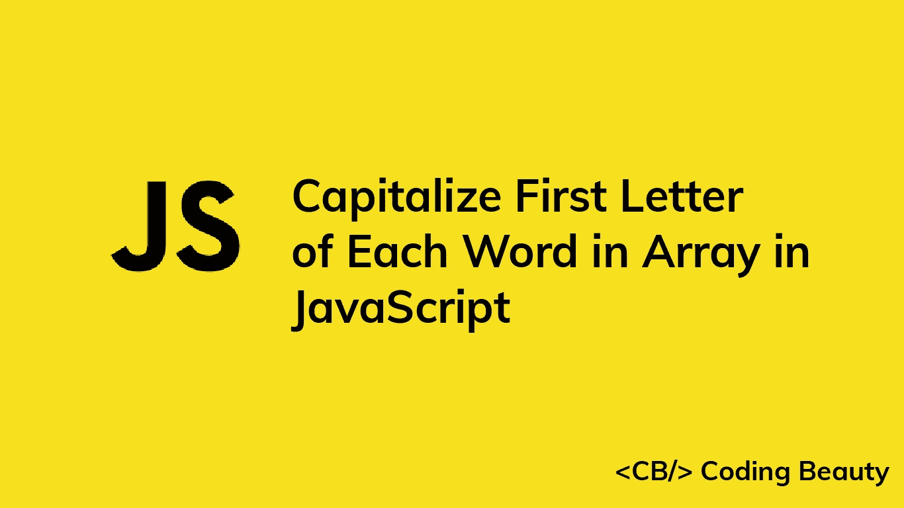

# 如何在 JavaScript 中将数组中每个单词的首字母大写

> 原文：<https://javascript.plainenglish.io/javascript-capitalize-first-letter-of-each-word-in-array-79635ce43aac?source=collection_archive---------6----------------------->



要在 JavaScript 中将数组中每个单词的首字母大写:

1.  用`.map()`迭代单词数组。
2.  对于每个单词，返回一个新单词，该单词的第一个字母的大写形式添加到该单词的其余部分。

例如:

```
function capitalizeWords(arr) {
  return arr.map((word) => {
    const capitalizedFirst = word.charAt(0).toUpperCase();
    const rest = word.slice(1).toLowerCase();
    return capitalizedFirst + rest;
  });
}

const words = ['welcome', 'to', 'CODING', 'Beauty'];

// [ 'Welcome', 'To', 'Coding', 'Beauty' ]
console.log(capitalizeWords(words));
```

我们的`capitalizeWords()`函数获取一个单词数组，并返回一个所有单词都大写的新数组，而不改变原始数组。

首先，我们在数组上调用`[map()](https://developer.mozilla.org/en-US/docs/Web/JavaScript/Reference/Global_Objects/Array/map)`方法，传递一个回调函数作为参数。这个函数将被调用并为数组中的每个单词返回一个结果。

在回调中，我们用`[charAt()](https://developer.mozilla.org/en-US/docs/Web/JavaScript/Reference/Global_Objects/String/charAt)`获取单词的第一个字符，用`[toUpperCase()](https://developer.mozilla.org/en-US/docs/Web/JavaScript/Reference/Global_Objects/String/toUpperCase)`将其转换为大写，并将其与字符串的其余部分连接起来。

我们使用`[String](https://developer.mozilla.org/en-US/docs/Web/JavaScript/Reference/Global_Objects/String/slice)` [](https://developer.mozilla.org/en-US/docs/Web/JavaScript/Reference/Global_Objects/String/slice)`[slice()](https://developer.mozilla.org/en-US/docs/Web/JavaScript/Reference/Global_Objects/String/slice)`方法得到字符串的剩余部分。将`1`传递给`slice()`会使它返回从第二个字符到末尾的字符串部分。

**注意:**字符串(和数组)索引是从零开始的 JavaScript，所以字符串中的第一个字符在索引 0 处，第二个在 1 处，最后一个在`str.length-1`

将单词大写后，我们用`[String](https://developer.mozilla.org/en-US/docs/Web/JavaScript/Reference/Global_Objects/String/toLowerCase)` [](https://developer.mozilla.org/en-US/docs/Web/JavaScript/Reference/Global_Objects/String/toLowerCase)`[toLowerCase()](https://developer.mozilla.org/en-US/docs/Web/JavaScript/Reference/Global_Objects/String/toLowerCase)`的方法将它小写。如果数组中每个单词的非首字母不需要大写，可以删除这个`toLowerCase()`调用。

*原载于*[](https://cbdev.link/88c13f)

# *JavaScript 做的每一件疯狂的事情*

*一本关于 JavaScript 微妙的警告和鲜为人知的部分的迷人指南。*

**

*[**报名**](https://cbdev.link/d3c4eb) 立即免费领取一份。*