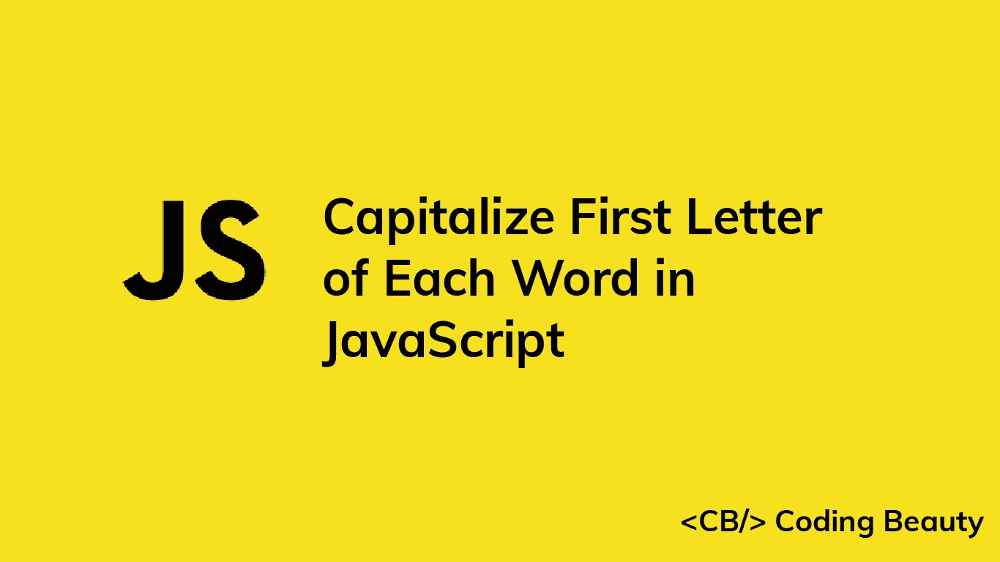

# JavaScript 中每个单词的首字母如何大写

> 原文：<https://javascript.plainenglish.io/javascript-capitalize-first-letter-of-each-word-in-string-22b631395937?source=collection_archive---------2----------------------->



要在 JavaScript 中将字符串中每个单词的首字母大写:

1.  用`.split('')`将字符串拆分成单词数组。
2.  用`.map()`迭代单词数组。
3.  对于每个单词，返回一个新单词，它是单词的第一个字母加到单词其余部分的大写形式。
4.  用`.join(' ')`将单词数组连接成一个字符串。

例如:

`index.js`

```
function capitalizeWords(str) {
  return str
    .toLowerCase()
    .split(' ')
    .map((word) => word.charAt(0).toUpperCase() + word.slice(1))
    .join(' ');
}

// Welcome To Coding Beauty
console.log(capitalizeWords('WELCOME to coding beauty'));

// JavaScript And TypeScript
console.log(capitalizeWords('JAVASCRIPT AND TYPESCRIPT'));
```

我们的`capitalizeWords()`函数获取一个字符串并返回一个所有单词都大写的新字符串。

首先，我们使用`[toLowerCase()](https://developer.mozilla.org/en-US/docs/Web/JavaScript/Reference/Global_Objects/String/toLowerCase)`方法将整个字符串小写，确保每个单词只有第一个字母大写。

```
// welcome to coding beauty
console.log('WELCOME to coding beauty'.toLowerCase());
```

**提示**:如果每个单词中剩余的字母不需要小写，可以去掉对`toLowerCase()`方法的调用。

然后我们调用字符串上的`[String](https://developer.mozilla.org/en-US/docs/Web/JavaScript/Reference/Global_Objects/String/split)` [](https://developer.mozilla.org/en-US/docs/Web/JavaScript/Reference/Global_Objects/String/split)`[split()](https://developer.mozilla.org/en-US/docs/Web/JavaScript/Reference/Global_Objects/String/split)`方法将所有单词拆分成一个数组。

```
// [ 'welcome', 'to', 'coding', 'beauty' ]
console.log('welcome to coding beauty'.split(' '));
```

创建数组后，我们调用它的`[map()](https://developer.mozilla.org/en-US/docs/Web/JavaScript/Reference/Global_Objects/Array/map)`方法，并使用回调函数作为参数。这个函数将被调用并为数组中的每个单词返回一个结果。

在函数中，我们用`[charAt()](https://developer.mozilla.org/en-US/docs/Web/JavaScript/Reference/Global_Objects/String/charAt)`获取单词的第一个字符，用`[toUpperCase()](https://developer.mozilla.org/en-US/docs/Web/JavaScript/Reference/Global_Objects/String/toUpperCase)`将其转换为大写，并将其与字符串的其余部分连接起来。

我们用`[String](https://developer.mozilla.org/en-US/docs/Web/JavaScript/Reference/Global_Objects/String/slice)` [](https://developer.mozilla.org/en-US/docs/Web/JavaScript/Reference/Global_Objects/String/slice)`[slice()](https://developer.mozilla.org/en-US/docs/Web/JavaScript/Reference/Global_Objects/String/slice)`的方法得到字符串的剩余部分。将`1`传递给`slice()`会使它返回从第二个字符(索引为 1)到末尾的那部分字符串。

```
// [ 'Welcome', 'To', 'Coding', 'Beauty' ]
console.log(
  'welcome to coding beauty'
    .split(' ')
    .map((word) => word.charAt(0).toUpperCase() + word.slice(1))
);
```

因此`map()`返回一个包含字符串中所有单词的数组，每个单词的首字母大写。

最后，我们用`Array` `join()`方法将所有单词连接成一个字符串。

向`join()`传递一个空格(`' '`)会在结果字符串中用一个空格分隔单词。

```
// Welcome To Coding Beauty
console.log(['Welcome', 'To', 'Coding', 'Beauty'].join(' '));
```

*原载于*[*codingbeautydev.com*](https://cbdev.link/3aae32)

# JavaScript 做的每一件疯狂的事情

一本关于 JavaScript 微妙的警告和鲜为人知的部分的迷人指南。


[**报名**](https://cbdev.link/d3c4eb) 立即免费领取一份。