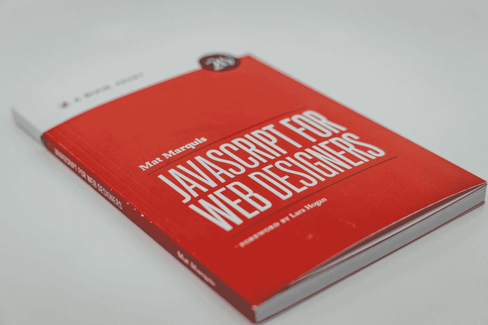

# JavaScript 备忘单

> 原文：<https://javascript.plainenglish.io/javascript-cheat-sheet-554a3f3f1d69?source=collection_archive---------4----------------------->

## 使用这个备忘单，让您的 JavaScript 之旅更加轻松



Photo by [Claudio Schwarz](https://unsplash.com/@purzlbaum?utm_source=medium&utm_medium=referral) on [Unsplash](https://unsplash.com?utm_source=medium&utm_medium=referral)

如果有人问我哪种编程语言是全球 web 开发者中最著名的，我的答案会是 JavaScript。JavaScript 通常缩写为 JS，是 web 开发中使用最广泛的编程语言。今天，我试图用备忘单让你的 JavaScript 之旅变得更容易。

所以，让我们来看看小抄。

## **JavaScript 基础知识**


Photo by [Mohammad Rahmani](https://unsplash.com/@afgprogrammer?utm_source=medium&utm_medium=referral) on [Unsplash](https://unsplash.com?utm_source=medium&utm_medium=referral)

*   在 HTML 页面中包含 JavaScript

```
<script type="text/javascript">
//JS code goes here
</script>
```

*   调用外部 JavaScript 文件

```
<script src="myscript.js"></script><code></code>
```

*   包括评论

```
//Single line comments/* comment here for Multi-line comments  */
```

## **变量(var，const，let)**

*   var
    最常见的变量。可以重新分配，但只能在函数中访问。执行代码时，用 var 定义的变量会移动到顶部。
*   const
    在出现在代码中之前不能被重新分配和访问。
*   let
    类似于 const，但是，let 变量可以被重新赋值，但不能被重新声明。

## **数据类型**

*   数字

```
var age = 23
```

*   变量

```
var x
```

*   文本(字符串)

```
var a = "init"
```

*   操作

```
var b = 1 + 2 + 3
```

*   对或错的陈述

```
var c = true
```

*   常数

```
const PI = 3.14
```

*   对象(名称)

```
var name = {firstName:"John", lastName:”Doe"}
```

*   对象(人)

```
var person = {
firstName:"John",
lastName:"Doe",
age:20,
nationality:"German"
};
```

## 数组

```
var fruit = ["Banana", "Apple", "Pear"];
```

## 数组方法

*   将几个数组连接成一个

```
concat()
```

*   返回给定元素在数组中出现的第一个位置

```
indexOf()
```

*   将数组中的元素组合成一个字符串，并返回该字符串

```
join()
```

*   给出给定元素在数组中出现的最后位置

```
lastIndexOf()
```

*   移除数组的最后一个元素

```
pop()
```

*   在末尾添加一个新元素

```
push()
```

*   反转数组中元素的顺序

```
reverse()
```

*   移除数组的第一个元素

```
shift()
```

*   将数组一部分的副本拉入新数组

```
slice()
```

*   将元素转换为字符串

```
toString()
```

*   向开头添加新元素

```
unshift()
```

*   返回指定对象的原始值

```
valueOf()
```

## **操作员**

*   基本运算符

```
+    Addition
-    Subtraction
*.   Multiplication
/.   Division
(..) Grouping operator
%    Modulus (remainder)
++   Increment numbers
--   Decrement numbers
```

*   比较运算符

```
==     Equal to
===    Equal value and equal type
!=     Not equal
!==    Not equal value or not equal type
>      Greater than
<      Less than
>=     Greater than or equal to
<=     Less than or equal to
?      Ternary operator
```

*   逻辑运算符

```
&&     Logical and
||     Logical or
!      Logical not
```

*   按位运算符

```
&     AND statement
|     OR statement
~.    NOT
^     XOR
<<    Left shift
>>    Right shift
>>>   Zero fill right shift
```

## **功能**

```
function name(parameter1, parameter2, parameter3) {
// what the function does
}
```

## **输出数据**

*   在浏览器窗口的警告框中输出数据

```
alert()
```

*   打开是/否对话框，并根据用户的点击返回真/假

```
confirm()
```

*   将信息写入浏览器控制台，有助于调试

```
console.log()
```

*   直接写入 HTML 文档

```
document.write()
```

*   为用户输入创建对话框

```
prompt()
```

## **全局函数**

*   解码由 encodeURI 或类似程序创建的统一资源标识符(URI)

```
decodeURI()
```

*   解码 URI 分量

```
decodeURIComponent()
```

*   将 URI 编码成 UTF 8

```
encodeURI()
```

*   相同，但适用于 URI 组件

```
encodeURIComponent()
```

*   评估表示为字符串的 JavaScript 代码

```
eval()
```

*   确定传递的值是否为有限数字

```
isFinite()
```

*   确定一个值是否为 NaN

```
isNaN()
```

*   返回从其参数转换而来的数字

```
Number()
```

*   分析一个参数并返回一个浮点数

```
parseFloat()
```

*   分析其参数并返回一个整数

```
parseInt()
```

## **循环**

```
for (before loop; condition for loop; execute after loop) {
// what to do during the loop
}
```

*   在 Javascript 中创建循环的最常见方式

```
for
```

*   设置循环执行的条件

```
while
```

*   然而，与 while 循环类似，它至少执行一次，并在结束时执行检查，以查看是否满足再次执行的条件

```
do while
```

*   用于在特定条件下停止和退出循环

```
break
```

*   如果满足某些条件，则跳过循环的某些部分

```
continue
```

## **If — Else 语句**

```
if (condition) {
// what to do if condition is met
} else {
// what to do if condition is not met
}
```

## **琴弦**

```
var person = "John Doe";
```

## **逃亡人物**

```
\'   — Single quote
\"   — Double quote
\\   — Backslash
\b   — Backspace
\f   — Form feed
\n   — New line
\r   — Carriage return
\t   — Horizontal tabulator
\v   — Vertical tabulator
```

## **弦乐方法**

*   返回字符串中指定位置的字符

```
charAt()
```

*   给出该位置字符的 unicode 编码

```
charCodeAt()
```

*   将两个或多个字符串连接成一个字符串

```
concat()
```

*   返回从指定的 UTF-16 代码单元序列创建的字符串

```
fromCharCode()
```

*   提供指定文本在字符串中第一次出现的位置

```
indexOf()
```

*   与 indexOf()相同，但最后一次出现时，向后搜索

```
lastIndexOf()
```

*   根据搜索模式检索字符串的匹配项

```
match()
```

*   查找和替换字符串中的特定文本

```
replace()
```

*   执行匹配文本的搜索并返回其位置

```
search()
```

*   提取字符串的一部分，并将其作为新字符串返回

```
slice()
```

*   在指定位置将 string 对象拆分为字符串数组

```
split()
```

*   与 slice()类似，但是根据指定的字符数提取子字符串

```
substr()
```

*   也类似于 slice()，但不能接受负索引

```
substring()
```

*   将字符串转换成小写

```
toLowerCase()
```

*   将字符串转换为大写

```
toUpperCase()
```

*   返回 string 对象的原始值(没有属性或方法)

```
valueOf()
```

## **正则表达式**

*   图案修改器

```
e    — Evaluate replacement
i    — Perform case-insensitive matching
g    — Perform global matching
m    — Perform multiple line matching
s    — Treat strings as single line
x    — Allow comments and whitespace in pattern
U    — Non Greedy pattern
```

*   括号

```
[abc] Find any of the characters between the brackets
[^abc] Find any character not in the brackets
[0-9] Used to find any digit from 0 to 9
[A-z] Find any character from uppercase A to lowercase z
(a|b|c) Find any of the alternatives separated with |
```

*   元字符

```
.    — Find a single character, except newline or line terminator
\w   — Word character
\W   — Non-word character
\d   — A digit
\D   — A non-digit character
\s   — Whitespace character
\S   — Non-whitespace character
\b   — Find a match at the beginning/end of a word
\B   — A match not at the beginning/end of a word
\0   — NUL character
\n   — A new line character
\f   — Form feed character
\r   — Carriage return character
\t   — Tab character
\v   — Vertical tab character
\xxx — The character specified by an octal number xxx
\xdd — Character specified by a hexadecimal number dd
\uxxxx — The Unicode character specified by a hexadecimal number xxxx
```

*   量词

```
n+       — Matches any string that contains at least one n
n*       — Any string that contains zero or more occurrences of n
n?       — A string that contains zero or one occurrences of n
n{X}     — String that contains a sequence of X n’s
n{X,Y}   — Strings that contains a sequence of X to Y n’s
n{X,}    — Matches any string that contains a sequence of at least X n’s
n$       — Any string with n at the end of it
^n       — String with n at the beginning of it
?=n      — Any string that is followed by a specific string n
?!n      — String that is not followed by a specific string n
```

# 数字和数学

## **数字属性**

*   JavaScript 中可表示的最大数值

```
MAX_VALUE
```

*   JavaScript 中可表示的最小正数值

```
MIN_VALUE
```

*   “非数字”值

```
NaN
```

*   负无穷大值

```
NEGATIVE_INFINITY
```

*   正无穷大值

```
POSITIVE_INFINITY
```

## **编号方法**

*   返回一个字符串，该字符串带有以指数记数法表示的舍入数字

```
toExponential()
```

*   返回具有指定小数位数的数字字符串

```
toFixed()
```

*   以指定长度书写的数字字符串

```
toPrecision()
```

*   以字符串形式返回一个数字

```
toString()
```

*   以数字形式返回一个数字

```
valueOf()
```

## **数学属性**

```
E Euler’s number
LN2 The natural logarithm of 2
LN10 Natural logarithm of 10
LOG2E Base 2 logarithm of E
LOG10E Base 10 logarithm of E
PI The number PI
SQRT1_2 Square root of 1/2
SQRT2 The square root of 2
```

## **数学方法**

*   返回 x 的绝对值(正值)

```
abs(x)
```

*   x 的反余弦值，以弧度表示

```
acos(x)
```

*   x 的反正弦，以弧度为单位

```
asin(x)
```

*   作为数值的 x 的反正切值

```
atan(x)
```

*   其参数商的反正切

```
atan2(y,x)
```

*   x 的值向上舍入到最接近的整数

```
ceil(x)
```

*   x 的余弦值(x 以弧度为单位)

```
cos(x)
```

*   Ex 值

```
exp(x)
```

*   x 的值向下舍入到最接近的整数

```
floor(x)
```

*   x 的自然对数(以 E 为底)

```
log(x)
```

*   返回具有最大值的数字

```
max(x,y,z,...,n)
```

*   具有最低值的数字也是如此

```
min(x,y,z,...,n)
```

*   x 的 y 次方

```
pow(x,y)
```

*   返回一个介于 0 和 1 之间的随机数

```
random()
```

*   x 的值舍入到最接近的整数

```
round(x)
```

*   x 的正弦值(x 以弧度为单位)

```
sin(x)
```

*   x 的平方根

```
sqrt(x)
```

*   一个角的正切

```
tan(x)
```

# 处理日期

## **设定日期**

*   用当前日期和时间创建一个新的 date 对象

```
Date()
```

*   创建自定义日期对象。这些数字代表年、月、日、小时、分钟、秒和毫秒。除了年份和月份，您可以省略任何内容。

```
Date(2017, 5, 21, 3, 23, 10, 0)
```

*   字符串形式的日期声明

```
Date("2017-06-23")
```

## **提取日期和时间值**

*   以数字形式获取一个月中的某一天(1–31)

```
getDate()
```

*   以数字表示的工作日(0–6)

```
getDay()
```

*   四位数的年份(yyyy)

```
getFullYear()
```

*   获取小时数(0–23)

```
getHours()
```

*   毫秒(0–999)

```
getMilliseconds()
```

*   获取分钟数(0–59)

```
getMinutes()
```

*   数字形式的月份(0–11)

```
getMonth()
```

*   获得第二名(0–59)

```
getSeconds()
```

*   获取自 1970 年 1 月 1 日以来的毫秒数

```
getTime()
```

*   根据世界时(也可用于日、月、整年、小时、分钟等)在指定日期的一个月中的某一天(日期)。)

```
getUTCDate()
```

*   分析日期的字符串表示形式，并返回自 1970 年 1 月 1 日以来的毫秒数

```
parse
```

## **设置日期的一部分**

*   将日期设置为数字(1–31)

```
setDate()
```

*   设置年份(可选月和日)

```
setFullYear()
```

*   设置小时(0–23)

```
setHours()
```

*   设置毫秒数(0–999)

```
setMilliseconds()
```

*   设置分钟数(0–59)

```
setMinutes()
```

*   设置月份(0–11)

```
setMonth()
```

*   设置秒数(0–59)

```
setSeconds()
```

*   设置时间(自 1970 年 1 月 1 日起的毫秒数)

```
setTime()
```

*   根据世界时(也可用于日、月、整年、小时、分钟等)为指定日期设置一个月中的某一天。)

```
setUTCDate()
```

# DOM 节点

## **节点属性**

*   返回注册到元素的所有属性的实时集合

```
attributes
```

*   提供 HTML 元素的绝对基 URL

```
baseURI
```

*   给出元素子节点的集合

```
childNodes
```

*   返回元素的第一个子节点

```
firstChild
```

*   元素的最后一个子节点

```
lastChild
```

*   为您提供同一节点树级别的下一个节点

```
nextSibling
```

*   返回节点的名称

```
nodeName
```

*   返回节点的类型

```
nodeType
```

*   设置或返回一个节点的值

```
nodeValue
```

*   此节点的顶级文档对象

```
ownerDocument
```

*   返回元素的父节点

```
parentNode
```

*   返回当前节点的前一个节点

```
previousSibling
```

*   设置或返回节点及其后代的文本内容

```
textContent
```

## **节点方法**

*   将新的子节点作为最后一个子节点添加到元素中

```
appendChild()
```

*   克隆 HTML 元素

```
cloneNode()
```

*   比较两个元素的文档位置

```
compareDocumentPosition()
```

*   返回实现指定功能的 API 的对象

```
getFeature()
```

*   如果元素有任何属性，则返回 true，否则返回 false

```
hasAttributes()
```

*   如果元素有任何子节点，则返回 true，否则返回 false

```
hasChildNodes()
```

*   在指定的现有子节点之前插入新的子节点

```
insertBefore()
```

*   如果指定的 namespaceURI 是默认值，则返回 true，否则返回 false

```
isDefaultNamespace()
```

*   检查两个元素是否相等

```
isEqualNode()
```

*   检查两个元素是否是同一节点

```
isSameNode()
```

*   如果元素支持指定的功能，则返回 true

```
isSupported()
```

*   返回与给定节点关联的 namespaceURI

```
lookupNamespaceURI()
```

*   返回包含给定 namespaceURI 前缀的 DOMString(如果存在)

```
lookupPrefix()
```

*   连接相邻的文本节点并移除元素中的空文本节点

```
normalize()
```

*   从元素中移除子节点

```
removeChild()
```

*   替换元素中的子节点

```
replaceChild()
```

## **元素方法**

*   返回元素节点的指定属性值

```
getAttribute()
```

*   返回具有指定命名空间和名称的属性的字符串值

```
getAttributeNS()
```

*   获取指定的属性节点

```
getAttributeNode()
```

*   返回具有给定命名空间和名称的属性的属性节点

```
getAttributeNodeNS()
```

*   提供具有指定标记名的所有子元素的集合

```
getElementsByTagName()
```

*   返回具有属于给定命名空间的特定标记名的元素的动态 html 集合

```
getElementsByTagNameNS()
```

*   如果元素有任何属性，则返回 true，否则返回 false

```
hasAttribute()
```

*   提供一个 true/false 值，指示给定命名空间中的当前元素是否具有指定的属性

```
hasAttributeNS()
```

*   从元素中移除指定的属性

```
removeAttribute()
```

*   从某个命名空间内的元素中移除指定的属性

```
removeAttributeNS()
```

*   移除指定的属性节点并返回移除的节点

```
removeAttributeNode()
```

*   将指定的属性设置或更改为指定的值

```
setAttribute()
```

*   添加新属性或更改具有给定命名空间和名称的属性的值

```
setAttributeNS()
```

*   设置或更改指定的属性节点

```
setAttributeNode()
```

*   向元素添加新的命名空间属性节点

```
setAttributeNodeNS()
```

# 使用浏览器

## **窗口属性**

*   检查窗口是否已经关闭，并返回真或假

```
closed
```

*   设置或返回窗口状态栏中的默认文本

```
defaultStatus
```

*   返回窗口的文档对象

```
document
```

*   返回当前窗口中的所有元素

```
frames
```

*   为窗口提供历史对象

```
history
```

*   窗口内容区域的内部高度

```
innerHeight
```

*   内容区域的内部宽度

```
innerWidth
```

*   找出窗口中元素的数量

```
length
```

*   返回窗口的位置对象

```
location
```

*   设置或返回窗口的名称

```
name
```

*   返回窗口的导航对象

```
navigator
```

*   返回对创建窗口的窗口的引用

```
opener
```

*   窗口的外部高度，包括工具栏/滚动条

```
outerHeight
```

*   窗口的外部宽度，包括工具栏/滚动条

```
outerWidth
```

*   当前文档水平滚动的像素数

```
pageXOffset
```

*   文档垂直滚动的像素数

```
pageYOffset
```

*   当前窗口的父窗口

```
parent
```

*   返回窗口的屏幕对象

```
screen
```

*   窗口的水平坐标(相对于屏幕)

```
screenLeft
```

*   窗口的垂直坐标

```
screenTop
```

*   与 screenLeft 相同，但某些浏览器需要

```
screenX
```

*   与 screenTop 相同，但某些浏览器需要

```
screenY
```

*   返回当前窗口

```
self
```

*   设置或返回窗口状态栏中的文本

```
status
```

*   返回最顶层的浏览器窗口

```
top
```

## **窗口方法**

*   显示一个带有消息和“确定”按钮的警告框

```
alert()
```

*   从当前窗口中移除焦点

```
blur()
```

*   清除用 setInterval()设置的计时器

```
clearInterval()
```

*   用 setTimeout()清除定时器设置

```
clearTimeout()
```

*   关闭当前窗口

```
close()
```

*   显示一个对话框，其中包含一条消息以及一个“确定”和“取消”按钮

```
confirm()
```

*   在当前窗口上设置焦点

```
focus()
```

*   相对于当前位置移动窗口

```
moveBy()
```

*   将窗口移动到指定位置

```
moveTo()
```

*   打开新的浏览器窗口

```
open()
```

*   打印当前窗口的内容

```
print()
```

*   显示一个对话框，提示访问者进行输入

```
prompt()
```

*   按指定的像素数调整窗口的大小

```
resizeBy()
```

*   将窗口调整到指定的宽度和高度

```
resizeTo()
```

*   将文档滚动指定的像素数

```
scrollBy()
```

*   将文档滚动到特定坐标

```
scrollTo()
```

*   以指定的间隔调用函数或计算表达式

```
setInterval()
```

*   在指定的时间间隔后调用函数或计算表达式

```
setTimeout()
```

*   停止窗口加载

```
stop()
```

## **屏幕属性**

*   返回屏幕的高度(不包括 Windows 任务栏)

```
availHeight
```

*   返回屏幕的宽度(不包括 Windows 任务栏)

```
availWidth
```

*   返回用于显示图像的调色板的位深度

```
colorDepth
```

*   屏幕的总高度

```
height
```

*   屏幕的颜色分辨率，以每像素位数表示

```
pixelDepth
```

*   屏幕的总宽度

```
width
```

# 事件

## **鼠标**

*   当用户单击元素时，事件发生

```
onclick
```

*   用户右键单击元素打开上下文菜单

```
oncontextmenu
```

*   用户双击一个元素

```
ondblclick
```

*   用户在元素上按下鼠标按钮

```
onmousedown
```

*   指针移动到一个元素上

```
onmouseenter
```

*   指针移出元素

```
onmouseleave
```

*   指针在元素上时正在移动

```
onmousemove
```

*   当指针移到一个元素或它的一个子元素上时

```
onmouseover
```

*   用户将鼠标指针移出元素或其子元素

```
onmouseout
```

*   用户在元素上释放鼠标按钮

```
onmouseup
```

## **键盘**

*   当用户按下按键时

```
onkeydown
```

*   当用户开始按键时

```
onkeypress
```

*   用户释放一个键

```
onkeyup
```

## **画面**

*   媒体加载被中止

```
onabort
```

*   事件在文档即将卸载之前发生

```
onbeforeunload
```

*   加载外部文件时出错

```
onerror
```

*   URL 的锚定部分发生了更改

```
onhashchange
```

*   当一个对象被加载时

```
onload
```

*   用户导航离开网页

```
onpagehide
```

*   当用户导航到网页时

```
onpageshow
```

*   调整文档视图的大小

```
onresize
```

*   元素的滚动条正在滚动

```
onscroll
```

*   当页面卸载时会发生事件

```
onunload
```

## **形式**

*   当一个元素失去焦点时

```
onblur
```

*   表单元素的内容改变(对于、<select>和</select><textarea>)</textarea>

```
onchange
```

*   一个元素获得焦点

```
onfocus
```

*   当一个元素将要获得焦点时

```
onfocusin
```

*   该元素即将失去焦点

```
onfocusout
```

*   元素上的用户输入

```
oninput
```

*   一个元素无效

```
oninvalid
```

*   表单被重置

```
onreset
```

*   用户在搜索栏中写下一些内容(用于

```
onsearch
```

*   用户选择一些文本(用于和<textarea></li></ul><pre class="kg kh ki kj gt mv mw mx my aw mz bi"><span id="c107" class="ls lt iq mw b gy na nb l nc nd">onselect</span></pre><ul class=""><li id="f93e" class="mm mn iq ky b kz la lc ld lf mo lj mp ln mq lr mr ms mt mu bi translated">提交一份表格</li></ul><pre class="kg kh ki kj gt mv mw mx my aw mz bi"><span id="40c8" class="ls lt iq mw b gy na nb l nc nd">onsubmit</span></pre><h2 id="f1ef" class="ls lt iq bd lu lv lw dn lx ly lz dp ma lf mb mc md lj me mf mg ln mh mi mj mk bi translated"><strong class="ak">拖动</strong></h2><ul class=""><li id="e055" class="mm mn iq ky b kz nf lc ng lf nh lj ni ln nj lr mr ms mt mu bi translated">一个元素被拖动</li></ul><pre class="kg kh ki kj gt mv mw mx my aw mz bi"><span id="6834" class="ls lt iq mw b gy na nb l nc nd">ondrag</span></pre><ul class=""><li id="db25" class="mm mn iq ky b kz la lc ld lf mo lj mp ln mq lr mr ms mt mu bi translated">用户已经完成了元素的拖动</li></ul><pre class="kg kh ki kj gt mv mw mx my aw mz bi"><span id="a8ea" class="ls lt iq mw b gy na nb l nc nd">ondragend</span></pre><ul class=""><li id="e712" class="mm mn iq ky b kz la lc ld lf mo lj mp ln mq lr mr ms mt mu bi translated">被拖动的元素进入放置目标</li></ul><pre class="kg kh ki kj gt mv mw mx my aw mz bi"><span id="12a4" class="ls lt iq mw b gy na nb l nc nd">ondragenter</span></pre><ul class=""><li id="a8a6" class="mm mn iq ky b kz la lc ld lf mo lj mp ln mq lr mr ms mt mu bi translated">被拖动的元素离开放置目标</li></ul><pre class="kg kh ki kj gt mv mw mx my aw mz bi"><span id="e23e" class="ls lt iq mw b gy na nb l nc nd">ondragleave</span></pre><ul class=""><li id="b187" class="mm mn iq ky b kz la lc ld lf mo lj mp ln mq lr mr ms mt mu bi translated">被拖动的元素位于拖放目标的顶部</li></ul><pre class="kg kh ki kj gt mv mw mx my aw mz bi"><span id="b1bd" class="ls lt iq mw b gy na nb l nc nd">ondragover</span></pre><ul class=""><li id="5c3b" class="mm mn iq ky b kz la lc ld lf mo lj mp ln mq lr mr ms mt mu bi translated">用户开始拖动一个元素</li></ul><pre class="kg kh ki kj gt mv mw mx my aw mz bi"><span id="3bce" class="ls lt iq mw b gy na nb l nc nd">ondragstart</span></pre><ul class=""><li id="a8ff" class="mm mn iq ky b kz la lc ld lf mo lj mp ln mq lr mr ms mt mu bi translated">被拖动的元素被拖放到拖放目标上</li></ul><pre class="kg kh ki kj gt mv mw mx my aw mz bi"><span id="9956" class="ls lt iq mw b gy na nb l nc nd">ondrop</span></pre><h2 id="1ad5" class="ls lt iq bd lu lv lw dn lx ly lz dp ma lf mb mc md lj me mf mg ln mh mi mj mk bi translated"><strong class="ak">剪贴板</strong></h2><ul class=""><li id="bbd0" class="mm mn iq ky b kz nf lc ng lf nh lj ni ln nj lr mr ms mt mu bi translated">用户复制元素的内容</li></ul><pre class="kg kh ki kj gt mv mw mx my aw mz bi"><span id="4d17" class="ls lt iq mw b gy na nb l nc nd">oncopy</span></pre><ul class=""><li id="1273" class="mm mn iq ky b kz la lc ld lf mo lj mp ln mq lr mr ms mt mu bi translated">用户剪切元素的内容</li></ul><pre class="kg kh ki kj gt mv mw mx my aw mz bi"><span id="b8d4" class="ls lt iq mw b gy na nb l nc nd">oncut</span></pre><ul class=""><li id="ddfd" class="mm mn iq ky b kz la lc ld lf mo lj mp ln mq lr mr ms mt mu bi translated">用户在元素中粘贴内容</li></ul><pre class="kg kh ki kj gt mv mw mx my aw mz bi"><span id="13b3" class="ls lt iq mw b gy na nb l nc nd">onpaste</span></pre><h2 id="86b1" class="ls lt iq bd lu lv lw dn lx ly lz dp ma lf mb mc md lj me mf mg ln mh mi mj mk bi translated"><strong class="ak">媒体</strong></h2><ul class=""><li id="a8e2" class="mm mn iq ky b kz nf lc ng lf nh lj ni ln nj lr mr ms mt mu bi translated">媒体加载被中止</li></ul><pre class="kg kh ki kj gt mv mw mx my aw mz bi"><span id="d6d0" class="ls lt iq mw b gy na nb l nc nd">onabort</span></pre><ul class=""><li id="f982" class="mm mn iq ky b kz la lc ld lf mo lj mp ln mq lr mr ms mt mu bi translated">浏览器可以开始播放媒体(例如，文件缓冲足够)</li></ul><pre class="kg kh ki kj gt mv mw mx my aw mz bi"><span id="4f17" class="ls lt iq mw b gy na nb l nc nd">oncanplay</span></pre><ul class=""><li id="8f1a" class="mm mn iq ky b kz la lc ld lf mo lj mp ln mq lr mr ms mt mu bi translated">当浏览器可以不间断地播放媒体时</li></ul><pre class="kg kh ki kj gt mv mw mx my aw mz bi"><span id="8b9c" class="ls lt iq mw b gy na nb l nc nd">oncanplaythrough</span></pre><ul class=""><li id="d89b" class="mm mn iq ky b kz la lc ld lf mo lj mp ln mq lr mr ms mt mu bi translated">媒体的持续时间会改变</li></ul><pre class="kg kh ki kj gt mv mw mx my aw mz bi"><span id="15d7" class="ls lt iq mw b gy na nb l nc nd">ondurationchange</span></pre><ul class=""><li id="1662" class="mm mn iq ky b kz la lc ld lf mo lj mp ln mq lr mr ms mt mu bi translated">媒体已经走到了尽头</li></ul><pre class="kg kh ki kj gt mv mw mx my aw mz bi"><span id="6513" class="ls lt iq mw b gy na nb l nc nd">onended</span></pre><ul class=""><li id="9029" class="mm mn iq ky b kz la lc ld lf mo lj mp ln mq lr mr ms mt mu bi translated">当加载外部文件时出现错误时发生</li></ul><pre class="kg kh ki kj gt mv mw mx my aw mz bi"><span id="84e6" class="ls lt iq mw b gy na nb l nc nd">onerror</span></pre><ul class=""><li id="86a9" class="mm mn iq ky b kz la lc ld lf mo lj mp ln mq lr mr ms mt mu bi translated">媒体数据被加载</li></ul><pre class="kg kh ki kj gt mv mw mx my aw mz bi"><span id="1a82" class="ls lt iq mw b gy na nb l nc nd">onloadeddata</span></pre><ul class=""><li id="9a22" class="mm mn iq ky b kz la lc ld lf mo lj mp ln mq lr mr ms mt mu bi translated">加载元元数据(如维度和持续时间)</li></ul><pre class="kg kh ki kj gt mv mw mx my aw mz bi"><span id="e5f3" class="ls lt iq mw b gy na nb l nc nd">onloadedmetadata</span></pre><ul class=""><li id="4c28" class="mm mn iq ky b kz la lc ld lf mo lj mp ln mq lr mr ms mt mu bi translated">浏览器开始查找指定的媒体</li></ul><pre class="kg kh ki kj gt mv mw mx my aw mz bi"><span id="f0cb" class="ls lt iq mw b gy na nb l nc nd">onloadstart</span></pre><ul class=""><li id="ce4e" class="mm mn iq ky b kz la lc ld lf mo lj mp ln mq lr mr ms mt mu bi translated">媒体由用户暂停或自动暂停</li></ul><pre class="kg kh ki kj gt mv mw mx my aw mz bi"><span id="71b8" class="ls lt iq mw b gy na nb l nc nd">onpause</span></pre><ul class=""><li id="e8f5" class="mm mn iq ky b kz la lc ld lf mo lj mp ln mq lr mr ms mt mu bi translated">媒体已启动或不再暂停</li></ul><pre class="kg kh ki kj gt mv mw mx my aw mz bi"><span id="b938" class="ls lt iq mw b gy na nb l nc nd">onplay</span></pre><ul class=""><li id="9cb4" class="mm mn iq ky b kz la lc ld lf mo lj mp ln mq lr mr ms mt mu bi translated">媒体在暂停或停止缓冲后正在播放</li></ul><pre class="kg kh ki kj gt mv mw mx my aw mz bi"><span id="4e5f" class="ls lt iq mw b gy na nb l nc nd">onplaying</span></pre><ul class=""><li id="9395" class="mm mn iq ky b kz la lc ld lf mo lj mp ln mq lr mr ms mt mu bi translated">浏览器正在下载媒体</li></ul><pre class="kg kh ki kj gt mv mw mx my aw mz bi"><span id="9c26" class="ls lt iq mw b gy na nb l nc nd">onprogress</span></pre><ul class=""><li id="bd37" class="mm mn iq ky b kz la lc ld lf mo lj mp ln mq lr mr ms mt mu bi translated">媒体的播放速度会改变</li></ul><pre class="kg kh ki kj gt mv mw mx my aw mz bi"><span id="0f6b" class="ls lt iq mw b gy na nb l nc nd">onratechange</span></pre><ul class=""><li id="a9f6" class="mm mn iq ky b kz la lc ld lf mo lj mp ln mq lr mr ms mt mu bi translated">用户完成了移动/跳到媒体中的新位置</li></ul><pre class="kg kh ki kj gt mv mw mx my aw mz bi"><span id="4bae" class="ls lt iq mw b gy na nb l nc nd">onseeked</span></pre><ul class=""><li id="adc0" class="mm mn iq ky b kz la lc ld lf mo lj mp ln mq lr mr ms mt mu bi translated">用户开始移动/跳跃</li></ul><pre class="kg kh ki kj gt mv mw mx my aw mz bi"><span id="529f" class="ls lt iq mw b gy na nb l nc nd">onseeking</span></pre><ul class=""><li id="8945" class="mm mn iq ky b kz la lc ld lf mo lj mp ln mq lr mr ms mt mu bi translated">浏览器正在尝试加载媒体，但不可用</li></ul><pre class="kg kh ki kj gt mv mw mx my aw mz bi"><span id="f5b0" class="ls lt iq mw b gy na nb l nc nd">onstalled</span></pre><ul class=""><li id="b2e8" class="mm mn iq ky b kz la lc ld lf mo lj mp ln mq lr mr ms mt mu bi translated">浏览器故意不加载媒体</li></ul><pre class="kg kh ki kj gt mv mw mx my aw mz bi"><span id="d819" class="ls lt iq mw b gy na nb l nc nd">onsuspend</span></pre><ul class=""><li id="f5ef" class="mm mn iq ky b kz la lc ld lf mo lj mp ln mq lr mr ms mt mu bi translated">播放位置已经改变(例如，由于快进)</li></ul><pre class="kg kh ki kj gt mv mw mx my aw mz bi"><span id="b7e5" class="ls lt iq mw b gy na nb l nc nd">ontimeupdate</span></pre><ul class=""><li id="c80c" class="mm mn iq ky b kz la lc ld lf mo lj mp ln mq lr mr ms mt mu bi translated">媒体音量已更改(包括静音)</li></ul><pre class="kg kh ki kj gt mv mw mx my aw mz bi"><span id="d18c" class="ls lt iq mw b gy na nb l nc nd">onvolumechange</span></pre><ul class=""><li id="6645" class="mm mn iq ky b kz la lc ld lf mo lj mp ln mq lr mr ms mt mu bi translated">媒体暂停，但预期会恢复(例如，缓冲)</li></ul><pre class="kg kh ki kj gt mv mw mx my aw mz bi"><span id="cc16" class="ls lt iq mw b gy na nb l nc nd">onwaiting</span></pre><h2 id="9f86" class="ls lt iq bd lu lv lw dn lx ly lz dp ma lf mb mc md lj me mf mg ln mh mi mj mk bi translated"><strong class="ak">动画</strong></h2><ul class=""><li id="fb33" class="mm mn iq ky b kz nf lc ng lf nh lj ni ln nj lr mr ms mt mu bi translated">一个 CSS 动画完成了</li></ul><pre class="kg kh ki kj gt mv mw mx my aw mz bi"><span id="9190" class="ls lt iq mw b gy na nb l nc nd">animationend</span></pre><ul class=""><li id="8644" class="mm mn iq ky b kz la lc ld lf mo lj mp ln mq lr mr ms mt mu bi translated">CSS 动画被重复</li></ul><pre class="kg kh ki kj gt mv mw mx my aw mz bi"><span id="f994" class="ls lt iq mw b gy na nb l nc nd">animationiteration</span></pre><ul class=""><li id="b334" class="mm mn iq ky b kz la lc ld lf mo lj mp ln mq lr mr ms mt mu bi translated">CSS 动画已经开始</li></ul><pre class="kg kh ki kj gt mv mw mx my aw mz bi"><span id="7516" class="ls lt iq mw b gy na nb l nc nd">animationstart</span></pre><h2 id="b280" class="ls lt iq bd lu lv lw dn lx ly lz dp ma lf mb mc md lj me mf mg ln mh mi mj mk bi translated"><strong class="ak">其他</strong></h2><ul class=""><li id="16a8" class="mm mn iq ky b kz nf lc ng lf nh lj ni ln nj lr mr ms mt mu bi translated">CSS 转换完成时触发</li></ul><pre class="kg kh ki kj gt mv mw mx my aw mz bi"><span id="6d26" class="ls lt iq mw b gy na nb l nc nd">transitionend</span></pre><ul class=""><li id="349a" class="mm mn iq ky b kz la lc ld lf mo lj mp ln mq lr mr ms mt mu bi translated">通过事件源接收消息</li></ul><pre class="kg kh ki kj gt mv mw mx my aw mz bi"><span id="997d" class="ls lt iq mw b gy na nb l nc nd">onmessage</span></pre><ul class=""><li id="c342" class="mm mn iq ky b kz la lc ld lf mo lj mp ln mq lr mr ms mt mu bi translated">浏览器开始脱机工作</li></ul><pre class="kg kh ki kj gt mv mw mx my aw mz bi"><span id="4a86" class="ls lt iq mw b gy na nb l nc nd">onoffline</span></pre><ul class=""><li id="09ec" class="mm mn iq ky b kz la lc ld lf mo lj mp ln mq lr mr ms mt mu bi translated">浏览器开始在线工作</li></ul><pre class="kg kh ki kj gt mv mw mx my aw mz bi"><span id="0542" class="ls lt iq mw b gy na nb l nc nd">onpopstate</span></pre><ul class=""><li id="2efb" class="mm mn iq ky b kz la lc ld lf mo lj mp ln mq lr mr ms mt mu bi translated">一个<menu>元素显示为一个上下文菜单</menu></li></ul><pre class="kg kh ki kj gt mv mw mx my aw mz bi"><span id="c6b2" class="ls lt iq mw b gy na nb l nc nd">onshow</span></pre><ul class=""><li id="c254" class="mm mn iq ky b kz la lc ld lf mo lj mp ln mq lr mr ms mt mu bi translated">更新网络存储区域</li></ul><pre class="kg kh ki kj gt mv mw mx my aw mz bi"><span id="c6b1" class="ls lt iq mw b gy na nb l nc nd">onstorage</span></pre><ul class=""><li id="4aa5" class="mm mn iq ky b kz la lc ld lf mo lj mp ln mq lr mr ms mt mu bi translated">用户打开或关闭<details>元素</details></li></ul><pre class="kg kh ki kj gt mv mw mx my aw mz bi"><span id="cd96" class="ls lt iq mw b gy na nb l nc nd">ontoggle</span></pre><ul class=""><li id="6145" class="mm mn iq ky b kz la lc ld lf mo lj mp ln mq lr mr ms mt mu bi translated">鼠标滚轮在元素上上下滚动</li></ul><pre class="kg kh ki kj gt mv mw mx my aw mz bi"><span id="6db7" class="ls lt iq mw b gy na nb l nc nd">onwheel</span></pre><ul class=""><li id="2eaa" class="mm mn iq ky b kz la lc ld lf mo lj mp ln mq lr mr ms mt mu bi translated">屏幕触摸被中断</li></ul><pre class="kg kh ki kj gt mv mw mx my aw mz bi"><span id="552c" class="ls lt iq mw b gy na nb l nc nd">ontouchcancel</span></pre><ul class=""><li id="0f3d" class="mm mn iq ky b kz la lc ld lf mo lj mp ln mq lr mr ms mt mu bi translated">用户的手指从触摸屏上移开</li></ul><pre class="kg kh ki kj gt mv mw mx my aw mz bi"><span id="3a83" class="ls lt iq mw b gy na nb l nc nd">ontouchend</span></pre><ul class=""><li id="6d5c" class="mm mn iq ky b kz la lc ld lf mo lj mp ln mq lr mr ms mt mu bi translated">手指被拖过屏幕</li></ul><pre class="kg kh ki kj gt mv mw mx my aw mz bi"><span id="2d19" class="ls lt iq mw b gy na nb l nc nd">ontouchmove</span></pre><ul class=""><li id="9d55" class="mm mn iq ky b kz la lc ld lf mo lj mp ln mq lr mr ms mt mu bi translated">手指放在触摸屏上</li></ul><pre class="kg kh ki kj gt mv mw mx my aw mz bi"><span id="242d" class="ls lt iq mw b gy na nb l nc nd">ontouchstart</span></pre><h2 id="6468" class="ls lt iq bd lu lv lw dn lx ly lz dp ma lf mb mc md lj me mf mg ln mh mi mj mk bi translated"><strong class="ak">错误</strong></h2><ul class=""><li id="fb4b" class="mm mn iq ky b kz nf lc ng lf nh lj ni ln nj lr mr ms mt mu bi translated">允许您定义代码块来测试错误</li></ul><pre class="kg kh ki kj gt mv mw mx my aw mz bi"><span id="f07a" class="ls lt iq mw b gy na nb l nc nd">try</span></pre><ul class=""><li id="8309" class="mm mn iq ky b kz la lc ld lf mo lj mp ln mq lr mr ms mt mu bi translated">建立一个在出错时执行的代码块</li></ul><pre class="kg kh ki kj gt mv mw mx my aw mz bi"><span id="8599" class="ls lt iq mw b gy na nb l nc nd">catch</span></pre><ul class=""><li id="bd6e" class="mm mn iq ky b kz la lc ld lf mo lj mp ln mq lr mr ms mt mu bi translated">创建自定义错误消息，而不是标准的 JavaScript 错误</li></ul><pre class="kg kh ki kj gt mv mw mx my aw mz bi"><span id="f9de" class="ls lt iq mw b gy na nb l nc nd">throw</span></pre><ul class=""><li id="408a" class="mm mn iq ky b kz la lc ld lf mo lj mp ln mq lr mr ms mt mu bi translated">允许您在 try and catch 之后执行代码，而不管结果如何</li></ul><pre class="kg kh ki kj gt mv mw mx my aw mz bi"><span id="ee6c" class="ls lt iq mw b gy na nb l nc nd">finally</span></pre><h2 id="2a4b" class="ls lt iq bd lu lv lw dn lx ly lz dp ma lf mb mc md lj me mf mg ln mh mi mj mk bi translated"><strong class="ak">错误名称值</strong></h2><ul class=""><li id="1a29" class="mm mn iq ky b kz nf lc ng lf nh lj ni ln nj lr mr ms mt mu bi translated">设置或返回错误名称</li></ul><pre class="kg kh ki kj gt mv mw mx my aw mz bi"><span id="9f7b" class="ls lt iq mw b gy na nb l nc nd">name</span></pre><ul class=""><li id="7475" class="mm mn iq ky b kz la lc ld lf mo lj mp ln mq lr mr ms mt mu bi translated">设置或返回字符串形式的错误信息</li></ul><pre class="kg kh ki kj gt mv mw mx my aw mz bi"><span id="a892" class="ls lt iq mw b gy na nb l nc nd">message</span></pre><ul class=""><li id="89e6" class="mm mn iq ky b kz la lc ld lf mo lj mp ln mq lr mr ms mt mu bi translated">eval()函数中出现错误</li></ul><pre class="kg kh ki kj gt mv mw mx my aw mz bi"><span id="0443" class="ls lt iq mw b gy na nb l nc nd">EvalError</span></pre><ul class=""><li id="46d3" class="mm mn iq ky b kz la lc ld lf mo lj mp ln mq lr mr ms mt mu bi translated">一个数字“超出范围”</li></ul><pre class="kg kh ki kj gt mv mw mx my aw mz bi"><span id="725f" class="ls lt iq mw b gy na nb l nc nd">RangeError</span></pre><ul class=""><li id="6119" class="mm mn iq ky b kz la lc ld lf mo lj mp ln mq lr mr ms mt mu bi translated">出现了非法引用</li></ul><pre class="kg kh ki kj gt mv mw mx my aw mz bi"><span id="88a7" class="ls lt iq mw b gy na nb l nc nd">ReferenceError</span></pre><ul class=""><li id="58d5" class="mm mn iq ky b kz la lc ld lf mo lj mp ln mq lr mr ms mt mu bi translated">出现了语法错误</li></ul><pre class="kg kh ki kj gt mv mw mx my aw mz bi"><span id="544c" class="ls lt iq mw b gy na nb l nc nd">SyntaxError</span></pre><ul class=""><li id="9781" class="mm mn iq ky b kz la lc ld lf mo lj mp ln mq lr mr ms mt mu bi translated">出现了类型错误</li></ul><pre class="kg kh ki kj gt mv mw mx my aw mz bi"><span id="6ccc" class="ls lt iq mw b gy na nb l nc nd">TypeError</span></pre><ul class=""><li id="ecc5" class="mm mn iq ky b kz la lc ld lf mo lj mp ln mq lr mr ms mt mu bi translated">发生了 encodeURI()错误</li></ul><pre class="kg kh ki kj gt mv mw mx my aw mz bi"><span id="fb65" class="ls lt iq mw b gy na nb l nc nd">URIError</span></pre><p id="1d14" class="pw-post-body-paragraph kw kx iq ky b kz la jr lb lc ld ju le lf lg lh li lj lk ll lm ln lo lp lq lr ij bi translated">我试图掩盖大部分事情。希望这个备忘单能帮助你学习 JavaScript。</p><p id="0b40" class="pw-post-body-paragraph kw kx iq ky b kz la jr lb lc ld ju le lf lg lh li lj lk ll lm ln lo lp lq lr ij bi translated">干杯！</p><p id="7d23" class="pw-post-body-paragraph kw kx iq ky b kz la jr lb lc ld ju le lf lg lh li lj lk ll lm ln lo lp lq lr ij bi translated">这里是一些其他的文章。希望你也会发现这些有用的。</p><div class="ob oc gp gr od oe"><a href="https://blog.devgenius.io/sql-cheatsheet-you-will-find-useful-b5316f308525" rel="noopener ugc nofollow" target="_blank"><div class="of ab fo"><div class="og ab oh cl cj oi"><h2 class="bd ir gy z fp oj fr fs ok fu fw ip bi translated">你会发现有用的 SQL Cheatsheet</h2><div class="ol l"><h3 class="bd b gy z fp oj fr fs ok fu fw dk translated">使用此备忘单，让您的 SQL 之旅更加轻松</h3></div><div class="om l"><p class="bd b dl z fp oj fr fs ok fu fw dk translated">blog.devgenius.io</p></div></div><div class="on l"><div class="oo l op oq or on os kp oe"/></div></div></a></div><div class="ob oc gp gr od oe"><a href="https://blog.devgenius.io/technical-ceo-almost-ruined-the-tech-company-6be6bf2a509c" rel="noopener ugc nofollow" target="_blank"><div class="of ab fo"><div class="og ab oh cl cj oi"><h2 class="bd ir gy z fp oj fr fs ok fu fw ip bi translated">技术 CEO 差点毁了这家科技公司</h2><div class="ol l"><h3 class="bd b gy z fp oj fr fs ok fu fw dk translated">有一个技术型 CEO 并不总是有趣的</h3></div><div class="om l"><p class="bd b dl z fp oj fr fs ok fu fw dk translated">blog.devgenius.io</p></div></div><div class="on l"><div class="ot l op oq or on os kp oe"/></div></div></a></div><p id="6117" class="pw-post-body-paragraph kw kx iq ky b kz la jr lb lc ld ju le lf lg lh li lj lk ll lm ln lo lp lq lr ij bi translated"><em class="oa">更多内容看</em> <a class="ae kv" href="https://plainenglish.io/" rel="noopener ugc nofollow" target="_blank"> <strong class="ky ir"> <em class="oa">说白了。报名参加我们的</em> <a class="ae kv" href="http://newsletter.plainenglish.io/" rel="noopener ugc nofollow" target="_blank"> <strong class="ky ir"> <em class="oa">免费周报</em> </strong> </a> <em class="oa">。关注我们</em><a class="ae kv" href="https://twitter.com/inPlainEngHQ" rel="noopener ugc nofollow" target="_blank"><strong class="ky ir"><em class="oa">Twitter</em></strong></a><em class="oa">和</em><a class="ae kv" href="https://www.linkedin.com/company/inplainenglish/" rel="noopener ugc nofollow" target="_blank"><strong class="ky ir"><em class="oa">LinkedIn</em></strong></a><em class="oa">。查看我们的</em> <a class="ae kv" href="https://discord.gg/GtDtUAvyhW" rel="noopener ugc nofollow" target="_blank"> <strong class="ky ir"> <em class="oa">社区不和谐</em> </strong> </a> <em class="oa">加入我们的</em> <a class="ae kv" href="https://inplainenglish.pallet.com/talent/welcome" rel="noopener ugc nofollow" target="_blank"> <strong class="ky ir"> <em class="oa">人才集体</em> </strong> </a> <em class="oa">。</em></strong></a></p></div></div> </body> </html></textarea>