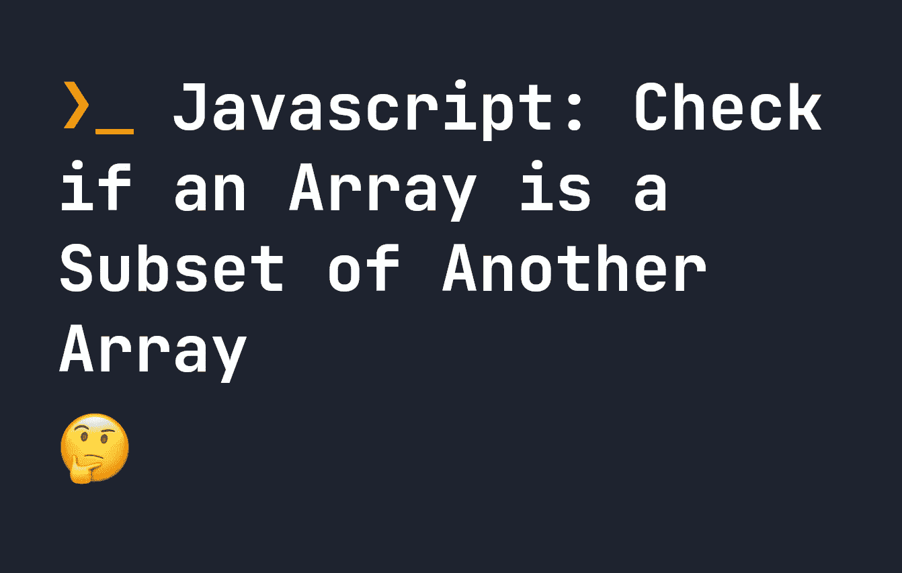

# JavaScript:检查一个数组是否是另一个数组的子集

> 原文：<https://javascript.plainenglish.io/javascript-check-if-an-array-is-a-subset-of-another-array-c9871bbf388b?source=collection_archive---------7----------------------->

## 如何检查一个数组是否是另一个数组的子集？在本指南中找到答案。



在许多用例中，知道一个数组是否是另一个数组的子集是非常有用的——尽管通常对人眼来说是显而易见的，但在代码中却很难评估。

在下面的代码中，`arr2`是`arr1`的**子集**，而`arr3`不是。

```
let arr1 = [ 'a', 'b', 'c' ];
let arr2 = [ 'b', 'c' ];
let arr3 = [ 'c', 'd' ];
```

如果我们想知道一个数组是否是另一个数组的子集，最好的方法是使用 [array every 方法](https://fjolt.com/article/javascript-array-every)。该方法遍历数组中的每个元素，并对其执行测试。如果数组中的每个元素都通过了测试，那么整个`every`方法将返回 true。

对于每一次评估，我们都有一个“父”数组和一个“子集”数组——我们要检查“子集”数组是否完全包含在“父”数组中。

为了评估一个数组是否是另一个数组的子集，我们可以对“子集”数组中的每个元素运行`every`。在`every`函数中，我们可以测试“父”数组是否包含“子集”数组中的每个元素。如果是，那么`every`将返回`true`。否则，它将返回`false`。

这可以通过如下所示的函数轻松实现——如果`subsetArray`完全包含在`parentArray`中，`checkSubset`将返回`true`:

```
let arr1 = [ 'a', 'b', 'c' ];
let arr2 = [ 'b', 'c' ];
let arr3 = [ 'c', 'd' ];

let checkSubset = (parentArray, subsetArray) => {
    return subsetArray.every((el) => {
        return parentArray.includes(el)
    })
}
checkSubset(arr1, arr2); // returns true
checkSubset(arr1, arr3); // returns false
```

这个题目到此为止。感谢您的阅读。

*更多内容请看*[***plain English . io***](https://plainenglish.io/)*。报名参加我们的* [***免费周报***](http://newsletter.plainenglish.io/) *。关注我们关于*[***Twitter***](https://twitter.com/inPlainEngHQ)[***LinkedIn***](https://www.linkedin.com/company/inplainenglish/)*[***YouTube***](https://www.youtube.com/channel/UCtipWUghju290NWcn8jhyAw)*[***不和***](https://discord.gg/GtDtUAvyhW) *。对增长黑客感兴趣？检查* [***电路***](https://circuit.ooo/) *。***