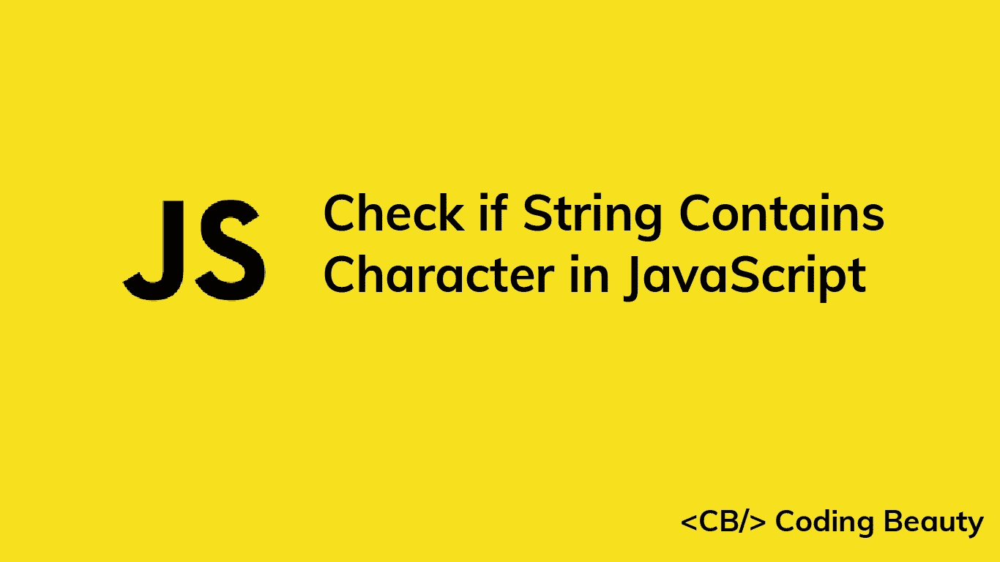

# 如何在 JavaScript 中检查字符串是否包含字符

> 原文：<https://javascript.plainenglish.io/javascript-check-if-string-contains-character-1f6b77394ca5?source=collection_archive---------4----------------------->

## 了解在 JavaScript 中快速检查字符串是否包含特定字符的多种方法。



在本文中，我们将研究不同的方法来快速检查一个字符串是否包含 JavaScript 中的特定字符。

# 1.String includes()方法

为了检查一个字符串是否包含一个特定的字符，我们可以在字符串上调用`includes()`方法，将字符作为参数传递，例如，`str.includes(char).`如果字符串包含字符，`includes()`方法返回`true`，如果不包含字符，则返回`false`。

```
const str = 'Bread and Milk';const char1 = 'd';
const char2 = 'p';console.log(str.includes(char1)); // trueconsole.log(str.includes(char2)); // false
```

## 小费

要执行不区分大小写的检查，在对字符串调用`includes()`之前，将字符串和字符都转换为小写。

```
const str = 'Bread and Milk';const char = 'D';console.log(str.toLowerCase().includes(char.toLowerCase())); // true
```

# 2.String indexOf()方法

我们也可以使用`indexOf()`方法来检查一个字符串是否包含一个特殊的字符。我们在字符串上调用`indexOf()`方法，将字符作为参数传递。然后我们将结果与`-1`进行比较。例如:

```
const str = 'Bread and Milk';const char1 = 'd';
const char2 = 'p';console.log(str.indexOf(char1) > -1); // trueconsole.log(str.indexOf(char2) > -1); // false
```

`indexOf()`方法在字符串中搜索一个值，并返回该值第一次出现的索引。如果找不到该值，则返回`-1`。

```
const str = 'Bread and Milk';const char1 = 'd';
const char2 = 'p';console.log(str.indexOf(char1)); // 4console.log(str.indexOf(char2)); // -1
```

这就是为什么我们比较`indexOf()`和`-1`的结果来检查字符是否在字符串中。

# 3.正则表达式匹配

我们可以根据正则表达式模式测试字符串，以确定它是否包含特定的字符。一种方法是使用`RegExp` `test()`方法。

```
const str = 'Bread and Milk';console.log(/d/.test(str)); // trueconsole.log(/p/.test(str)); // false
```

`test()`方法在字符串中搜索与正则表达式匹配的内容。如果找到匹配，它返回`true`，否则返回`false`。

使用正则表达式匹配可以让我们很容易地在字符串中指定多个字符进行搜索。

```
const str = 'Bread and Milk';// Contains a digit?
console.log(/\d/.test(str)); // false// Contains 'r', 'l' or 'c'?
console.log(/[rlc]/.test(str)); // true// Contains whitespace?
console.log(/\s/.test(str)); // true
```

*更新于:*[【codingbeautydev.com】T21](https://cbdev.link/eab057)

# JavaScript 做的每一件疯狂的事情

一本关于 JavaScript 微妙的警告和鲜为人知的部分的迷人指南。


[**报名**](https://cbdev.link/d3c4eb) 立即免费领取一份。