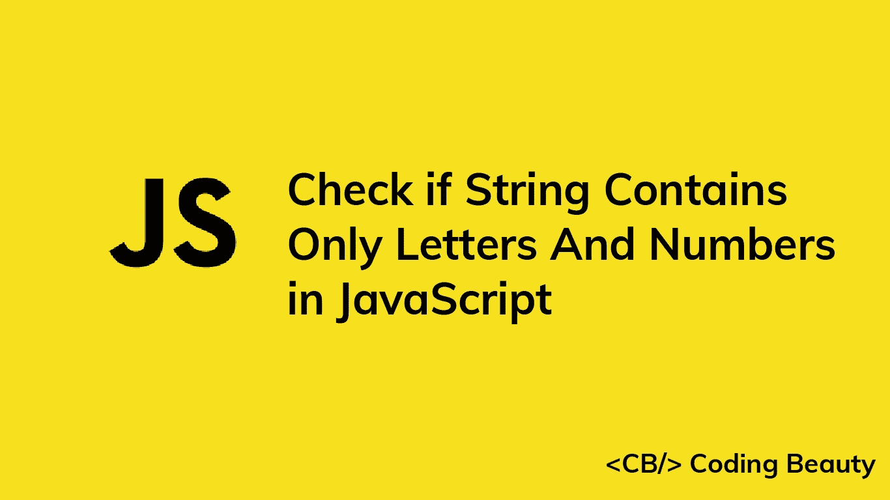

# 如何在 JavaScript 中检查一个字符串是否只包含字母和数字

> 原文：<https://javascript.plainenglish.io/javascript-check-if-string-contains-only-letters-and-numbers-5dce23ddfecf?source=collection_archive---------1----------------------->



# 1.RegExp test()方法

要在 JavaScript 中检查一个字符串是否只包含字母和数字，在这个 regex: `/^[A-Za-z0-9]*$/`上调用`test()`方法。如果字符串只包含字母和数字，该方法返回`true`。否则返回`false`。

```
function onlyLettersAndNumbers(str) {
  return /^[A-Za-z0-9]*$/.test(str);
}const str1 = 'number60';
const str2 = 'contains spaces';
const str3 = 'has special characters !@#$%^&';console.log(onlyLettersAndNumbers(str1)); // true
console.log(onlyLettersAndNumbers(str2)); // false
console.log(onlyLettersAndNumbers(str3)); // false
```

`[RegExp](https://developer.mozilla.org/en-US/docs/Web/JavaScript/Reference/Global_Objects/RegExp/test)` [](https://developer.mozilla.org/en-US/docs/Web/JavaScript/Reference/Global_Objects/RegExp/test)`[test()](https://developer.mozilla.org/en-US/docs/Web/JavaScript/Reference/Global_Objects/RegExp/test)`方法搜索正则表达式和指定字符串之间的匹配。

`/`和`/`字符用于开始和结束正则表达式。

`^`字符匹配字符串的开头，而`$`字符匹配字符串的结尾。

方括号(`[]`)用于匹配多个指定模式中的任意一个。在我们的例子中，我们指定了三种模式:`A-Z`、`a-z`和`0-9`。

`A-Z`匹配任何大写字母。

`a-z`匹配任何小写字母。

`0-9`匹配任何数字。

`*`字符匹配一个特定模式的零次或多次出现。我们将它添加到方括号之后，以尽可能多地匹配方括号中的任何模式。

# 2.字符串匹配()方法

我们可以用`String` `match()`方法代替`RegExp`测试()。

```
function onlyLettersAndNumbers(str) {
  return Boolean(str.match(/^[A-Za-z0-9]*$/));
}const str1 = 'number60';
const str2 = 'contains spaces';
const str3 = 'has special characters !@#$%^&';console.log(onlyLettersAndNumbers(str1)); // true
console.log(onlyLettersAndNumbers(str2)); // false
console.log(onlyLettersAndNumbers(str3)); // false
```

`[String match()](https://developer.mozilla.org/en-US/docs/Web/JavaScript/Reference/Global_Objects/String/match)`方法返回一个字符串中正则表达式所有匹配的数组。如果没有匹配，它返回`null`。

```
const str1 = 'number60';
const str2 = 'contains spaces';
const str3 = 'has special characters !@#$%^&';// [ 'number60', index: 0, input: 'number60', groups: undefined ]
console.log(str1.match(/^[A-Za-z0-9]*$/));console.log(str2.match(/^[A-Za-z0-9]*$/)); // null
console.log(str3.match(/^[A-Za-z0-9]*$/)); // null
```

我们将 match()的结果传递给布尔构造函数，将其转换成一个`Boolean`。`Boolean()`将真值转换为`true`，将假值转换为`false`。

在 JavaScript 中，有六个 falsy 值:`undefined`、`null`、`NaN`、`0`、`''`(空字符串)、和`false`。其他所有的价值都是真实的。

```
console.log(Boolean(undefined)); // false
console.log(Boolean(['number60'])); // true
console.log(Boolean(null)); // false
console.log(Boolean(5)); // true
```

# 从字符串中移除字母和数字

如果您想从字符串中删除任何字母和数字，您可以使用`String` `replace()`方法。

```
function removeLettersAndNumbers(str) {
  return str.replace(/[A-Za-z0-9]/g, '');
}const str1 = 'number!60 ?';
const str2 = '#wel_com%e';console.log(removeLettersAndNumbers(str1)); // ! ?
console.log(removeLettersAndNumbers(str2)); // #_%
```

`String` `replace()`方法返回一个新的字符串，其中指定模式的部分或全部匹配被替换。我们使用一个空字符串(`''`)作为替换，删除结果字符串中的所有字母和数字。

我们使用`g`(全局)标志来匹配字符串中出现的所有模式。如果我们不指定这个标志，只有第一个匹配的字母或数字会被删除。

```
function removeLettersAndNumbers(str) {
  // 'g' flag not set
  return str.replace(/[A-Za-z0-9]/, '');
}const str1 = 'number!60 ?';
const str2 = '#wel_com%e';console.log(removeLettersAndNumbers(str1)); // umber!60 ?
console.log(removeLettersAndNumbers(str2)); // #el_com%e
```

*更新于:*[*codingbeautydev.com*](https://cbdev.link/698ada)

# JavaScript 做的每一件疯狂的事情

一本关于 JavaScript 微妙的警告和鲜为人知的部分的迷人指南。


[**报名**](https://cbdev.link/d3c4eb) 立即免费领取一份。