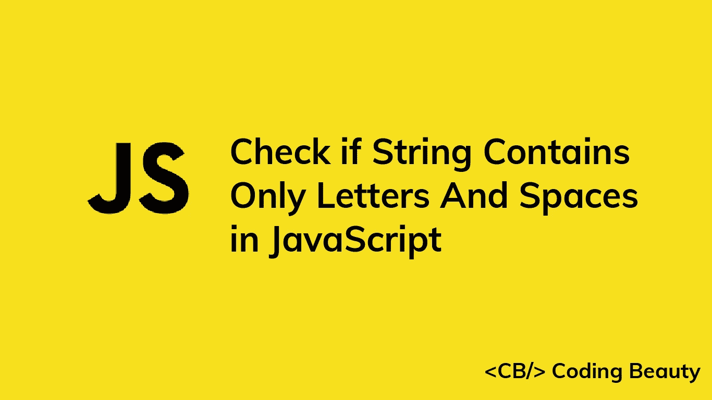

# 如何在 JavaScript 中检查一个字符串是否只包含字母和空格

> 原文：<https://javascript.plainenglish.io/javascript-check-if-string-contains-only-letters-and-spaces-8feb27c15835?source=collection_archive---------5----------------------->



# 1.RegExp test()方法

要在 JavaScript 中检查一个字符串是否只包含字母和空格，在这个 regex: `/^[A-Za-z\s]*$/`上调用`test()`方法。如果字符串只包含字母和空格，这个方法返回`true`。否则返回`false`。

```
function onlyLettersAndSpaces(str) {
  return /^[A-Za-z\s]*$/.test(str);
}const str1 = 'contains_underscore';
const str2 = 'only letters and spaces';console.log(onlyLettersAndSpaces(str1)); // false
console.log(onlyLettersAndSpaces(str2)); // true
```

`[RegExp](https://developer.mozilla.org/en-US/docs/Web/JavaScript/Reference/Global_Objects/RegExp/test)` [](https://developer.mozilla.org/en-US/docs/Web/JavaScript/Reference/Global_Objects/RegExp/test)`[test()](https://developer.mozilla.org/en-US/docs/Web/JavaScript/Reference/Global_Objects/RegExp/test)`方法搜索正则表达式和指定字符串之间的匹配。

`/`和`/`字符用于开始和结束正则表达式。

`^`字符匹配字符串的开头，而`$`字符匹配字符串的结尾。

方括号(`[]`)用于匹配多个指定模式中的任意一个。在我们的例子中，我们指定了三种模式:`A-Z`、`a-z`和 `\s`。`A-Z`匹配任意大写字母，`a-z`匹配任意小写字母，`0-9`匹配任意数字。

`*`字符匹配一个特定模式的零次或多次出现。我们将它添加到方括号之后，以尽可能多地匹配方括号中的任何模式。

# 如何检查字符串是否至少包含一个字母和一个空格

如果字符串只包含字母或空格，我们使用的正则表达式使方法返回`true`。

```
const str1 = 'OnlyLetters';
const str2 = '  '; // only spaces
const str3 = 'letters and spaces';console.log(onlyLettersAndSpaces(str1)); // true
console.log(onlyLettersAndSpaces(str2)); // true
console.log(onlyLettersAndSpaces(str3)); // true
```

为了确保字符串包含至少一个字母和一个空格，我们需要将字符串与至少匹配一个字母的正则表达式(`/[A-Za-z]/`)和至少匹配一个空格的正则表达式`/\s/`进行匹配。

```
function atLeastOneLetterAndSpace(str) {
  return (
    /^[A-Za-z\s]*$/.test(str) &&
    /[A-Za-z]/.test(str) &&
    /\s/.test(str)
  );
}const str1 = 'OnlyLetters';
const str2 = '  '; // Only spaces
const str3 = 'letters and spaces';console.log(atLeastOneLetterAndSpace(str1)); // false
console.log(atLeastOneLetterAndSpace(str2)); // false
console.log(atLeastOneLetterAndSpace(str3)); // true
```

# 2.字符串匹配()方法

我们还可以使用`String` `match()`方法来检查一个字符串是否只包含字母和空格。

```
function onlyLettersAndSpaces(str) {
  return Boolean(str?.match(/^[A-Za-z\s]*$/));
}const str1 = 'contains_underscore';
const str2 = 'only letters and spaces';console.log(onlyLettersAndSpaces(str1)); // false
console.log(onlyLettersAndSpaces(str2)); // true
```

`[String match()](https://developer.mozilla.org/en-US/docs/Web/JavaScript/Reference/Global_Objects/String/match)`方法返回一个字符串中正则表达式所有匹配的数组。如果没有匹配，它返回`null`。

```
const regex = /^[A-Za-z\s]*$/;const str1 = 'contains_underscore';
const str2 = 'only letters and spaces';// null
console.log(str1?.match(regex));/**
[
  'only letters and spaces',
  index: 0,
  input: 'only letters and spaces',
  groups: undefined
]
 */
console.log(str2?.match(regex));
```

我们将`match()`的结果传递给`Boolean`构造函数，将其转换为`Boolean`。`Boolean()`将真值转换为`true`，将假值转换为`false`。

在 JavaScript 中，有六个 falsy 值:`undefined`、`null`、`NaN`、`0`、`''`(空字符串)和`false`。其他所有的价值都是真实的。

```
console.log(Boolean(undefined)); // false
console.log(Boolean(['letters'])); // true
console.log(Boolean(null)); // false
console.log(Boolean(5)); // true
```

我们在字符串变量上使用了可选的链接操作符(`?.`)。如果变量是 nullish ( `undefined`或`null`)，当我们试图对其调用`match()`方法时，不会抛出错误，这个操作符会阻止方法调用并返回`undefined`。

```
const str = null;console.log(str?.match(/^[A-Za-z\s]*$/)); // undefined
```

*更新于:*【codingbeautydev.com】

# *JavaScript 做的每一件疯狂的事情*

*一本关于 JavaScript 微妙的警告和鲜为人知的部分的迷人指南。*

**

*[**报名**](https://cbdev.link/d3c4eb) 立即免费领取一份。*