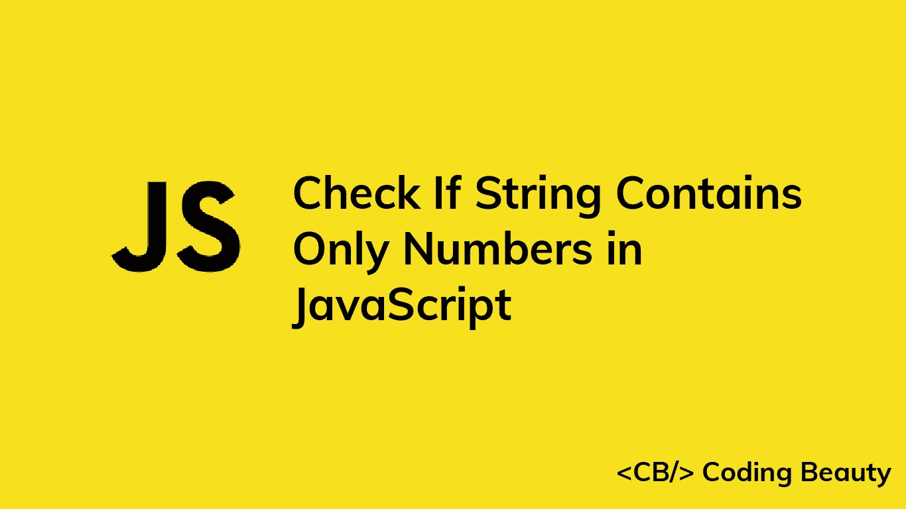

# 如何在 JavaScript 中检查一个字符串是否只包含数字

> 原文：<https://javascript.plainenglish.io/javascript-check-if-string-contains-only-numbers-a6a5a74a24eb?source=collection_archive---------4----------------------->

## 了解如何在 JavaScript 中轻松检查字符串是否只包含数字。匹配包含由字符分隔的数字的字符串。



要在 JavaScript 中检查一个字符串是否只包含数字，在这个正则表达式上调用`test()`方法:`^\d+$`。如果字符串只包含数字，`test()`方法将返回`true`。否则，它将返回`false`。

例如:

```
function containsOnlyNumbers(str) {
  return /^\d+$/.test(str);
}console.log(containsOnlyNumbers('HTML5')); // false
console.log(containsOnlyNumbers('1234')); // true
console.log(containsOnlyNumbers('3 bananas')); // false
```

RegExp test() 方法搜索正则表达式和字符串之间的匹配。

`/`和`/`字符用于开始和结束一个正则表达式。

`^`字符标记字符串输入的开始，`$`字符标记字符串输入的结束。

`\d`模式匹配字符串中的任意数字(`0` - `9`)。

在`\d`之后添加`+`字符使得正则表达式匹配一个或多个`\d`模式。

因此正则表达式匹配以连续数字序列开始和结束的字符串。

我们可以使用`[0-9]`模式来匹配数字。该模式匹配`0`和`9`之间的任何数字字符。

```
function containsOnlyNumbers(str) {
  return /^[0-9]+$/.test(str);
}console.log(containsOnlyNumbers('HTML5')); // false
console.log(containsOnlyNumbers('1234')); // true
console.log(containsOnlyNumbers('3 bananas')); // false
```

您可能会发现`[0-9]`比`\d`更易读，尤其是如果您不太熟悉正则表达式中的特殊字符。

# 匹配包含由字符分隔的数字的字符串

有时，我们希望匹配由特定字符(如空格或逗号)分隔数字的字符串。

```
function containsOnlyNumbers(str) {
  return /^(\d+,)*(\d+)$/.test(str);
}console.log(containsOnlyNumbers('123456789')); // true (separator not required)
console.log(containsOnlyNumbers('123,456,789')); // true
console.log(containsOnlyNumbers('123-456-789')); // false
```

我们使用以下格式的正则表达式来实现这一点:`^(\d+{ch})*(\d+)$`，其中`{ch}`是分隔数字的字符。

因此，我们可以使用非常相似的正则表达式来匹配只包含用连字符分隔的数字的字符串:

```
function containsOnlyNumbers(str) {
  return /^(\d+-)*(\d+)$/.test(str);
}console.log(containsOnlyNumbers('123456789')); // true
console.log(containsOnlyNumbers('123,456,789')); // false
console.log(containsOnlyNumbers('123-456-789')); // true
```

或空格:

```
function containsOnlyNumbers(str) {
  return /^(\d+ )*(\d+)$/.test(str);
}console.log(containsOnlyNumbers('123456789')); // true
console.log(containsOnlyNumbers('123 456 789')); // true
console.log(containsOnlyNumbers('123-456-789')); // false
```

**提示:**如果你曾经遇到一个正则表达式的模式很难理解，MDN 文档中的这个[正则表达式备忘单](https://developer.mozilla.org/en-US/docs/Web/JavaScript/Guide/Regular_Expressions/Cheatsheet)可能会有所帮助。

像以前一样，我们可以用`[0-9]`代替正则表达式的`\d`:

```
function containsOnlyNumbers(str) {
  return /^([0-9]+-)*([0-9]+)$/.test(str);
}console.log(containsOnlyNumbers('123456789')); // true
console.log(containsOnlyNumbers('123,456,789')); // false
console.log(containsOnlyNumbers('123-456-789')); // true
```

*原载于*【codingbeautydev.com】

# *ES13 中 11 个惊人的新 JavaScript 特性*

*本指南将带您了解 ECMAScript 13 中添加的所有最新功能。这些强大的新特性将用更短、更具表现力的代码来更新您的 JavaScript。*

**

*[注册](https://cbdev.link/900477)，立即获得免费副本。*

**更多内容看* [***说白了。报名参加我们的***](https://plainenglish.io/) **[***免费周报***](http://newsletter.plainenglish.io/) *。关注我们关于* [***推特***](https://twitter.com/inPlainEngHQ) ，[***LinkedIn***](https://www.linkedin.com/company/inplainenglish/)*，*[***YouTube***](https://www.youtube.com/channel/UCtipWUghju290NWcn8jhyAw)*，以及* [***不和***](https://discord.gg/GtDtUAvyhW) *。****