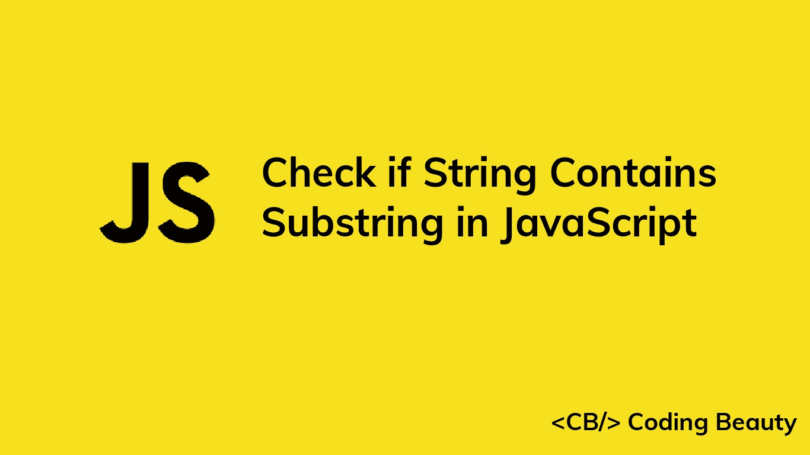

# 如何在 JavaScript 中检查字符串是否包含子串

> 原文：<https://javascript.plainenglish.io/javascript-check-if-string-contains-substring-ad4ac2b567b0?source=collection_archive---------5----------------------->



在本文中，我们将研究在 JavaScript 中快速检查字符串是否包含子串的多种方法。

# 1.String includes()方法

为了检查一个字符串是否包含子串，我们可以在字符串上调用`includes()`方法，将子串作为参数传递，例如`str.includes(substr)`。如果字符串包含子串，则`includes()`方法返回`true`，否则返回`false`。

```
const str = 'Bread and Milk';const substr1 = 'Milk';
const substr2 = 'Tea';console.log(str.includes(substr1)); // trueconsole.log(str.includes(substr2)); // false
```

## 小费

要执行不区分大小写的检查，在对字符串调用`includes()`之前，将字符串和子字符串都转换为小写。

```
const str = 'Bread and Milk';const substr = 'milk';console.log(
  str.toLowerCase().includes(substr.toLowerCase())
); // true
```

# 2.String indexOf()方法

我们还可以使用`indexOf()`方法来检查一个字符串是否包含子串。我们在字符串上调用`indexOf()`方法，将子字符串作为参数传递。然后我们将结果与`-1`进行比较。例如:

```
const str = 'Bread and Milk';const substr1 = 'Milk';
const substr2 = 'Tea';console.log(str.indexOf(substr1) > -1); // trueconsole.log(str.indexOf(substr2) > -1); // false
```

`indexOf()`方法在字符串中搜索一个值，并返回该值第一次出现的索引。如果找不到该值，则返回`-1`。

```
const str = 'Bread and Milk';const substr1 = 'Milk';
const substr2 = 'Tea';console.log(str.indexOf(substr1)); // 10
console.log(str.indexOf(substr2)); // -1
```

这就是为什么我们比较`indexOf()`和`-1`的结果来检查子串是否在字符串中。

## 小费

要执行不区分大小写的检查，在对字符串调用`indexOf()`之前，将字符串和子字符串都转换为小写。

```
const str = 'Bread and Milk';const substr = 'milk';console.log(
  str.toLowerCase().indexOf(substr.toLowerCase()) > -1
); // true
```

# 3.正则表达式匹配

我们可以根据正则表达式模式测试字符串，以确定它是否包含子字符串。一种方法是使用`RegExp` `test()`方法。

```
const str = 'Bread and Milk';console.log(/Milk/.test(str)); // true
console.log(/Tea/.test(str)); // false
```

使用正则表达式匹配允许我们轻松地指定复杂的模式来搜索字符串。

```
const str = 'Bread and Milk';// Contains 'sand', 'land', or 'and'?
console.log(/[sl]?and/.test(str)); // true// Contains 'book0', 'book1', ..., 'book8' or 'book9'?
console.log(/book(\d)/.test(str)); // false
```

*更新于:*[*codingbeautydev.com*](https://cbdev.link/671716)

# JavaScript 做的每一件疯狂的事情

一本关于 JavaScript 微妙的警告和鲜为人知的部分的迷人指南。


[**报名**](https://cbdev.link/d3c4eb) 立即免费领取一份。