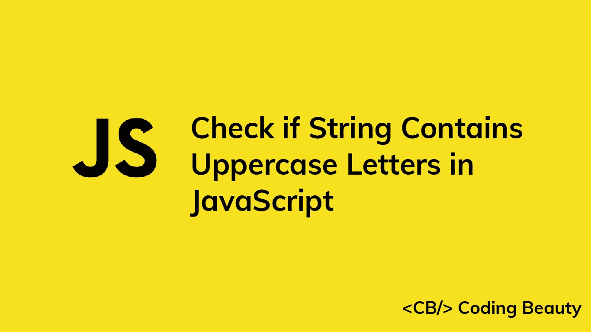

# 如何在 JavaScript 中检查一个字符串是否包含大写字母

> 原文：<https://javascript.plainenglish.io/javascript-check-if-string-contains-uppercase-letters-9a78b69739f6?source=collection_archive---------0----------------------->

## 了解如何在 JavaScript 中轻松检查字符串是否包含大写字母。



要在 JavaScript 中检查一个字符串是否包含大写字母，在这个正则表达式`/[A-Z]/`上调用`test()`方法，即`/A-Z/.test(str)`。如果字符串包含任何大写字母，`test()`将返回`true`。否则将返回`false`。

例如:

```
function containsUppercase(str) {
  return /[A-Z]/.test(str);
}console.log(containsUppercase('javascript')); // false
console.log(containsUppercase('PHP')); // true
console.log(containsUppercase('Coding')); // true
```

`[RegExp](https://developer.mozilla.org/en-US/docs/Web/JavaScript/Reference/Global_Objects/RegExp/test)` [](https://developer.mozilla.org/en-US/docs/Web/JavaScript/Reference/Global_Objects/RegExp/test)`[test()](https://developer.mozilla.org/en-US/docs/Web/JavaScript/Reference/Global_Objects/RegExp/test)`方法在字符串中搜索指定正则表达式的匹配项，如果找到，则返回`true`。否则返回`false`。

正斜杠(`/ /`)表示正则表达式的开始和结束。

方括号(`[ ]`)匹配一组给定字符中的任何一个。`A-Z`模式指定这些字符是从 A 到 Z 的所有大写字母。所以完整的正则表达式匹配字符串中的任何大写字母。

# 检查字符串是否只包含大写字母

为了检查一个字符串是否只包含**大写字母**，我们需要使用一个稍微不同的正则表达式:`/^[A-Z]+$/`。

```
function containsUppercase(str) {
  return /^[A-Z]+$/.test(str);
}console.log(containsUppercase('javascript')); // false
console.log(containsUppercase('PHP')); // true
console.log(containsUppercase('Coding')); // false
```

让我们来看看这个新正则表达式的不同之处:

`^`字符指定模式必须在字符串的开头。相反，`$`字符表示图案必须在末尾。

`+`字符匹配字符串中一个或多个连续出现的前面的模式。

因此，正则表达式的匹配只能在包含一组从开始到结束的连续大写字母的字符串中找到——只有大写字母的字符串。

查看 MDN 文档中的这个备忘单，获得正则表达式语法的全面指南。

# `String` `match()`方法

`RegExp` `test()`的替代方法是`String` `match()`方法。我们没有在正则表达式上调用`test()`，而是用正则表达式作为参数在字符串上调用`match()`。

```
function containsUppercase(str) {
  return Boolean(str.match(/[A-Z]/));
}console.log(containsUppercase('javascript')); // false
console.log(containsUppercase('PHP')); // true
console.log(containsUppercase('Coding')); // true
```

`[String](https://developer.mozilla.org/en-US/docs/Web/JavaScript/Reference/Global_Objects/String/match)` [](https://developer.mozilla.org/en-US/docs/Web/JavaScript/Reference/Global_Objects/String/match)`[match()](https://developer.mozilla.org/en-US/docs/Web/JavaScript/Reference/Global_Objects/String/match)`方法返回一个字符串中正则表达式所有匹配项的数组。如果没有匹配，它返回`null`。

```
const str1 = 'javascript';
const str2 = 'Beauty';console.log(str1?.match(/[A-Z]/)); // null
console.log(str2?.match(/[A-Z]/)); // [ 'B', ... ] (single-item array)
```

我们将`match()`的结果传递给`Boolean()`构造函数，将其转换为`Boolean`。`Boolean`将真值转换为`true`，将`falsy`值转换为`false`。

在 JavaScript 中，有六个 falsy 值:`undefined`、`null`、`NaN`、`0`、`''`(空字符串)和`false`。其他所有的价值都是真实的。

```
console.log(Boolean(undefined)); // false
console.log(Boolean(['letters'])); // true
console.log(Boolean(null)); // false
console.log(Boolean(5)); // true
```

我们在字符串变量上使用了[可选链接操作符](https://developer.mozilla.org/en-US/docs/Web/JavaScript/Reference/Operators/Optional_chaining) ( `?.`)。如果变量是`undefined`或`null`，这个操作符会阻止方法调用并返回`undefined`而不是抛出错误。

```
const str = null;console.log(str?.match(/[A-Z]/)); // undefined
```

*原载于*[*codingbeautydev.com*](https://cbdev.link/f4c344)

# JavaScript 做的每一件疯狂的事情

一本关于 JavaScript 微妙的警告和鲜为人知的部分的迷人指南。


[**报名**](https://cbdev.link/d3c4eb) 立即免费领取一份。